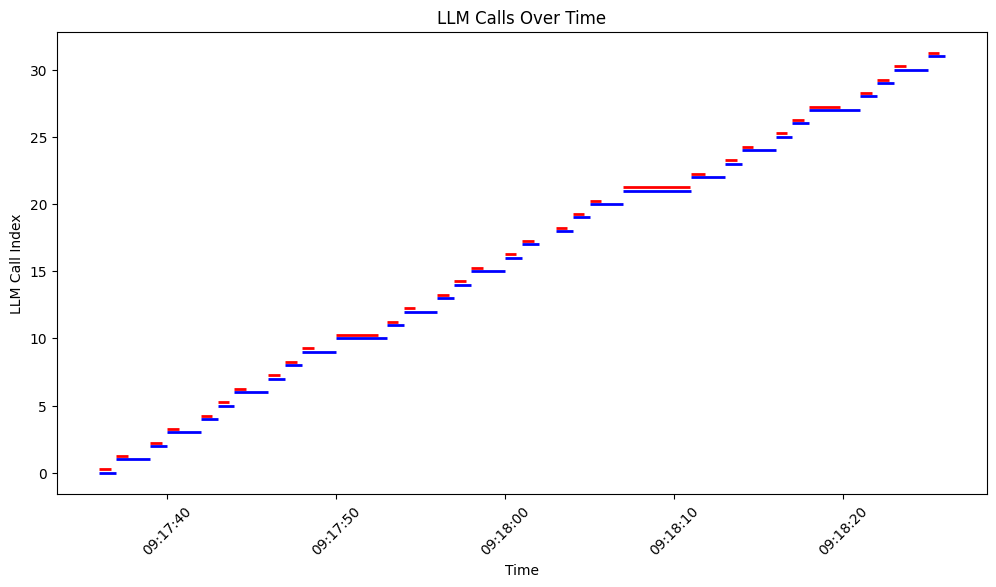

<a href="https://sambanova.ai/">
<picture>
 <source media="(prefers-color-scheme: dark)" srcset="../images/SambaNova-light-logo-1.png" height="60">
  
</picture>
</a>

Benchmarking
======================

<!-- TOC -->

- [Benchmarking](#benchmarking)
- [Overview](#overview)
- [Before you begin](#before-you-begin)
  - [Clone this repository](#clone-this-repository)
  - [Set up the account and config file](#set-up-the-account-and-config-file)
  - [Create the (virtual) environment](#create-the-virtual-environment)
- [Use the starter kit](#use-the-starter-kit)
  - [GUI Option](#gui-option)
    - [Deploy the starter kit GUI](#deploy-the-starter-kit-gui)
    - [Quickstart](#quickstart)
    - [Full Walkthrough](#full-walkthrough)
      - [Synthetic Performance Evaluation](#synthetic-performance-evaluation)
      - [Custom Performance Evaluation](#custom-performance-evaluation)
      - [Performance on Chat](#performance-on-chat)
  - [CLI Option](#cli-option)
    - [Custom Dataset](#custom-dataset)
    - [Synthetic Dataset](#synthetic-dataset)
- [Batching vs non-batching benchmarking](#batching-vs-non-batching-benchmarking)
- [Third-party tools and data sources](#third-party-tools-and-data-sources)

<!-- /TOC -->

# Overview

This AI Starter Kit evaluates the performance of different LLM models hosted in SambaStudio. It allows users to configure various LLMs with diverse parameters, enabling experiments to not only generate different outputs but also measurement metrics simultaneously. The Kit includes:
- A configurable SambaStudio connector. The connector generates answers from a deployed model.
- An app with two functionalities:
    - A performance evaluation process with configurable options that users will utilize to obtain and compare different metrics 
    - A chat interface with configurable options that users will set to interact and get performance metrics
- A bash script that is the core of the performance evaluation and provides more flexibility to users

This sample is ready-to-use. We provide:
- Instructions for setup with SambaStudio
- Instructions for running the model as-is
- Instructions for customizing the model
   
# Before you begin

To perform this setup, you must be a SambaNova customer with a SambaStudio account or a FastAPI API key. You also have to set up your environment before you can run or customize the starter kit. 

_These steps assume a Mac/Linux/Unix shell environment. If using Windows, you will need to adjust some commands for navigating folders, activating virtual environments, etc._

## Clone this repository

Clone the starter kit repo.
```bash
git clone https://github.com/sambanova/ai-starter-kit.git
```

## Set up for SambaStudio users

1. Log in to SambaStudio and get your API authorization key. The steps for getting this key are described [here](https://docs.sambanova.ai/sambastudio/latest/cli-setup. 

2. Select the LLM you want to use (e.g. COE/Meta-Llama-3-8B-Instruct) and deploy an endpoint for inference. See the [SambaStudio endpoint documentation](https://docs.sambanova.ai/sambastudio/latest/endpoints.html) for a general reference, and the [Dynamic batching documentation](https://docs.sambanova.ai/sambastudio/latest/dynamic-batching.html#_create_a_dynamic_batching_coe_endpoint) for more information on how to deploy a dynamic batching endpoint. 

3. Update the `ai-starter-kit/.env` config file in the root repo directory. Here's an example:
    - Assume you have an endpoint with the URL
        "https://api-stage.sambanova.net/api/predict/generic/stream/12345678-9abc-def0-1234-56789abcdef0/456789ab-cdef-0123-4567-89abcdef0123"

    - You can enter the following in the env file (with no spaces):

    ``` bash
        SAMBASTUDIO_BASE_URL="https://api-stage.sambanova.net"
        SAMBASTUDIO_BASE_URI="api/predict/generic"
        SAMBASTUDIO_PROJECT_ID="12345678-9abc-def0-1234-56789abcdef0"
        SAMBASTUDIO_ENDPOINT_ID="456789ab-cdef-0123-4567-89abcdef0123"
        SAMBASTUDIO_API_KEY="89abcdef-0123-4567-89ab-cdef01234567"
    ```
__Note: only streaming endpoint responses are supported for now__
__Note: API v1 and API v2 are supported__

## Set up for FastAPI CoE users

In the repo root directory, create an env file in `ai-starter-kit/.env` and specify the FastAPI CoE url and the FastAPI CoE API key (with no spaces), as in the following example:

``` bash
        FASTAPI_URL = "https://abcd.snova.ai/api/v1/chat/completion"
        FASTAPI_API_KEY = "456789abcdef0123456789abcdef0123"
```

## Create the (virtual) environment
1. (Recommended) Create a virtual environment and activate it (python version 3.11 recommended): 
    ```bash
    python<version> -m venv <virtual-environment-name>
    source <virtual-environment-name>/bin/activate
    ```

2. Install the required dependencies:
    ```bash
    cd benchmarking # If not already in the benchmarking folder
    pip install -r requirements.txt
    ```

# Use the starter kit

When using the benchmarking starter kit, you have two options for running the program:

- [*GUI Option*](#gui-option): This option contains plots and configurations from a web browser.
- [*CLI Option*](#cli-option): This option allows you to run the program from the command line.


## GUI Option

The GUI for this starter kit uses Streamlit, a Python framework for building web applications. This method is useful for analyzing outputs in a graphical manner since the results are shown via plots in the UI.

### Deploy the starter kit GUI

Ensure you are in the `benchmarking` folder and run the following command:

```shell
streamlit run streamlit/app.py --browser.gatherUsageStats false 
```

After deploying the starter kit, you will see the following user interface:


### Quickstart 

After you've deployed the GUI, you can use the starter kit. More details will come in the following sections, however the general usage is described in the comming bullets: 

1. In the left side bar, select one of the three app functionalities (Click on each section to go to the full details): 
  - [`Synthetic Performance Evaluation`](#synthetic-performance-evaluation): Evaluate the performance of the selected LLM on data generated by this benchmarking tool.
  - [`Custom Performance Evaluation`](#custom-performance-evaluation): Evaluate the performance of the selected LLM on custom data specified by you.
  - [`Performance on Chat`](#performance-on-chat): Evaluate the performance of the selected LLM in a chat interface.

2. If the deployed LLM is a Composition of Experts (CoE), specify the desired expert in the corresponding text box and then set the configuration parameters. If the deployed LLM is not a CoE, simply set the configuration parameters.

3. If the deployed LLM is a FastAPI endpoint, choose in the API type dropdown the `fastapi` option. 

4. After pressing the `Run` button, the program will perform inference on the data and product results in the middle of the screen. In the case of `Performance on Chat` functionality, users are able to interact with the LLM in a multi-turn chat interface.  

### Full Walkthrough

There are 3 options on the left side bar for running the benchmarking tool. Pick the walkthrough that best suits your needs.

#### Synthetic Performance Evaluation

This option allows you to evaluate the performance of the selected LLM on synthetic data generated by this benchmarking tool.

1. Enter a model name and choose the right API type

**__Note__**: Currently we have specific prompting support for Llama2, Llama3, Mistral, Deepseek, Solar, and Eeve. Other instruction models use a generic prompt format.

  - If the model specified is a CoE, specify the desired expert in the Model Name text box.
    - The model name should mirror the name shown in studio, preceded with `COE/` - 
    - For example, the Samba-1 Turbo Llama-3-8B expert in studio is titled `Meta-Llama-3-8B-Instruct` so my model name would be `COE/Meta-Llama-3-8B-Instruct`.
  - If the model is a standalone model, enter the full model name shown on the model card. I.e. `Llama-2-70b-chat-hf`.
  - If the model is a FastAPI, then be aware of the right model names used. Then, choose `fastapi` in the API type dropdown option.
    - For example, the Llama-3-8B model in FastAPI is titles `llama3-8b` so that will be the model name

2. Set the configuration parameters

- **Number of input tokens**: The number of input tokens in the generated prompt. *Default*: 1000.
- **Number of output tokens**: The number of output tokens the LLM can generate. *Default*: 1000.
- **Number of total requests**: Number of requests sent. *Default*: 32. *Note*: the program can timeout before all requests are sent. Configure the **Timeout** parameter accordingly.
- **Number of concurrent workers**: The number of concurrent workers. *Default*: 1. For testing [batching-enabled models](https://docs.sambanova.ai/sambastudio/latest/dynamic-batching.html), this value should be greater than the largest batch_size one needs to test. The typical batch sizes that are supported are 1,4,8 and 16.
- **Timeout**: Number of seconds before program times out. *Default*: 600 seconds

3. Run the performance evaluation

- Click the `Run!` button. This will start the program and a spinning indicator will show in the UI confirming the program is executing.
- Depending on the parameter configurations, it should take between 1 min and 20 min. Some diagnostic/progress information will be displayed in the terminal shell.

4. Analyze results

    _Note: Not all model endpoints currently support the calculation of server-side statistics. Depending on your choice of endpoint, you may see either client and server information, or you may see just the client-side information._

    **Bar plots**

    The plots compare (if available) the following:

    - **Server metrics**: These are performance metrics from the API.
    - **Client metrics**: These are performance metrics computed on the client side.
    Additionally, if the endpoint supports dynamic batching, the plots will show per-batch metrics.

    The results are composed of four bar plots:

    - ```ttft_s``` bar plot: This plot shows the Time to First Token (TTFT). One should see higher values and higher variance in the client-side metrics compared to the server-side metrics. This difference is mainly due to the request waiting in the queue to be served (for concurrent requests), which is not included in server-side metrics. There is also a small additional factor on the client-side due to the added latency of the API call to the client computer.

    - ```end_to_end_latency_s``` bar plot: This plot shows the end-to-end latency. One should see higher values and higher variance in the client-side metrics compared to the server-side metrics. This difference is also mainly due to the request waiting in the queue to be served (for concurrent requests), which is not included in server-side metrics. There is also a small additional factor on the client-side due to the added latency of the API call to the client computer.

    - ```output_token_per_s_per_request``` bar plot: This plot shows the number of output tokens per second per request. One should see good agreement between the client and server-side metrics. For endpoints that support dynamic batching, one should see a decreasing trend in metrics as the batch size increases.

    - ```throughput_token_per_s``` bar plot: This plot shows the total tokens generated per second per batch. One should see good agreement between the client and server-side metrics. This metric represents the total number of tokens generated per second, which is the same as the previous metric for batch size = 1. However, for batch size > 1, it is estimated as the average of ```output_token_per_s_per_request * batch_size_used``` for each batch, to account for more tokens being generated due to concurrent requests being served in batch mode.

#### Custom Performance Evaluation

This option allows you to evaluate the performance of the selected LLM on your own custom dataset. The interface should look like this:


1. Prep your dataset

- The dataset needs to be in `.jsonl` format - these means a file with one JSON object per line.
- Each JSON object should have a `prompt` key with the value being the prompt you want to pass to the LLM.
  - You can use a different keyword instead of `prompt`, but it's important that all your JSON objects use the same key

2. Enter the dataset path

- The entered path should be an absolute path to your dataset.
  - For example: `/Users/johndoe/Documents/my_dataset.jsonl`

3. Enter a model name and choose the right API type

**__Note__**: Currently we have specific prompting support for Llama2, Llama3, Mistral, Deepseek, Solar, and Eeve. Other instruction models use a generic prompt format.

  - If the model specified is a CoE, specify the desired expert in the Model Name text box.
    - The model name should mirror the name shown in studio, preceded with `COE/` - 
    - For example, the Samba-1 Turbo Llama-3-8B expert in studio is titled `Meta-Llama-3-8B-Instruct` so my model name would be `COE/Meta-Llama-3-8B-Instruct`.
  - If the model is a standalone model, enter the full model name shown on the model card. I.e. `Llama-2-70b-chat-hf`.
  - If the model is a FastAPI, then be aware of the right model names used. Then, choose `fastapi` in the API type dropdown option.
    - For example, the Llama-3-8B model in FastAPI is titles `llama3-8b` so that will be the model name

4. Set the configuration and tuning parameters

- **Number of concurrent workers**: The number of concurrent workers. *Default*: 1. For testing [batching-enabled models](https://docs.sambanova.ai/sambastudio/latest/dynamic-batching.html), this value should be greater than the largest batch_size one needs to test. The typical batch sizes that are supported are 1,4,8 and 16.
- **Timeout**: Number of seconds before program times out. *Default*: 600 seconds
- **Max Output Tokens**: Maximum number of tokens to generate. *Default*: 256

5. Analyze results

    _Note: Not all model endpoints currently support the calculation of server-side statistics. Depending on your choice of endpoint, you may see either client and server information, or you may see just the client-side information._

    **Bar plots**

    The plots compare (if available) the following:

    - **Server metrics**: These are performance metrics from the API.
    - **Client metrics**: These are performance metrics computed on the client side.
    Additionally, if the endpoint supports dynamic batching, the plots will show per-batch metrics.

    The results are composed of four bar plots:

    - ```ttft_s``` bar plot: This plot shows the Time to First Token (TTFT). One should see higher values and higher variance in the client-side metrics compared to the server-side metrics. This difference is mainly due to the request waiting in the queue to be served (for concurrent requests), which is not included in server-side metrics. There is also a small additional factor on the client-side due to the added latency of the API call to the client computer.

    - ```end_to_end_latency_s``` bar plot: This plot shows the end-to-end latency. One should see higher values and higher variance in the client-side metrics compared to the server-side metrics. This difference is also mainly due to the request waiting in the queue to be served (for concurrent requests), which is not included in server-side metrics. There is also a small additional factor on the client-side due to the added latency of the API call to the client computer.

    - ```output_token_per_s_per_request``` bar plot: This plot shows the number of output tokens per second per request. One should see good agreement between the client and server-side metrics. For endpoints that support dynamic batching, one should see a decreasing trend in metrics as the batch size increases.

    - ```throughput_token_per_s``` bar plot: This plot shows the total tokens generated per second per batch. One should see good agreement between the client and server-side metrics. This metric represents the total number of tokens generated per second, which is the same as the previous metric for batch size = 1. However, for batch size > 1, it is estimated as the average of ```output_token_per_s_per_request * batch_size_used``` for each batch, to account for more tokens being generated due to concurrent requests being served in batch mode.

#### Performance on Chat

This option allows you to measure performance during a multi-turn conversation with an LLM. The interface should look like this:


1. Enter a model name and choose the right API type

  - If the model specified is a CoE, specify the desired expert in the Model Name text box.
    - The model name should mirror the name shown in studio, preceded with `COE/` - 
    - For example, the Samba-1 Turbo Llama-3-8B expert in studio is titled `Meta-Llama-3-8B-Instruct` so my model name would be `COE/Meta-Llama-3-8B-Instruct`.
  - If the model is a standalone model, enter the full model name shown on the model card. I.e. `Llama-2-70b-chat-hf`.
  - If the model is a FastAPI, then be aware of the right model names used. Then, choose `fastapi` in the API type dropdown option.
    - For example, the Llama-3-8B model in FastAPI is titles `llama3-8b` so that will be the model name

2. Set the configuration parameters

- **Max tokens to generate**: Maximum number of tokens to generate. *Default*: 256
<!-- - **Do sample**: 
- **Repetition penalty**:
- **Temperature**:
- **Top k**:
- **Top p**: -->

3. Start the chat session

After entering the model name and configuring the parameters, press `Run!` to activate the chat session.

4. Ask anything and see results

Users are able to ask anything and get a generated answer to their questions, as shown in the image below. In addition to the back and forth conversations between the user and the LLM, there is a expander option that users can click to see the following metrics per each LLM response:
- **Latency (s)**
- **Throughput (tokens/s)**
- **Time to first token (s)**


## CLI Option

This method can be ran from a terminal session. Users have this option if they want to experiment using values that are beyond the limits specified in the Streamlit app parameters. You have two options for running the program from terminal:

- Run with a custom dataset via `run_custom_dataset.sh`
- Run with a synthetic dataset via `run_synthetic_dataset.sh`

### Custom Dataset

**__Note__**: Currently we have specific prompting support for Llama2, Llama3, Mistral, Deepseek, Solar, and Eeve. Other instruction models use a generic prompt format.

1. Open the file `run_custom_dataset.sh` and configure the following parameters:
  - **model-name**: Model name to be used. If it's a COE model, add "COE/" prefix to the name. Example: "COE/Meta-Llama-3-8B-Instruct"
  - **llm-api**: API type to be chosen. If it's a fastapi model, double check the right model name spelling because it's shorter then other sambastudio model names.
  - **results-dir**: Path to the results directory. _Default_: "./data/results/llmperf"
  - **num-workers**: Number of concurrent workers. _Default_: 1
  - **timeout**: Timeout in seconds. _Default_: 600

  _Note_: You should leave the `--mode` parameter untouched - this indicates what dataset mode to use. 

2. Run the script

- Run the following command in your terminal:
```shell
sh run_custom_dataset.sh
```
- The evaluation process will start and  progress bar will be shown until it's complete.

3. Analyze results

- Results will be saved at the location specified in `results-dir`.
- The name of the output files will depend on the input file name, mode name, and number of workers. You should see files that follow a similar format to the following:

```
<MODEL_NAME>_{FILE_NAME}_{NUM_CONCURRENT_WORKERS}_{MODE}
```
- For each run, two files are generated with the following suffixes in the output file names: `_individual_responses` and `_summary`.
  
  - Individual responses file

    - This output file contains the number of input and output tokens, number of total tokens, Time To First Token (TTFT), End-To-End Latency (E2E Latency) and Throughput from Server (if available) and Client side, for each individual request sent to the LLM. Users can use this data for further analysis. We provide this notebook `notebooks/analyze-token-benchmark-results.ipynb` with some charts that they can use to start.


  - Summary file

    - This file includes various statistics such as percentiles, mean and standard deviation to describe the number of input and output tokens, number of total tokens, Time To First Token (TTFT), End-To-End Latency (E2E Latency) and Throughput from Client side. It also provides additional data points that bring more information about the overall run, like inputs used, number of errors, and number of completed requests per minute. 


### Synthetic Dataset

**__Note__**: Currently we have specific prompting support for Llama2, Llama3, Mistral, Deepseek, Solar, and Eeve. Other instruction models use a generic prompt format.

1. Open the file `run_synthetic_dataset.sh` and configure the following parameters:
  - **model-name**: Model name to be used. If it's a COE model, add "COE/" prefix to the name. Example: "COE/Meta-Llama-3-8B-Instruct"
  - **llm-api**: API type to be chosen. If it's a fastapi model, double check the right model name spelling because it's shorter then other sambastudio model names.
  - **results-dir**: Path to the results directory. _Default_: "./data/results/llmperf"
  - **num-workers**: Number of concurrent workers. _Default_: 1
  - **timeout**: Timeout in seconds. _Default_: 600
  - **num-input-tokens**: Number of input tokens to include in the request prompts. It's recommended to choose no more than 2000 tokens to avoid long wait times. _Default_: 1000.
  - **num-output-tokens**: Number of output tokens in the generation. It's recommended to choose no more than 2000 tokens to avoid long wait times. _Default_: 1000.
  - **num-requests**: Number of requests sent. _Default_: 32. _Note_: the program can timeout before all requests are sent. Configure the **Timeout** parameter accordingly.

   _Note_: You should leave the `--mode` parameter untouched - this indicates what dataset mode to use.

2. Run the script

- Run the following command in your terminal:
```shell
sh run_synthetic_dataset.sh
```
- The evaluation process will start and  progress bar will be shown until it's complete.

3. Analyze results

- Results will be saved at the location specified in `results-dir`.
- The name of the output files will depend on the input file name, mode name, and number of workers. You should see files that follow a similar format to the following:

```
<MODEL_NAME>_{NUM_INPUT_TOKENS}_{NUM_OUTPUT_TOKENS}_{NUM_CONCURRENT_WORKERS}_{MODE}
```

- For each run, two files are generated with the following suffixes in the output file names: `_individual_responses` and `_summary`.
  
  - Individual responses file

    - This output file contains the number of input and output tokens, number of total tokens, Time To First Token (TTFT), End-To-End Latency (E2E Latency) and Throughput from Server (if available) and Client side, for each individual request sent to the LLM. Users can use this data for further analysis. We provide this notebook `notebooks/analyze-token-benchmark-results.ipynb` with some charts that they can use to start.


  - Summary file

    - This file includes various statistics such as percentiles, mean and standard deviation to describe the number of input and output tokens, number of total tokens, Time To First Token (TTFT), End-To-End Latency (E2E Latency) and Throughput from Client side. It also provides additional data points that bring more information about the overall run, like inputs used, number of errors, and number of completed requests per minute. 


- There's an additional notebook `notebooks/multiple-models-benchmark.ipynb` that will help users on running multiple benchmarks with different experts and gather performance results in one single table. A COE endpoint is meant to be used for this analysis. 

# Batching vs non-batching benchmarking

This kit also supports [SambaNova Studio models with Dynamic Batch Size](https://docs.sambanova.ai/sambastudio/latest/dynamic-batching.html), which improves the model performance significantly. 

In order to use a batching model, first users need to set up the proper endpoint supporting this feature, please [look at this section](#set-up-the-account-and-config-file) for reference. Additionally, users need to specify `number of workers > 1`, either using [the streamlit app](#using-streamlit-app) or [the terminal](#using-terminal). Since the current maximum batch size is 16, it's recomended to choose a value for `number of workers` equal or greater than that to test different batch sizes. 

Here's an example with parameters for using an endpoint with and without dynamic batching size.

Non-batching setup
If the user wants to send 32 requests to be processed sequentially, here are the parameter values that can work as an example:
- Parameters:
  - Number of requests: 32
  - Number of concurrent workers: 1

We can see in the following Gantt chart how the 32 requests are being executed one after the other. (FastAPI with LLama3-8b was used for this example)



Batching setup
If the user wants to send 60 requests to be processed in batch, it's important to consider the number of workers chosen.

For example:

For the following parameter values:
- Parameters:
  - Number of requests: 60
  - Number of concurrent workers: 21

We can see from the Gantt chart that the way they're batched and processed is 1-16-4 requests, because there are 21 workers sending requests in parallel. This setup took ~ 4 mins 30 secs.


Another example is the following:
- Parameters:
  - Number of requests: 60
  - Number of concurrent workers: 60

We can see from the Gantt chart that the way they're batched and processed is 1-16-16-16-8-1-1-1 requests, because there are 60 workers sending all requests in parallel. This setup took ~ 3 mins.


# Third-party tools and data sources 

All the packages/tools are listed in the requirements.txt file in the project directory. Some of the main packages are listed below:

- streamlit (version 1.37.0)
- st-pages (version 0.5.0)
- transformers (version 4.40.1)
- python-dotenv (version 1.0.0)
- Requests (version 2.31.0)
- seaborn (version 0.12.2)
