<a href="https://sambanova.ai/">
<picture>
 <source media="(prefers-color-scheme: dark)" srcset="../images/light-logo.png" height="100">
  
</picture>
</a>

Benchmarking
======================

<!-- TOC -->

- [Overview](#overview)
- [Before you begin](#before-you-begin)
    - [Clone this repository](#clone-this-repository)
    - [Set up the inference endpoint, and environment variables](#set-up-the-inference-endpoint-and-environment-variables)
    - [Create the (virtual) environment](#create-the-virtual-environment)
- [Use the starter kit](#use-the-starter-kit)
    - [GUI Option](#gui-option)
        - [Deploy the starter kit GUI](#deploy-the-starter-kit-gui)
        - [Full Walkthrough](#full-walkthrough)
    - [CLI Option](#cli-option)
- [Third-party tools and data sources](#third-party-tools-and-data-sources)
- [TroubleShooting](#troubleshooting)

<!-- /TOC -->

# Overview

This AI Starter Kit evaluates the performance of different LLM models hosted by [SambaNova.ai](https://sambanova.ai/). It allows users to configure various LLMs with diverse parameters, enabling experiments to not only generate different outputs but also measurement metrics simultaneously. The Kit includes:
- Configurable SambanNova Cloud connectors. The connectors generate answers from a deployed model. You can also use any of them to run OpenAI compatible endpoints from other providers.
- An app with four functionalities:
    - A synthetic performance evaluation process with configurable options that users will utilize to obtain and compare different metrics over synthetic data generated by the app. This evaluation also includes the optional execution and comparison with vLLM.
    - A real workload performance evaluation process with configurable options that users will utilize to obtain and compare different metrics over real workloads of synthetic data generated by the app.
    - A custom performance evaluation process with configurable options that users will utilize to obtain and compare different metrics over their own customed prompts. 
    - A chat interface with configurable options that users will set to interact and get performance metrics
- A set of bash scripts that are the core of the performance evaluations and provide more flexibility to users

This sample is ready-to-use. We provide:
- Instructions for setup with SambaNova Cloud
- Instructions for running the model as-is
- Instructions for customizing the model
   
# Before you begin

To perform this setup, you must be a SambaNova customer with a SambaNova Cloud API key (more details in the following sections). You also have to set up your environment before you can run or customize the starter kit. 

Additionaly, there's a Frecuently Asked Questions documentation [here](./FAQ.md) that has several useful common questions and answers about the kit.

_These steps assume a Mac/Linux/Unix shell environment. If using Windows, you will need to adjust some commands for navigating folders, activating virtual environments, etc._

## Clone this repository

Clone the starter kit repo.
```bash
git clone https://github.com/sambanova/ai-starter-kit.git
```

## Set up the inference endpoint, and environment variables

The next step is to set up your environment variables to use one of the models available from SambaNova. You can self-service provision API endpoints using SambaNova Cloud.

Please follow the instructions [here](../README.md#getting-a-sambanova-api-key-and-setting-your-generative-models) for setting up your environment variables.

**Notes**: 
1. You can modify `SAMBANOVA_API_BASE` if you'd like to use another SambaNova URL if available.
2. You can also use an OpenAI compatible endpoint from other providers. You will need to generate respective API keys on their platforms and map the URL and API Key SambaNova Cloud environment variables.

## Create the (virtual) environment
1. (Recommended) Create a virtual environment and activate it (python version 3.11 recommended): 
    ```bash
    python<version> -m venv <virtual-environment-name>
    source <virtual-environment-name>/bin/activate
    ```

2. Install the required dependencies:
    ```bash
    cd benchmarking # If not already in the benchmarking folder
    pip install uv
    uv pip install -r requirements.txt
    ```

_Note: vLLM is also installed (via `requirements.txt`) for the optional vLLM speed-benchmark comparison. It uses your existing SambaNova API credentials, so no additional setup is needed beyond the standard environment variables._

# Use the starter kit

When using the benchmarking starter kit, you have two options for running the program:

- [*GUI Option*](#gui-option): This option contains plots and configurations from a web browser.
- [*CLI Option*](#cli-option): This option allows you to run the program from the command line and provides more flexibility.


## GUI Option

The GUI for this starter kit uses Streamlit, a Python framework for building web applications. This method is useful for analyzing outputs in a graphical manner since the results are shown via plots in the UI.

If you face any issues or have questions, please visit the Frecuently Asked Questions documentation [here](./FAQ.md).

### Deploy the starter kit GUI

Ensure you are in the `benchmarking` folder and run the following command:

```shell
ulimit -n 4096
streamlit run streamlit/app.py --browser.gatherUsageStats false 
```

### Full Walkthrough

There are 4 options on the left side bar for running the benchmarking tool. Pick the walkthrough that best suits your needs.

<details id="synthetic-performance-evaluation">
<summary><strong>Synthetic Performance Evaluation</strong></summary>

This option allows you to evaluate the performance of the selected LLM on synthetic data generated by this benchmarking tool.

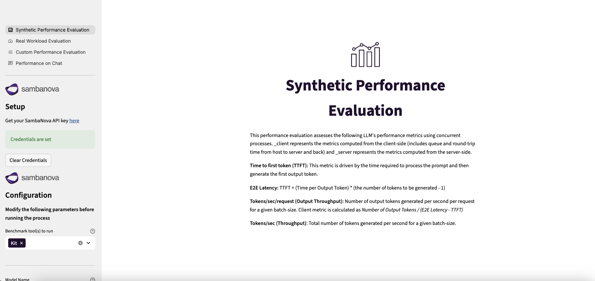

1. **Select Benchmarking Mode**

   Choose from three benchmarking options:
   - **Kit Only**: Run benchmarks using the SambaNova AI Starter Kit implementation (default)
   - **vLLM Only**: Run benchmarks using vLLM's benchmark serve command
   - **Both (Side-by-Side Comparison)**: Run both benchmarks simultaneously and compare results side-by-side

   _Note: vLLM benchmarking requires vLLM, which is listed in `requirements.txt` and installed during [environment setup](#create-the-virtual-environment). For API benchmarking, vLLM drives a remote endpoint, so no local GPU is required._

2. Enter a model name and choose the right API type

     _Note: Currently we have specific prompting support for GPT, Llama, Gemma, Mistral, Deepseek, Qwen, Solar, and Eeve. Other instruction models can work, but number of tokens may not be close to the ones specified._

  Use one of the models displayed in the website. Then, choose `SambaNova Cloud` in the API type dropdown option. E.g. `Meta-Llama-3.3-70B-Instruct`.

3. If the model selected is **multimodal**, then select the pre-set image size to include in the benchmarking requests. There are three categories: Small (500x500px), Medium (1000x1000px) and Large (2000x2000px). Otherwise, if model is not multimodal, then leave the value to N/A.

    **Warning!** Multimodal models may activate their guardrails when running benchmarks. Changing the input or output number of tokens may help to solve the issue.

4. Set the configuration parameters

- **Number of input tokens**: The number of input tokens in the generated prompt. *Default*: 1000.
- **Number of output tokens**: The number of output tokens the LLM can generate. *Default*: 1000.
- **Number of total requests**: Number of requests sent. *Default*: 10. *Note*: the program can timeout before all requests are sent. Configure the **Timeout** parameter accordingly.
- **Number of concurrent requests**: The number of concurrent requests. *Default*: 1. For testing batching-enabled models, this value should be greater than the largest batch_size one needs to test. The typical batch sizes that are supported are 1,4,8 and 16.
- **Number of warm-up requests**: Number of throwaway requests sent (at the concurrency above) *before* the measured run. Their results are discarded, so one-time costs such as server cold start (weight/KV-cache allocation, autoscaler spin-up) and batch ramp-up don't skew the reported metrics. *Default*: 0 (disabled). *Note*: supported by both the Kit and vLLM benchmarks (the vLLM path maps to vLLM's native `--num-warmups` flag). For the Kit, warm-up shares the same **Timeout** budget as the measured run.
- **Timeout**: Number of seconds before the program times out. *Default*: 600 seconds. *Note*: this is a single budget shared across the warm-up and measured phases — if it is reached during warm-up, the measured run is skipped.

4. Run the performance evaluation

- Click the `Run!` button. This will start the program and a progress bar will be shown in the UI.
- Depending on the parameter configurations, it should take between 1 min and 10 min. 
- If needed, you can stop the process at any time by clicking the `Stop` button. **Warning** Stopping a run with multiple concurrent requests and a high number of input/output tokens may leave some requests still running on the API. To allow the API to recover, it's recommended to wait one to two minutes before starting a new run.
- Once the process is complete, you can download the output files to analyze performance metrics per request or review summary statistics.

5. Analyze results

    _Note: Not all model endpoints currently support the calculation of server-side statistics. Depending on your choice of endpoint, you may see either client and server information, or you may see just the client-side information._

    **Plots**

    The plots compare (if available) the following:

    - **Server metrics**: These are performance metrics from the Server API. 
    - **Client metrics**: These are performance metrics computed on the client side / local machine.
    
    Additionally, if the endpoint supports dynamic batching, the plots will show per-batch metrics.

    The results are composed of six plots:

    - ```Distribution of TTFT by batch size```: This bar plot shows the median Time to First Token (TTFT) in a bold colored horizontal line, and a rectangular area representing the range between the 5th and 95th percentile. One should see higher values and higher variance in the client-side metrics compared to the server-side metrics. This difference is mainly due to the request waiting in the queue to be served (for concurrent requests), which is not included in server-side metrics. 

    - ```Distribution of end-to-end latency by batch size```: This bar plot shows the median end-to-end latency in a bold colored horizontal line, and a rectangular area representing the range between the 5th and 95th percentile. One should see higher values and higher variance in the client-side metrics compared to the server-side metrics. This difference is also mainly due to the request waiting in the queue to be served (for concurrent requests), which is not included in server-side metrics. 

    - ```Distribution of output throughput by batch size``` plot: This bar plot shows the median number of **output** tokens per second per request in a bold colored horizontal line, and a rectangular area representing the range between the 5th and 95th percentile. One should see good agreement between the client and server-side metrics. For endpoints that support dynamic batching, one should see a decreasing trend in metrics as the batch size increases.

    - ```Distribution of Mean Inter-Token Latency (ITL) by batch size```: This bar plot shows the median mean inter-token latency (in milliseconds) per request in a bold colored horizontal line, and a rectangular area representing the range between the 5th and 95th percentile.

    - ```Total output throughput per batch size```: This bar plot shows the median total tokens generated per second per batch in a bold colored horizontal line, and a rectangular area representing the range between the 5th and 95th percentile. One should see good agreement between the client and server-side metrics. This metric will calculate the same values as the previous metric for batch size = 1. However, for batch size > 1, it is estimated as the average of ```Output throughput by batch size * Batch size``` for each batch, to account for more generated tokens due to concurrent requests being served in batch mode.

    - ```LLM requests across time```: This gantt plot shows the duration of the TTFT and end-to-end latency per request in a timeline. One should expect latencies considerably greater than TTFTs, and multiple bars starting at the same time as number of concurrent requests specified. In addition, if the endpoint allows dynamic batching, one could see grouped bars according to the batch sizes supported.

    **vLLM Only mode**

    When running in **vLLM Only** mode, the app benchmarks the SambaNova API using `vllm bench serve` and displays client-side metrics only (server-side metrics are not captured by vLLM). You will see:

    - ```Distribution of TTFT```: Client TTFT distribution across requests.
    - ```Distribution of Mean ITL```: Client mean inter-token latency distribution across requests.

    _Note: If some requests fail (e.g. due to rate limits or timeouts), the charts will display only the successful requests and a warning will indicate how many failed._

    **Both (Side-by-Side Comparison) mode**

    When running in **Both** mode, the app runs Kit and vLLM benchmarks sequentially and presents the results together for easy comparison. You will see:

    - **Summary Metrics Comparison** table: A side-by-side table showing duration, completed/failed requests, token counts, request throughput, output throughput, mean/median TTFT, and mean/median ITL for both Kit and vLLM.
    - **Side-by-side distribution charts**: TTFT and Mean ITL distributions for Kit (left) and vLLM (right), plotted at the same scale for easy visual comparison.

6. Customize synthetic prompts.

    Synthetic prompts for performance evaluation can be found [here](./prompts/). You are free to add, modify, or remove prompts as needed. If adding new prompts, please follow the data structure used in the existing ones as a reference.

7. Synthetic Performance common examples
    1. Dynamic batching speed  

        Parameters:
        - Model name: Meta-Llama-3.3-70B-Instruct
        - Number of input tokens: 250
        - Number of output tokens: 250
        - Number of total requests: 80
        - Number of concurrent requests: 20
        - Timeout: 600
          
        Results:

        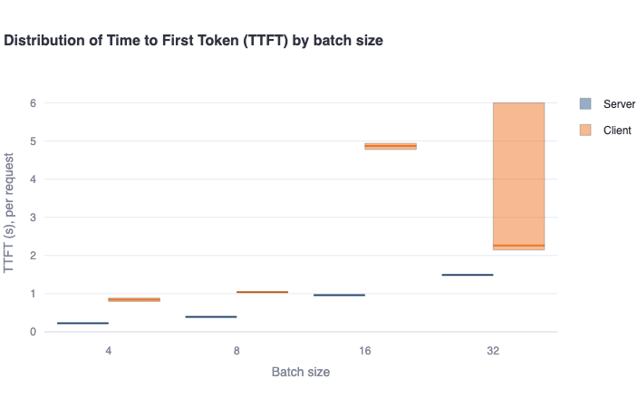
        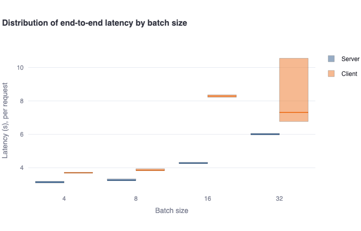
        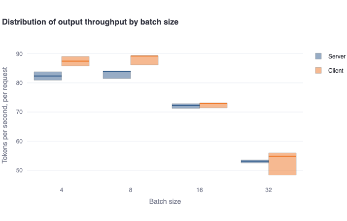
        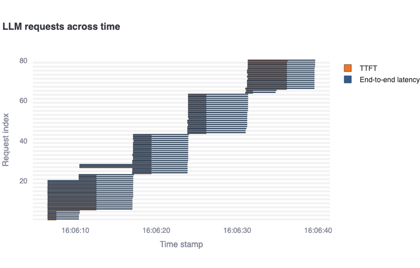
      
    2. High input and ouput tokens

        Parameters:
        - Model name: Meta-Llama-3.3-70B-Instruct
        - Number of input tokens: 2000
        - Number of output tokens: 2000
        - Number of total requests: 80
        - Number of concurrent requests: 25
        - Timeout: 600

        Results:

        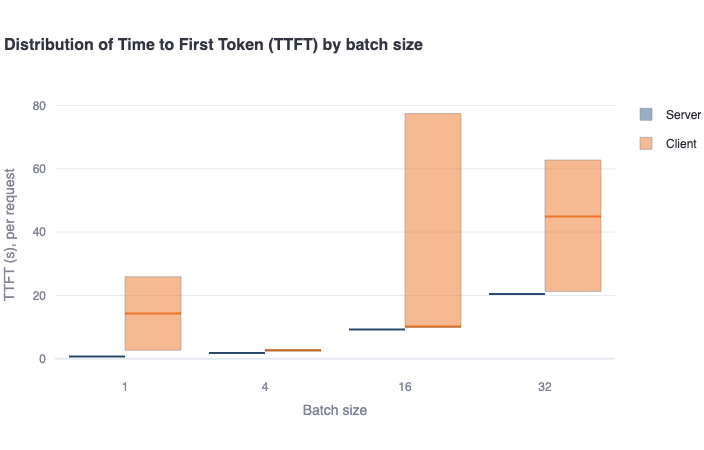
        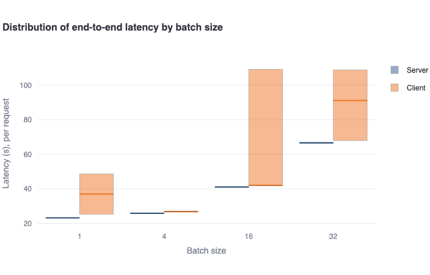
        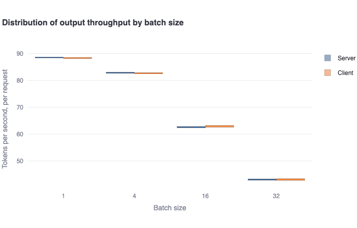
        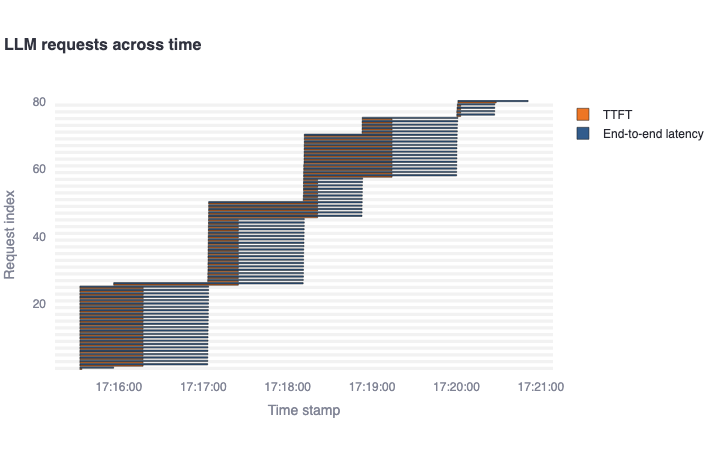

    3. Running multiple concurrent requests

        Parameters:
        - Model name: Meta-Llama-3.3-70B-Instruct
        - Number of input tokens: 250
        - Number of output tokens: 250
        - Number of total requests: 400
        - Number of concurrent requests: 80
        - Timeout: 600

        Results:
        
        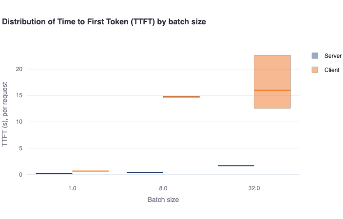
        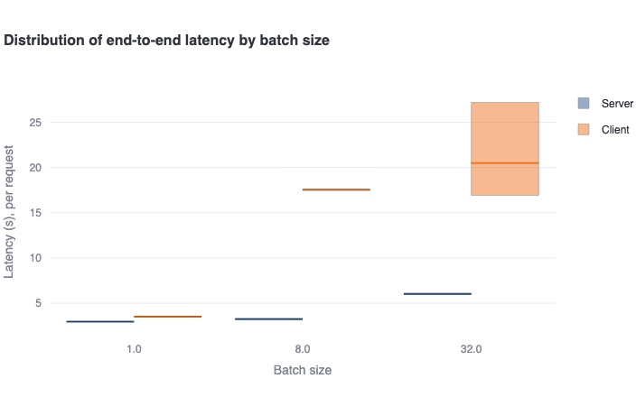
        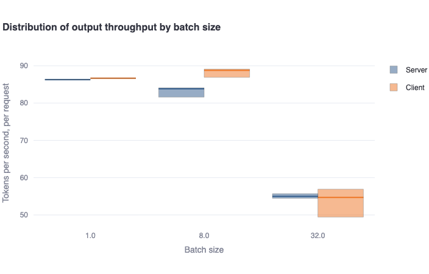
        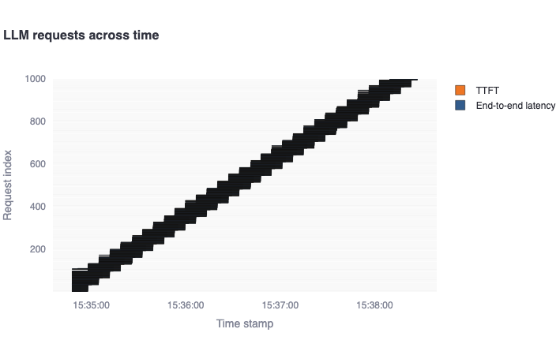

  </details>

<details id="real-workload-performance-evaluation">
<summary><strong>Real Workload Performance Evaluation</strong></summary>

This option allows you to evaluate the performance of the selected LLM on real workload synthetic data generated by this benchmarking tool. 

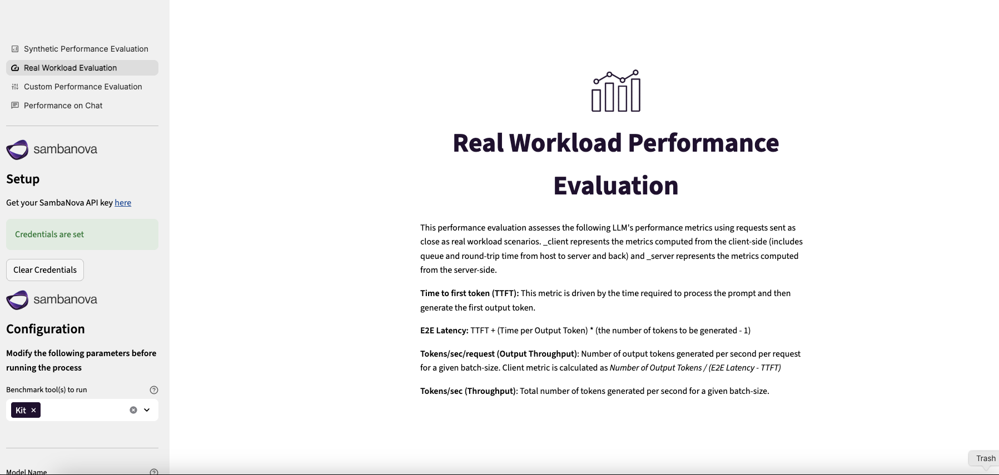 

1. Enter a model name and choose the right API type

     _Note: Currently we have specific prompting support for GPT, Llama, Gemma, Mistral, Deepseek, Qwen, Solar, and Eeve. Other instruction models can work, but number of tokens may not be close to the ones specified._

  Use one of the models displayed in the website. Then, choose `SambaNova Cloud` in the API type dropdown option. E.g. `Meta-Llama-3.3-70B-Instruct`.

2. If the model selected is **multimodal**, then select the pre-set image size to include in the benchmarking requests. There are three categories: Small (500x500px), Medium (1000x1000px) and Large (2000x2000px). Otherwise, if model is not multimodal, then leave the value to N/A.

    **Warning!** Multimodal models may activate their guardrails when running benchmarks. Changing the input or output number of tokens may help to solve the issue.

3. Set the configuration parameters

- **Number of input tokens**: The number of input tokens in the generated prompt. *Default*: 1000.
- **Number of output tokens**: The number of output tokens the LLM can generate. *Default*: 1000.
- **Number of total requests**: Number of requests sent. *Default*: 10. *Note*: the program can timeout before all requests are sent. Configure the **Timeout** parameter accordingly.
- **Queries per second**: the number of queries that will be sent to the endpoint per second. Values QPS<10 are recommended since user can hit rate limits. *Default*: 1.0
- **Queries per second distribution**: the type of wait time distribution in between requests. User can choose the values 'constant', 'uniform', 'exponential'. *Default*: constant.
- **Number of warm-up requests**: Number of throwaway requests sent *before* the measured run. Their results are discarded, so one-time costs such as server cold start and batch ramp-up don't skew the reported metrics. *Default*: 0 (disabled). *Note*: warm-up requests are fired together (not paced by the QPS above) and share the same **Timeout** budget as the measured run.
- **Timeout**: Number of seconds before the program times out. *Default*: 600 seconds. *Note*: this is a single budget shared across the warm-up and measured phases — if it is reached during warm-up, the measured run is skipped.

4. Run the performance evaluation

- Click the `Run!` button. This will start the program and a progress bar will be shown in the UI.
- Depending on the parameter configurations, it should take between 1 min and 10 min. 
- If needed, you can stop the process at any time by clicking the `Stop` button. **Warning** Stopping a run with multiple concurrent requests and a high number of input/output tokens may leave some requests still running on the API. To allow the API to recover, it's recommended to wait one to two minutes before starting a new run.

5. Analyze results

    _Note: Not all model endpoints currently support the calculation of server-side statistics. Depending on your choice of endpoint, you may see either client and server information, or you may see just the client-side information._

    **Plots**

    The plots compare (if available) the following:

    - **Server metrics**: These are performance metrics from the Server API. 
    - **Client metrics**: These are performance metrics computed on the client side / local machine.
    
    Additionally, if the endpoint supports dynamic batching, the plots will show per-batch metrics.

    The results are composed of five plots:

    - ```Distribution of TTFT by batch size```: This bar plot shows the median Time to First Token (TTFT) in a bold colored horizontal line, and a rectangular area representing the range between the 5th and 95th percentile. One should see higher values and higher variance in the client-side metrics compared to the server-side metrics. This difference is mainly due to the request waiting in the queue to be served (for concurrent requests), which is not included in server-side metrics. 

    - ```Distribution of end-to-end latency by batch size```: This bar plot shows the median end-to-end latency in a bold colored horizontal line, and a rectangular area representing the range between the 5th and 95th percentile. One should see higher values and higher variance in the client-side metrics compared to the server-side metrics. This difference is also mainly due to the request waiting in the queue to be served (for concurrent requests), which is not included in server-side metrics. 

    - ```Distribution of output throughput by batch size``` plot: This bar plot shows the median number of **output** tokens per second per request in a bold colored horizontal line, and a rectangular area representing the range between the 5th and 95th percentile. One should see good agreement between the client and server-side metrics. For endpoints that support dynamic batching, one should see a decreasing trend in metrics as the batch size increases.

    - ```Total output throughput per batch size```: This bar plot shows the median total tokens generated per second per batch in a bold colored horizontal line, and a rectangular area representing the range between the 5th and 95th percentile. One should see good agreement between the client and server-side metrics. This metric will calculate the same values as the previous metric for batch size = 1. However, for batch size > 1, it is estimated as the average of ```Output throughput by batch size * Batch size``` for each batch, to account for more generated tokens due to concurrent requests being served in batch mode.

    - ```LLM requests across time```: This gantt plot shows the duration of the TTFT and end-to-end latency per request in a timeline. One should expect latencies considerably greater than TTFTs, and multiple bars starting at the same time as number of concurrent requests specified. In addition, if the endpoint allows dynamic batching, one could see grouped bars according to the batch sizes supported.

6. Customize synthetic prompts:

    Synthetic prompts for performance evaluation can be found [here](./prompts/). You are free to add, modify, or remove prompts as needed. If adding new prompts, please follow the data structure used in the existing ones as a reference.

</details>

<details id="custom-performance-evaluation">
<summary><strong>Custom Performance Evaluation</strong></summary>

This option allows you to evaluate the performance of the selected LLM on your own custom dataset. The interface should look like this:

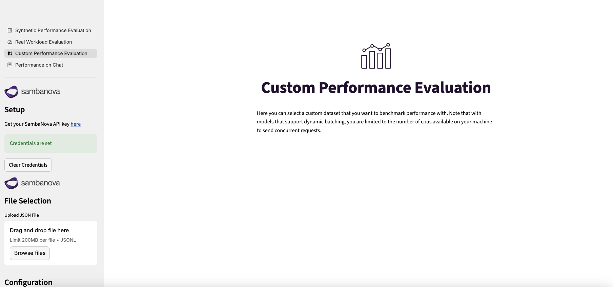 

1. Prep your dataset

- The dataset needs to be in `.jsonl` format - these means a file with one JSON object per line. You can take as example the file [in here.](./prompts/custom_prompt_example.jsonl)
- Each JSON object need to have a `prompt` key with the value being the prompt you want to pass to the LLM. If you want to benchmark a multimodal model, then also include the `image_path` key with an absolute path value. **Warning!** Multimodal models may activate their guardrails when running benchmarks. Changing prompt may help to solve the issue.

2. Upload the jsonl file using the option in the sidebar.

3. Enter a model name and choose the right API type

    _Note: Currently we have specific prompting support for GPT, Llama, Gemma, Mistral, Deepseek, Qwen, Solar, and Eeve. Other instruction models can work, but number of tokens may not be close to the ones specified._

  Use one of the models displayed in the website. Then, choose `SambaNova Cloud` in the API type dropdown option. E.g. `Meta-Llama-3.3-70B-Instruct`.

4. Set the configuration and tuning parameters

- **Number of concurrent requests**: The number of concurrent requests. *Default*: 1. For testing dynamic batching, this value should be greater than the largest batch_size one needs to test. The typical batch sizes that are supported are 1,4,8 and 16.
- **Num Warm-up Requests**: Number of throwaway requests sent (at the concurrency above) *before* the measured run. Their results are discarded, so one-time costs such as server cold start and batch ramp-up don't skew the reported metrics. *Default*: 0 (disabled). *Note*: warm-up shares the same **Timeout** budget as the measured run.
- **Timeout**: Number of seconds before the program times out. *Default*: 600 seconds. *Note*: this is a single budget shared across the warm-up and measured phases — if it is reached during warm-up, the measured run is skipped.
- **Max Output Tokens**: Maximum number of tokens to generate. *Default*: 256
- **Save LLM Responses**: Whether to save the actual outputs of the LLM to an output file. The output file will contain the `response_texts` suffix.

5. Analyze results

    _Note: Not all model endpoints currently support the calculation of server-side statistics. Depending on your choice of endpoint, you may see either client and server information, or you may see just the client-side information._

    **Plots**

    The plots compare (if available) the following:

    - **Server metrics**: These are performance metrics from the Server API. 
    - **Client metrics**: These are performance metrics computed on the client side / local machine.
    
    Additionally, if the endpoint supports dynamic batching, the plots will show per-batch metrics.

    The results are composed of five plots:

    - ```Distribution of TTFT by batch size```: This bar plot shows the median Time to First Token (TTFT) in a bold colored horizontal line, and a rectangular area representing the range between the 5th and 95th percentile. One should see higher values and higher variance in the client-side metrics compared to the server-side metrics. This difference is mainly due to the request waiting in the queue to be served (for concurrent requests), which is not included in server-side metrics.

    - ```Distribution of end-to-end latency by batch size```: This bar plot shows the median end-to-end latency in a bold colored horizontal line, and a rectangular area representing the range between the 5th and 95th percentile. One should see higher values and higher variance in the client-side metrics compared to the server-side metrics. This difference is also mainly due to the request waiting in the queue to be served (for concurrent requests), which is not included in server-side metrics. 

    - ```Distribution of output throughput by batch size``` plot: This bar plot shows the median number of **output** tokens per second per request in a bold colored horizontal line, and a rectangular area representing the range between the 5th and 95th percentile. One should see good agreement between the client and server-side metrics. For endpoints that support dynamic batching, one should see a decreasing trend in metrics as the batch size increases.

    - ```Total output throughput per batch size```: This bar plot shows the median total tokens generated per second per batch in a bold colored horizontal line, and a rectangular area representing the range between the 5th and 95th percentile. One should see good agreement between the client and server-side metrics. This metric will calculate the same values as the previous metric for batch size = 1. However, for batch size > 1, it is estimated as the average of ```Output throughput by batch size * Batch size``` for each batch, to account for more generated tokens due to concurrent requests being served in batch mode.

    - ```LLM requests across time```: This gantt plot shows the duration of the TTFT and end-to-end latency per request in a timeline. One should expect latencies considerably greater than TTFTs, and multiple bars starting at the same time as number of concurrent requests specified. In addition, if the endpoint allows dynamic batching, one could see grouped bars according to the batch sizes supported.
</details>

<details id="performance-on-chat">
<summary><strong>Performance on Chat</strong></summary>

This option allows you to measure performance during a multi-turn conversation with an LLM. The interface should look like this:

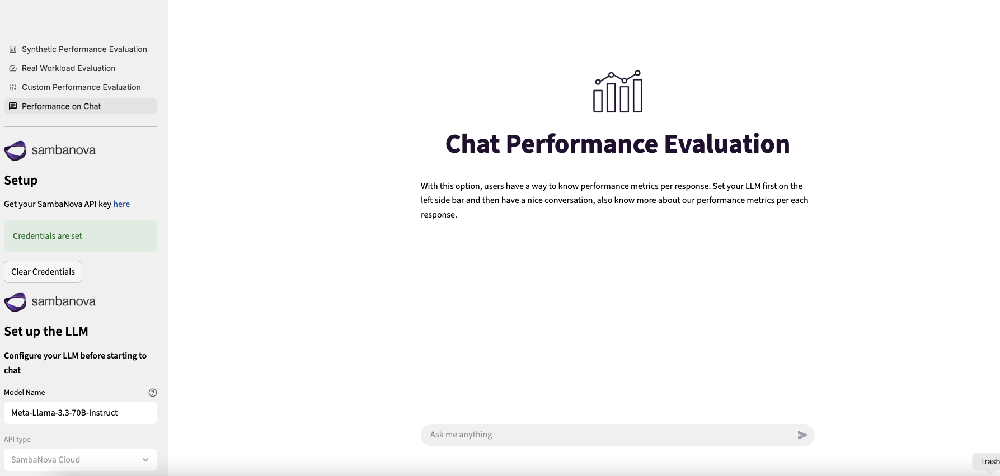

1. Enter a model name and choose the right API type

  Use one of the models displayed in the website. Then, choose `SambaNova Cloud` in the API type dropdown option. E.g. `Meta-Llama-3.3-70B-Instruct`.

2. If the model to benchmark is multimodal, then you can upload an image using the option in the sidebar. (Limit size: 200MB) **Warning!** Multimodal models may activate their guardrails when running benchmarks. Changing prompt may help to solve the issue.

3. Set the configuration parameters

- **Max tokens to generate**: Maximum number of tokens to generate. *Default*: 256
<!-- - **Do sample**: 
- **Repetition penalty**:
- **Temperature**:
- **Top k**:
- **Top p**: -->

4. Start the chat session

After entering the model name and configuring the parameters, press `Run!` to activate the chat session.

5. Ask anything and see results

Users are able to ask anything and get a generated answer to their questions, as shown in the image below. In addition to the back and forth conversations between the user and the LLM, there is a expander option that users can click to see the following metrics per each LLM response:
- **Latency (s)**
- **Throughput (tokens/s)**
- **Time to first token (s)** 

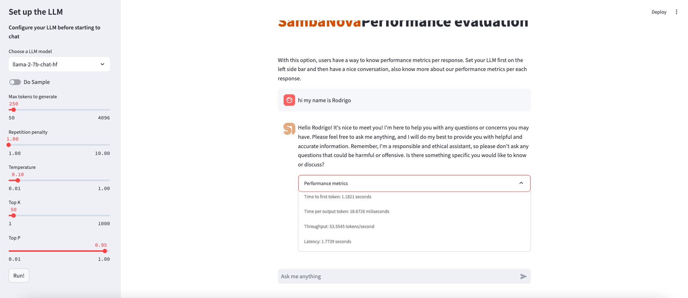
</details>


## CLI Option

This method can be ran from a terminal session. Users have this option if they want to experiment using values that are beyond the limits specified in the Streamlit app parameters. 

If you face any issues or have questions, please visit the Frecuently Asked Questions documentation [here](./FAQ.md).

Run `ulimit -n 4096` once per terminal session before invoking the evaluator, to raise the open-file-descriptor limit for higher-concurrency runs.

**This CLI runs the Kit's own native evaluator** (`benchmarking_tools/kit/src/evaluator.py`). For vLLM or aiperf (including aiperf's AgentX MVP agentic-coding benchmark), those tools are run directly via their own native CLIs instead — see [`vllm/README.md`](./benchmarking_tools/vllm/README.md) and [`aiperf/README.md`](./benchmarking_tools/aiperf/README.md).

**`--mode` is optional and inferred by `benchmarking_tools/kit/src/evaluator.py` itself** from whichever other arguments you give it:

1. `--input-file-path` is given → **custom** (evaluates your own dataset).
2. `--num-concurrent-requests` equals `--num-requests` (or either is omitted) → **synthetic** (fires all requests as one concurrent burst).
3. `--num-concurrent-requests` and `--num-requests` are both given and differ → **real_workload** (paces requests over time according to `--qps`/`--qps-distribution`).

You can also pass `--mode` explicitly to bypass inference. Unrecognized arguments for whichever mode gets picked are ignored (with a note printed to the terminal) rather than erroring, so a caller can pass every mode's flags unconditionally without knowing in advance which mode will run.

`--qps-distribution` accepts `constant`, `uniform`, or `exponential`.

There's a separate editable-variables quickstart script **per mode** — each one passes `--mode` explicitly and only exposes the parameters that actually apply to it (no inference, no dead parameters to second-guess):
- **[`benchmarking_tools/kit/quickstart_synthetic.sh`](./benchmarking_tools/kit/quickstart_synthetic.sh)**
- **[`benchmarking_tools/kit/quickstart_real_workload.sh`](./benchmarking_tools/kit/quickstart_real_workload.sh)**
- **[`benchmarking_tools/kit/quickstart_custom.sh`](./benchmarking_tools/kit/quickstart_custom.sh)**

Edit the variables at the top of whichever one matches your use case, then `cd benchmarking_tools/kit && sh quickstart_<mode>.sh`. The sections below show the equivalent direct `python benchmarking_tools/kit/src/evaluator.py <flags>` invocation for each mode — both are the same evaluator, just two ways of passing it parameters.

<details id="synthetic-dataset">
<summary><strong>Synthetic Dataset</summary></strong>

_Note: Currently we have specific prompting support for GPT, Llama, Gemma, Mistral, Deepseek, Qwen, Solar, and Eeve. Other instruction models can work, but number of tokens may not be close to the ones specified._

1. Set `--num-concurrent-requests` equal to `--num-requests` so the evaluator infers **synthetic** mode (or pass `--mode synthetic` explicitly). Relevant flags:
  - **`--model-names`**: Model name(s) to be used. See section `1. Enter a model name and choose the right API type` in [Synthetic Performance Evaluation](#synthetic-performance-evaluation) for more information about model name.
  - **`--llm-api`**: API type to be chosen.
  - **`--results-dir`**: Path to the results directory. _Default_: "./data/results"
  - **`--num-concurrent-requests`**: Number of concurrent requests, and (together with `--num-requests`) what selects this mode — set it equal to `--num-requests`. _Default_: 16.
  - **`--num-warmup-requests`**: Number of throwaway warm-up requests sent (at the concurrency above) before the measured run. Their results are discarded so server cold-start and batch ramp-up costs don't skew the reported metrics. _Default_: 0 (disabled). It shares the same **timeout** budget as the measured run.
  - **`--timeout`**: Timeout in seconds. _Default_: 600. This is a single budget shared across the warm-up and measured phases — if it is reached during warm-up, the measured run is skipped.
  - **`--num-input-tokens`**: Number of input tokens to include in the request prompts. It's recommended to choose no more than 2000 tokens to avoid long wait times. _Default_: 1000.
  - **`--num-output-tokens`**: Number of output tokens in the generation. It is strongly recommended to set this value to no more than 2000, as most LLMs cannot generate outputs beyond this limit. _Default_: 1000.
  - **`--multimodal-image-size`**: Size of the pre-set image to be used with a **multimodal** model. There are three categories: small (500x500px), medium (1000x1000px) and large (2000x2000px). **Warning!** Multimodal models may activate their guardrails when running benchmarks. Changing the input or output number of tokens may help to solve the issue. If model is not multimodal, then leave the value to na. _Default:_ na.
  - **`--num-requests`**: Number of requests sent. _Default_: 16. _Note_: the program can timeout before all requests are sent. Configure the **Timeout** parameter accordingly.
  - **`--use-multiple-prompts`**: Whether to use multiple prompts selected randomly or a single default prompt. This option is only available on **text instruct** models. Go to [this link](./prompts/user-prompt_template-text_instruct.yaml) if customization is needed. _Default_: False
  - **`--save-llm-responses`**: Whether to save the actual Kit LLM response texts to an output file. The output file will contain the `response_texts` suffix. _Default_: False
  - **`--use-debugging-mode`**: Whether to use the debugging mode or not. WARNING: Debug mode will provide more detailed response at the cost of increased latency. _Default_: False

   To run vLLM instead of (or alongside) Kit for a side-by-side comparison, see [`vllm/README.md`](./benchmarking_tools/vllm/README.md) — it's driven via vLLM's own native CLI.

2. Run it — either edit [`quickstart_synthetic.sh`](./benchmarking_tools/kit/quickstart_synthetic.sh)'s variables and `sh quickstart_synthetic.sh`, or call the evaluator directly:
```shell
python benchmarking_tools/kit/src/evaluator.py \
  --mode synthetic \
  --model-names Meta-Llama-3.3-70B-Instruct \
  --results-dir ./data/results \
  --llm-api sncloud \
  --num-concurrent-requests 16 \
  --num-requests 16 \
  --num-input-tokens 1000 \
  --num-output-tokens 1000 \
  --multimodal-image-size na \
  --use-multiple-prompts False
```
- A progress bar for the Kit evaluation will be shown in the terminal until it completes.

3. Analyze results

- Results will be saved at the location specified in `results-dir`.

  **Kit output files**

  The Kit output file names depend on the model name, number of input/output tokens, and number of concurrent requests. You should see files that follow a similar format to the following:

  ```
  synthetic_<MODEL_IDX>_<MODEL_NAME><MULTIMODAL_SUFFIX>_{NUM_INPUT_TOKENS}_{NUM_OUTPUT_TOKENS}_{NUM_CONCURRENT_REQUESTS}_{MODE}
  ```

  For each Kit run, two files are generated with the following suffixes: `_individual_responses` and `_summary`.

  - Individual responses file

    - This output file contains the number of input and output tokens, number of total tokens, Time To First Token (TTFT), End-To-End Latency (E2E Latency) and Throughput from Server (if available) and Client side, for each individual request sent to the LLM. Users can use this data for further analysis. We provide this notebook `notebooks/analyze-results.ipynb` with some charts that they can use to start.

  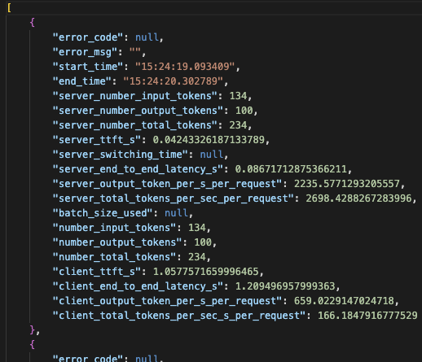

  - Summary file

    - This file includes various statistics such as percentiles, mean and standard deviation to describe the number of input and output tokens, number of total tokens, Time To First Token (TTFT), End-To-End Latency (E2E Latency) and Throughput from Client side. It also provides additional data points that bring more information about the overall run, like inputs used, number of errors, and number of completed requests per minute. 

  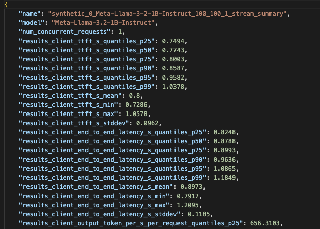

- There's an additional notebook `notebooks/multiple-models-benchmark.ipynb` that will help users on running multiple benchmarks with different experts and gather performance results in one single table. A Bundle endpoint is meant to be used for this analysis.

4. Customize synthetic prompts

Synthetic prompts for performance evaluation can be found [here](./prompts/). You are free to add, modify, or remove prompts as needed. If adding new prompts, please follow the data structure used in the existing ones as a reference.

</details>

<details id="real-workload-dataset">
<summary><strong>Real Workload Dataset</summary></strong>

_Note: Currently we have specific prompting support for GPT, Llama, Gemma, Mistral, Deepseek, Qwen, Solar, and Eeve. Other instruction models can work, but number of tokens may not be close to the ones specified._

1. Set `--num-concurrent-requests` to a value **less than** `--num-requests` so the evaluator infers **real_workload** mode (equal values would infer synthetic mode instead; or pass `--mode real_workload` explicitly). Relevant flags:
  - **`--model-names`**: Model name(s) to be used. See section `1. Enter a model name and choose the right API type` in [Real Workload Evaluation](#real-workload-performance-evaluation) for more information about model name.
  - **`--llm-api`**: API type to be chosen.
  - **`--results-dir`**: Path to the results directory. _Default_: "./data/results"
  - **`--qps`**: the number of queries that will be sent to the endpoint per second. Values QPS<10 are recommended since user can hit rate limits. _Default_: 1
  - **`--qps-distribution`**: the type of wait time distribution in between requests. User can choose the values 'constant', 'uniform', 'exponential'. _Default_: constant
  - **`--num-warmup-requests`**: Number of throwaway warm-up requests sent before the measured run. Their results are discarded so server cold-start and batch ramp-up costs don't skew the reported metrics. _Default_: 0 (disabled). _Note_: warm-up requests are fired together (not paced by **qps**) and share the same **timeout** budget as the measured run.
  - **`--timeout`**: Timeout in seconds. _Default_: 600. This is a single budget shared across the warm-up and measured phases — if it is reached during warm-up, the measured run is skipped.
  - **`--num-input-tokens`**: Number of input tokens to include in the request prompts. It's recommended to choose no more than 2000 tokens to avoid long wait times. _Default_: 1000.
  - **`--num-output-tokens`**: Number of output tokens in the generation. It's recommended to choose no more than 2000 tokens to avoid long wait times. _Default_: 1000.
  - **`--multimodal-image-size`**: Size of the pre-set image to be used with a **multimodal** model. There are three categories: small (500x500px), medium (1000x1000px) and large (2000x2000px). **Warning!** Multimodal models may activate their guardrails when running benchmarks. Changing the input or output number of tokens may help to solve the issue. If model is not multimodal, then leave the value to na. _Default:_ na.
  - **`--num-requests`**: Number of requests sent. _Default_: 16. _Note_: the program can timeout before all requests are sent. Configure the **Timeout** parameter accordingly.
  - **`--use-debugging-mode`**: Whether to use the debugging mode or not. WARNING: Debug mode will provide more detailed response at the cost of increased latency. _Default_: False

2. Run it — either edit [`quickstart_real_workload.sh`](./benchmarking_tools/kit/quickstart_real_workload.sh)'s variables and `sh quickstart_real_workload.sh`, or call the evaluator directly (note: real_workload has no `--num-concurrent-requests` flag at all — QPS pacing is open-loop, there's no concurrency cap to set):
```shell
python benchmarking_tools/kit/src/evaluator.py \
  --mode real_workload \
  --model-names Meta-Llama-3.3-70B-Instruct \
  --results-dir ./data/results \
  --llm-api sncloud \
  --qps 1 \
  --qps-distribution constant \
  --num-requests 16 \
  --num-input-tokens 1000 \
  --num-output-tokens 1000 \
  --multimodal-image-size na
```
- The evaluation process will start and a progress bar will be shown until it's complete.

3. Analyze results

- Results will be saved at the location specified in `results-dir`.
- The name of the output files will depend on the input file name, mode name, and number of concurrent requests. You should see files that follow a similar format to the following:

```
realworkload_<MODEL_IDX>_<MODEL_NAME><MULTIMODAL_SUFFIX>_{NUM_INPUT_TOKENS}_{NUM_OUTPUT_TOKENS}_{QPS}_{QPS_DISTRIBUTION}_{MODE}
```

- For each run, two files are generated with the following suffixes in the output file names: `_individual_responses` and `_summary`.
  
  - Individual responses file

    - This output file contains the number of input and output tokens, number of total tokens, Time To First Token (TTFT), End-To-End Latency (E2E Latency) and Throughput from Server (if available) and Client side, for each individual request sent to the LLM. Users can use this data for further analysis. We provide this notebook `notebooks/analyze-results.ipynb` with some charts that they can use to start.

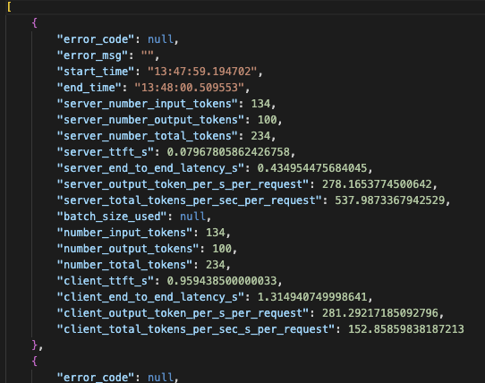

  - Summary file

    - This file includes various statistics such as percentiles, mean and standard deviation to describe the number of input and output tokens, number of total tokens, Time To First Token (TTFT), End-To-End Latency (E2E Latency) and Throughput from Client side. It also provides additional data points that bring more information about the overall run, like inputs used, number of errors, and number of completed requests per minute. 

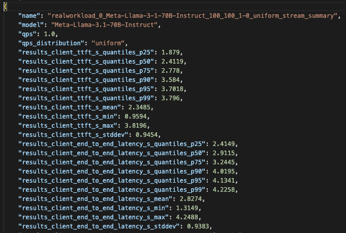

- There's an additional notebook `notebooks/multiple-models-benchmark.ipynb` that will help users on running multiple benchmarks with different experts and gather performance results in one single table. A Bundle endpoint is meant to be used for this analysis. 

4. Customize synthetic prompts

Synthetic prompts for performance evaluation can be found [here](./prompts/). You are free to add, modify, or remove prompts as needed. If adding new prompts, please follow the data structure used in the existing ones as a reference.

</details>

<details id="custom-dataset">
<summary><strong>Custom Dataset</summary></strong>

_Note: Currently we have specific prompting support for GPT, Llama, Gemma, Mistral, Deepseek, Qwen, Solar, and Eeve. Other instruction models can work, but number of tokens may not be close to the ones specified._

1. Passing `--input-file-path` is what makes the evaluator infer **custom** mode, taking priority over the synthetic/real_workload inference above (or pass `--mode custom` explicitly). Relevant flags:
  - **`--model-names`**: Model name(s) to be used — space-separated for multiple models, each run sequentially. See section `1. Enter a model name and choose the right API type` in [Synthetic Performance Evaluation](#synthetic-performance-evaluation) for more information about model name.
  - **`--llm-api`**: API type to be chosen.
  - **`--results-dir`**: Path to the results directory. _Default_: "./data/results"
  - **`--num-concurrent-requests`**: Number of concurrent requests. _Default_: 16
  - **`--num-warmup-requests`**: Number of throwaway warm-up requests sent (at the concurrency above) before the measured run. Their results are discarded so server cold-start and batch ramp-up costs don't skew the reported metrics. _Default_: 0 (disabled). _Note_: warm-up shares the same **timeout** budget as the measured run.
  - **`--timeout`**: Timeout in seconds. _Default_: 600. This is a single budget shared across the warm-up and measured phases — if it is reached during warm-up, the measured run is skipped.
  - **`--input-file-path`**: The location of the custom dataset that you want to evaluate with. You can take as example the file [in here.](./prompts/custom_prompt_example.jsonl)
  - **`--save-llm-responses`**: Whether to save the actual outputs of the LLM to an output file. The output file will contain the `response_texts` suffix.
  - **`--sampling-params`**: JSON string of sampling parameters sent with each request. **Must include `max_tokens_to_generate`** for custom mode (e.g. `'{"max_tokens_to_generate": 256}'`) — unlike synthetic/real_workload, custom mode has no `--num-output-tokens` flag to derive a default from, so passing `'{}'` fails every request with a `KeyError`.
  - **`--use-debugging-mode`**: Whether to use the debugging mode or not. WARNING: Debug mode will provide more detailed response at the cost of increased latency. _Default_: False

2. Run it — either edit [`quickstart_custom.sh`](./benchmarking_tools/kit/quickstart_custom.sh)'s variables and `sh quickstart_custom.sh`, or call the evaluator directly:
```shell
python benchmarking_tools/kit/src/evaluator.py \
  --mode custom \
  --model-names Meta-Llama-3.3-70B-Instruct \
  --results-dir ./data/results \
  --llm-api sncloud \
  --num-concurrent-requests 16 \
  --input-file-path ./prompts/custom_prompt_example.jsonl \
  --sampling-params '{"max_tokens_to_generate": 256}'
```
- The evaluation process will start and a progress bar will be shown until it's complete.

3. Analyze results

- Results will be saved at the location specified in `results-dir`.
- The name of the output files will depend on the input file name, mode name, and number of concurrent requests. You should see files that follow a similar format to the following:

```
custom_<MODEL_NAME>_{FILE_NAME}_{NUM_CONCURRENT_REQUESTS}_{MODE}
```

- For each run, two files are generated with the following suffixes in the output file names: `_individual_responses` and `_summary`.
  
  - Individual responses file

    - This output file contains the number of input and output tokens, number of total tokens, Time To First Token (TTFT), End-To-End Latency (E2E Latency) and Throughput from Server (if available) and Client side, for each individual request sent to the LLM. Users can use this data for further analysis. We provide this notebook `notebooks/analyze-results.ipynb` with some charts that they can use to start.

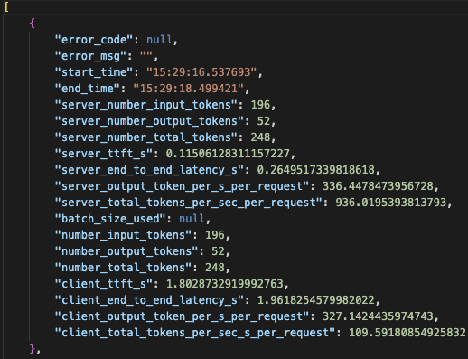

  - Summary file

    - This file includes various statistics such as percentiles, mean and standard deviation to describe the number of input and output tokens, number of total tokens, Time To First Token (TTFT), End-To-End Latency (E2E Latency) and Throughput from Client side. It also provides additional data points that bring more information about the overall run, like inputs used, number of errors, and number of completed requests per minute. 

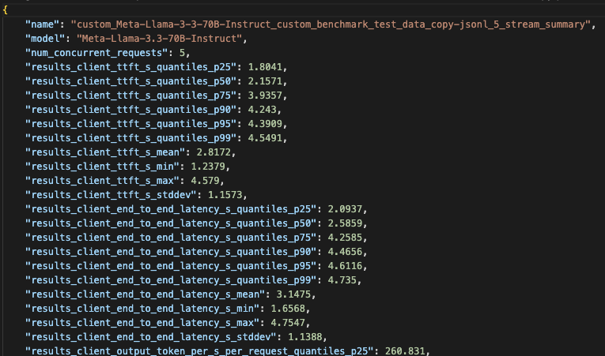
</details>

# Third-party tools and data sources 

All the packages/tools used by the Kit's own evaluator are listed in the `requirements.txt` file in the project directory.

Two other benchmarking tools are run directly via their own native CLIs (not wrapped by this Kit):
- **vLLM** (`vllm bench serve`) — see [`vllm/README.md`](./benchmarking_tools/vllm/README.md).
- **aiperf** (NVIDIA's `aiperf`, including the AgentX MVP agentic-coding benchmark) — see [`aiperf/README.md`](./benchmarking_tools/aiperf/README.md).

# TroubleShooting

1. A Frequently Asked Questions (FAQ) document is available [here](FAQ.md)
. It covers common questions about the kit, including troubleshooting guidance.
2. If you encounter issues after updating:
Verify your virtual environment and reinstall dependencies from requirements.txt.
If the issue persists, delete your existing environment and create a new one, reinstalling packages with pip install --force-reinstall.
If problems continue, consider switching to a different package manager such as pip, conda, or uv.
3. There is a [known issue with macOS on Intel chips and PyTorch](https://dev-discuss.pytorch.org/t/pytorch-macos-x86-builds-deprecation-starting-january-2024/1690?utm_source=chatgpt.com)
. We recommend recreating your virtual environment or trying one of the alternative package managers mentioned above.