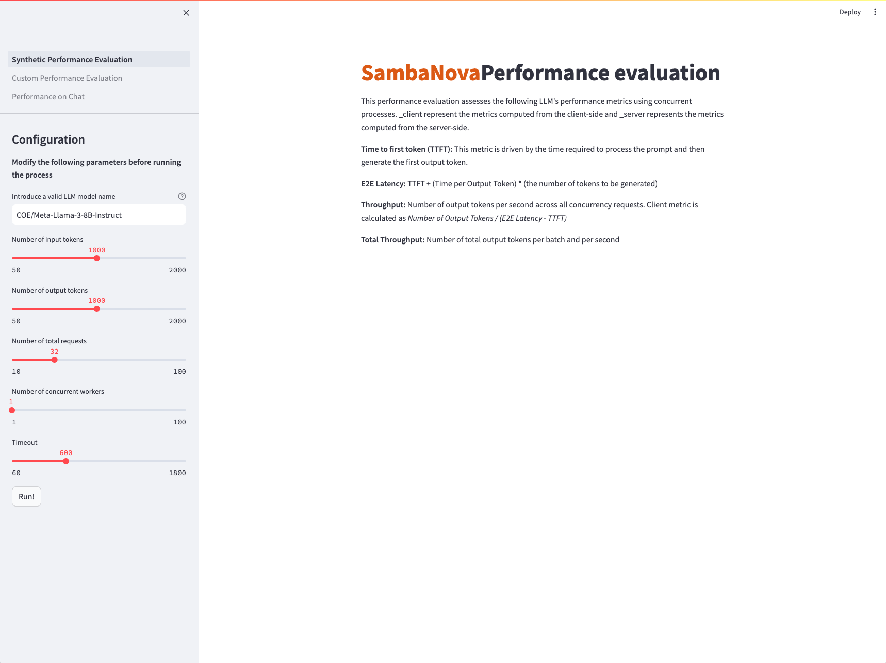

<a href="https://sambanova.ai/">
<picture>
 <source media="(prefers-color-scheme: dark)" srcset="../images/SambaNova-light-logo-1.png" height="60">
  
</picture>
</a>

Benchmarking
======================

<!-- TOC -->

- [Benchmarking](#benchmarking)
- [Overview](#overview)
- [Before you begin](#before-you-begin)
  - [Clone this repository](#clone-this-repository)
  - [Set up the inference endpoint, and environment variables](#set-up-the-inference-endpoint-and-environment-variables)
  - [Create the (virtual) environment](#create-the-virtual-environment)
- [Use the starter kit](#use-the-starter-kit)
  - [GUI Option](#gui-option)
    - [Deploy the starter kit GUI](#deploy-the-starter-kit-gui)
    - [Full Walkthrough](#full-walkthrough)
      - [Synthetic Performance Evaluation](#synthetic-performance-evaluation)
      - [Custom Performance Evaluation](#custom-performance-evaluation)
      - [Performance on Chat](#performance-on-chat)
  - [CLI Option](#cli-option)
    - [Custom Dataset](#custom-dataset)
    - [Synthetic Dataset](#synthetic-dataset)
- [Third-party tools and data sources](#third-party-tools-and-data-sources)

<!-- /TOC -->

# Overview

This AI Starter Kit evaluates the performance of different LLM models hosted in SambaStudio. It allows users to configure various LLMs with diverse parameters, enabling experiments to not only generate different outputs but also measurement metrics simultaneously. The Kit includes:
- Configurable SambaStudio and SambanNova Cloud connectors. The connectors generate answers from a deployed model.
- An app with three functionalities:
    - A synthetic performance evaluation process with configurable options that users will utilize to obtain and compare different metrics over synthetic data generated by the app.
    - A custom performance evaluation process with configurable options that users will utilize to obtain and compare different metrics over their own customed prompts. 
    - A chat interface with configurable options that users will set to interact and get performance metrics
- A couple of bash scripts that are the core of the performance evaluations and provide more flexibility to users

This sample is ready-to-use. We provide:
- Instructions for setup with SambaStudio or SambaNova Cloud
- Instructions for running the model as-is
- Instructions for customizing the model
   
# Before you begin

To perform this setup, you must be a SambaNova customer with a SambaStudio account or have a SambaNova Cloud API key (more details in the following sections). You also have to set up your environment before you can run or customize the starter kit. 

_These steps assume a Mac/Linux/Unix shell environment. If using Windows, you will need to adjust some commands for navigating folders, activating virtual environments, etc._

## Clone this repository

Clone the starter kit repo.
```bash
git clone https://github.com/sambanova/ai-starter-kit.git
```

## Set up the inference endpoint, and environment variables

The next step is to set up your environment variables to use one of the models available from SambaNova. If you're a current SambaNova customer, you can deploy your models with SambaStudio. If you are not a SambaNova customer, you can self-service provision API endpoints using SambaNova Cloud.

- If using **SambaNova Cloud** Please follow the instructions [here](../README.md#use-sambanova-cloud-option-1) for setting up your environment variables.

- If using **SambaStudio** Please follow the instructions [here](../README.md#use-sambastudio-option-2) for setting up endpoint and your environment variables. 
_Note: In case you're using a **SambaStudio Turbo** endpoint, please update the URL variable and include `api/v2` like the following to ensure the use of dynamic batching:_
``` bash
SAMBASTUDIO_URL="https://api-stage.sambanova.net/api/v2/predict/generic/12345678-9abc-def0-1234-56789abcdef0/456789ab-cdef-0123-4567-89abcdef0123"
```

## Create the (virtual) environment
1. (Recommended) Create a virtual environment and activate it (python version 3.11 recommended): 
    ```bash
    python<version> -m venv <virtual-environment-name>
    source <virtual-environment-name>/bin/activate
    ```

2. Install the required dependencies:
    ```bash
    cd benchmarking # If not already in the benchmarking folder
    pip install -r requirements.txt
    ```

# Use the starter kit

When using the benchmarking starter kit, you have two options for running the program:

- [*GUI Option*](#gui-option): This option contains plots and configurations from a web browser.
- [*CLI Option*](#cli-option): This option allows you to run the program from the command line and provides more flexibility.


## GUI Option

The GUI for this starter kit uses Streamlit, a Python framework for building web applications. This method is useful for analyzing outputs in a graphical manner since the results are shown via plots in the UI.

### Deploy the starter kit GUI

Ensure you are in the `benchmarking` folder and run the following command:

```shell
streamlit run streamlit/app.py --browser.gatherUsageStats false 
```

After deploying the starter kit, you will see the following user interface:



### Full Walkthrough

There are 3 options on the left side bar for running the benchmarking tool. Pick the walkthrough that best suits your needs.

<details id="synthetic-performance-evaluation">
<summary><strong>Synthetic Performance Evaluation</strong></summary>

This option allows you to evaluate the performance of the selected LLM on synthetic data generated by this benchmarking tool.

1. Enter a model name and choose the right API type

     _Note: Currently we have specific prompting support for Llama2, Llama3, Mistral, Deepseek, Solar, and Eeve. Other instruction models can work, but number of tokens may not be close to the ones specified._

  - If the model specified is a CoE, specify the desired expert in the Model Name text box.
    - The model name should mirror the name shown in studio, preceded with `COE/` 
    - For example, the Samba-1 Turbo Llama-3-8B expert in studio is titled `Meta-Llama-3-8B-Instruct` so my model name would be `COE/Meta-Llama-3-8B-Instruct`.
  - If the model is a standalone model, enter the full model name shown on the model card. E.g. `Llama-2-70b-chat-hf`.
  - If the model is a SambaNova Cloud one, then be aware of the right model names used. Then, choose `SambaNova Cloud` in the API type dropdown option.
    - For example, the Llama-3-8B model in SambaNova Cloud is titled `llama3-8b` so that will be the model name.

2. Set the configuration parameters

- **Number of input tokens**: The number of input tokens in the generated prompt. *Default*: 1000.
- **Number of output tokens**: The number of output tokens the LLM can generate. *Default*: 1000.
- **Number of total requests**: Number of requests sent. *Default*: 32. *Note*: the program can timeout before all requests are sent. Configure the **Timeout** parameter accordingly.
- **Number of concurrent requests**: The number of concurrent requests. *Default*: 1. For testing [batching-enabled models](https://docs.sambanova.ai/sambastudio/latest/dynamic-batching.html), this value should be greater than the largest batch_size one needs to test. The typical batch sizes that are supported are 1,4,8 and 16.
- **Timeout**: Number of seconds before program times out. *Default*: 600 seconds

3. Run the performance evaluation

- Click the `Run!` button. This will start the program and a progress bar will be shown in the UI.
- Depending on the parameter configurations, it should take between 1 min and 10 min. 

4. Analyze results

    _Note: Not all model endpoints currently support the calculation of server-side statistics. Depending on your choice of endpoint, you may see either client and server information, or you may see just the client-side information._

    **Plots**

    The plots compare (if available) the following:

    - **Server metrics**: These are performance metrics from the Server API. 
    - **Client metrics**: These are performance metrics computed on the client side / local machine.
    
    Additionally, if the endpoint supports dynamic batching, the plots will show per-batch metrics.

    The results are composed of five plots:

    - ```Distribution of TTFT by batch size```: This bar plot shows the median Time to First Token (TTFT) in a bold colored horizontal line, and a rectangular area representing the range between the 5th and 95th percentile. One should see higher values and higher variance in the client-side metrics compared to the server-side metrics. This difference is mainly due to the request waiting in the queue to be served (for concurrent requests), which is not included in server-side metrics. 

    - ```Distribution of end-to-end latency by batch size```: This bar plot shows the median end-to-end latency in a bold colored horizontal line, and a rectangular area representing the range between the 5th and 95th percentile. One should see higher values and higher variance in the client-side metrics compared to the server-side metrics. This difference is also mainly due to the request waiting in the queue to be served (for concurrent requests), which is not included in server-side metrics. 

    - ```Distribution of output throughput by batch size``` plot: This bar plot shows the median number of **output** tokens per second per request in a bold colored horizontal line, and a rectangular area representing the range between the 5th and 95th percentile. One should see good agreement between the client and server-side metrics. For endpoints that support dynamic batching, one should see a decreasing trend in metrics as the batch size increases.

    - ```Total output throughput per batch size```: This bar plot shows the median total tokens generated per second per batch in a bold colored horizontal line, and a rectangular area representing the range between the 5th and 95th percentile. One should see good agreement between the client and server-side metrics. This metric will calculate the same values as the previous metric for batch size = 1. However, for batch size > 1, it is estimated as the average of ```Output throughput by batch size * Batch size``` for each batch, to account for more generated tokens due to concurrent requests being served in batch mode.

    - ```LLM requests across time```: This gantt plot shows the duration of the TTFT and end-to-end latency per request in a timeline. One should expect latencies considerably greater than TTFTs, and multiple bars starting at the same time as number of concurrent requests specified. In addition, if the endpoint allows dynamic batching, one could see grouped bars according to the batch sizes supported.

5. Synthetic Performance common examples
    1. Dynamic batching speed  

        Parameters:
        - Model name: COE/Meta-Llama-3.1-70B-Instruct
        - API type: SambaStudio
        - Number of input tokens: 250
        - Number of output tokens: 250
        - Number of total requests: 80
        - Number of concurrent requests: 20
        - Timeout: 600
          
        Results:

        
        
        
        
        
      
    2. High input and ouput tokens

        Parameters:
        - Model name: COE/Meta-Llama-3.1-70B-Instruct
        - API type: SambaStudio
        - Number of input tokens: 2000
        - Number of output tokens: 2000
        - Number of total requests: 80
        - Number of concurrent requests: 25
        - Timeout: 600

        Results:

        
        
        
        
        

    3. Running multiple concurrent requests

        Parameters:
        - Model name: COE/Meta-Llama-3.1-70B-Instruct
        - API type: SambaStudio
        - Number of input tokens: 250
        - Number of output tokens: 250
        - Number of total requests: 1000
        - Number of concurrent requests: 100
        - Timeout: 600

        Results:
        
        
        
        
        
        

  </details>

<details id="custom-performance-evaluation">
<summary><strong>Custom Performance Evaluation</strong></summary>

This option allows you to evaluate the performance of the selected LLM on your own custom dataset. The interface should look like this:


1. Prep your dataset

- The dataset needs to be in `.jsonl` format - these means a file with one JSON object per line.
- Each JSON object should have a `prompt` key with the value being the prompt you want to pass to the LLM.
  - You can use a different keyword instead of `prompt`, but it's important that all your JSON objects use the same key

2. Enter the dataset path

- The entered path should be an absolute path to your dataset.
  - For example: `/Users/johndoe/Documents/my_dataset.jsonl`

3. Enter a model name and choose the right API type

    _Note: Currently we have specific prompting support for Llama2, Llama3, Mistral, Deepseek, Solar, and Eeve. Other instruction models can work, but number of tokens may not be close to the ones specified.

  - If the model specified is a CoE, specify the desired expert in the Model Name text box.
    - The model name should mirror the name shown in studio, preceded with `COE/` - 
    - For example, the Samba-1 Turbo Llama-3-8B expert in studio is titled `Meta-Llama-3-8B-Instruct` so my model name would be `COE/Meta-Llama-3-8B-Instruct`.
  - If the model is a standalone model, enter the full model name shown on the model card. I.e. `Llama-2-70b-chat-hf`.
  - If the model is a SambaNova Cloud one, then be aware of the right model names used. Then, choose `SambaNova Cloud` in the API type dropdown option.
    - For example, the Llama-3-8B model in SambaNova Cloud is titled `llama3-8b` so that will be the model name

4. Set the configuration and tuning parameters

- **Number of concurrent requests**: The number of concurrent requests. *Default*: 1. For testing [batching-enabled models](https://docs.sambanova.ai/sambastudio/latest/dynamic-batching.html), this value should be greater than the largest batch_size one needs to test. The typical batch sizes that are supported are 1,4,8 and 16.
- **Timeout**: Number of seconds before program times out. *Default*: 600 seconds
- **Max Output Tokens**: Maximum number of tokens to generate. *Default*: 256
- **Save LLM Responses**: Whether to save the actual outputs of the LLM to an output file. The output file will contain the `response_texts` suffix.

5. Analyze results

    _Note: Not all model endpoints currently support the calculation of server-side statistics. Depending on your choice of endpoint, you may see either client and server information, or you may see just the client-side information._

    **Plots**

    The plots compare (if available) the following:

    - **Server metrics**: These are performance metrics from the Server API. 
    - **Client metrics**: These are performance metrics computed on the client side / local machine.
    
    Additionally, if the endpoint supports dynamic batching, the plots will show per-batch metrics.

    The results are composed of five plots:

    - ```Distribution of end-to-end latency by batch size```: This bar plot shows the median end-to-end latency in a bold colored horizontal line, and a rectangular area representing the range between the 5th and 95th percentile. One should see higher values and higher variance in the client-side metrics compared to the server-side metrics. This difference is also mainly due to the request waiting in the queue to be served (for concurrent requests), which is not included in server-side metrics. 

    - ```Distribution of output throughput by batch size``` plot: This bar plot shows the median number of **output** tokens per second per request in a bold colored horizontal line, and a rectangular area representing the range between the 5th and 95th percentile. One should see good agreement between the client and server-side metrics. For endpoints that support dynamic batching, one should see a decreasing trend in metrics as the batch size increases.

    - ```Total output throughput per batch size```: This bar plot shows the median total tokens generated per second per batch in a bold colored horizontal line, and a rectangular area representing the range between the 5th and 95th percentile. One should see good agreement between the client and server-side metrics. This metric will calculate the same values as the previous metric for batch size = 1. However, for batch size > 1, it is estimated as the average of ```Output throughput by batch size * Batch size``` for each batch, to account for more generated tokens due to concurrent requests being served in batch mode.

    - ```LLM requests across time```: This gantt plot shows the duration of the TTFT and end-to-end latency per request in a timeline. One should expect latencies considerably greater than TTFTs, and multiple bars starting at the same time as number of concurrent requests specified. In addition, if the endpoint allows dynamic batching, one could see grouped bars according to the batch sizes supported.
</details>

<details id="performance-on-chat">
<summary><strong>Performance on Chat</strong></summary>

This option allows you to measure performance during a multi-turn conversation with an LLM. The interface should look like this:


1. Enter a model name and choose the right API type

  - If the model specified is a CoE, specify the desired expert in the Model Name text box.
    - The model name should mirror the name shown in studio, preceded with `COE/` - 
    - For example, the Samba-1 Turbo Llama-3-8B expert in studio is titled `Meta-Llama-3-8B-Instruct` so my model name would be `COE/Meta-Llama-3-8B-Instruct`.
  - If the model is a standalone model, enter the full model name shown on the model card. I.e. `Llama-2-70b-chat-hf`.
  - If the model is a SambaNova Cloud one, then be aware of the right model names used. Then, choose `SambaNova Cloud` in the API type dropdown option.
    - For example, the Llama-3-8B model in SambaNova Cloud is titled `llama3-8b` so that will be the model name

2. Set the configuration parameters

- **Max tokens to generate**: Maximum number of tokens to generate. *Default*: 256
<!-- - **Do sample**: 
- **Repetition penalty**:
- **Temperature**:
- **Top k**:
- **Top p**: -->

3. Start the chat session

After entering the model name and configuring the parameters, press `Run!` to activate the chat session.

4. Ask anything and see results

Users are able to ask anything and get a generated answer to their questions, as shown in the image below. In addition to the back and forth conversations between the user and the LLM, there is a expander option that users can click to see the following metrics per each LLM response:
- **Latency (s)**
- **Throughput (tokens/s)**
- **Time to first token (s)**


</details>


## CLI Option

This method can be ran from a terminal session. Users have this option if they want to experiment using values that are beyond the limits specified in the Streamlit app parameters. You have two options for running the program from terminal:

<details id="custom-dataset">
<summary><strong>Custom Dataset</summary></strong>

_Note: Currently we have specific prompting support for Llama2, Llama3, Mistral, Deepseek, Solar, and Eeve. Other instruction models can work, but number of tokens may not be close to the ones specified._

1. Open the file `run_custom_dataset.sh` and configure the following parameters:
  - **model-name**: Model name to be used. If it's a COE model, add "COE/" prefix to the name. Example: "COE/Meta-Llama-3-8B-Instruct"
  - **llm-api**: API type to be chosen. If it's a SambaNova Cloud model, double check the right model name spelling because it's shorter than other SambaStudio model names.
  - **results-dir**: Path to the results directory. _Default_: "./data/results/llmperf"
  - **num-concurrent-requests**: Number of concurrent requests. _Default_: 1
  - **timeout**: Timeout in seconds. _Default_: 600
  - **input-file-path**: The location of the custom dataset that you want to evaluate with
  - **save-llm-responses**: Whether to save the actual outputs of the LLM to an output file. The output file will contain the `response_texts` suffix.

  _Note_: You should leave the `--mode` parameter untouched - this indicates what dataset mode to use. 

2. Run the script

- Run the following command in your terminal:
```shell
sh run_custom_dataset.sh
```
- The evaluation process will start and a progress bar will be shown until it's complete.

3. Analyze results

- Results will be saved at the location specified in `results-dir`.
- The name of the output files will depend on the input file name, mode name, and number of concurrent requests. You should see files that follow a similar format to the following:

```
<MODEL_NAME>_{FILE_NAME}_{NUM_CONCURRENT_REQUESTS}_{MODE}
```
- For each run, two files are generated with the following suffixes in the output file names: `_individual_responses` and `_summary`.
  
  - Individual responses file

    - This output file contains the number of input and output tokens, number of total tokens, Time To First Token (TTFT), End-To-End Latency (E2E Latency) and Throughput from Server (if available) and Client side, for each individual request sent to the LLM. Users can use this data for further analysis. We provide this notebook `notebooks/analyze-token-benchmark-results.ipynb` with some charts that they can use to start.


  - Summary file

    - This file includes various statistics such as percentiles, mean and standard deviation to describe the number of input and output tokens, number of total tokens, Time To First Token (TTFT), End-To-End Latency (E2E Latency) and Throughput from Client side. It also provides additional data points that bring more information about the overall run, like inputs used, number of errors, and number of completed requests per minute. 


</details>

<details id="synthetic-dataset">
<summary><strong>Synthetic Dataset</summary></strong>

_Note: Currently we have specific prompting support for Llama2, Llama3, Mistral, Deepseek, Solar, and Eeve. Other instruction models can work, but number of tokens may not be close to the ones specified._

1. Open the file `run_synthetic_dataset.sh` and configure the following parameters:
  - **model-name**: Model name to be used. If it's a COE model, add "COE/" prefix to the name. Example: "COE/Meta-Llama-3-8B-Instruct"
  - **llm-api**: API type to be chosen. If it's a SambaNova Cloud model, double check the right model name spelling because it's shorter than other SambaStudio model names.
  - **results-dir**: Path to the results directory. _Default_: "./data/results/llmperf"
  - **num-concurrent-requests**: Number of concurrent requests. _Default_: 1
  - **timeout**: Timeout in seconds. _Default_: 600
  - **num-input-tokens**: Number of input tokens to include in the request prompts. It's recommended to choose no more than 2000 tokens to avoid long wait times. _Default_: 1000.
  - **num-output-tokens**: Number of output tokens in the generation. It's recommended to choose no more than 2000 tokens to avoid long wait times. _Default_: 1000.
  - **num-requests**: Number of requests sent. _Default_: 16. _Note_: the program can timeout before all requests are sent. Configure the **Timeout** parameter accordingly.

   _Note_: You should leave the `--mode` parameter untouched - this indicates what dataset mode to use.

2. Run the script

- Run the following command in your terminal:
```shell
sh run_synthetic_dataset.sh
```
- The evaluation process will start and a progress bar will be shown until it's complete.

3. Analyze results

- Results will be saved at the location specified in `results-dir`.
- The name of the output files will depend on the input file name, mode name, and number of concurrent requests. You should see files that follow a similar format to the following:

```
<MODEL_NAME>_{NUM_INPUT_TOKENS}_{NUM_OUTPUT_TOKENS}_{NUM_CONCURRENT_REQUESTS}_{MODE}
```

- For each run, two files are generated with the following suffixes in the output file names: `_individual_responses` and `_summary`.
  
  - Individual responses file

    - This output file contains the number of input and output tokens, number of total tokens, Time To First Token (TTFT), End-To-End Latency (E2E Latency) and Throughput from Server (if available) and Client side, for each individual request sent to the LLM. Users can use this data for further analysis. We provide this notebook `notebooks/analyze-token-benchmark-results.ipynb` with some charts that they can use to start.


  - Summary file

    - This file includes various statistics such as percentiles, mean and standard deviation to describe the number of input and output tokens, number of total tokens, Time To First Token (TTFT), End-To-End Latency (E2E Latency) and Throughput from Client side. It also provides additional data points that bring more information about the overall run, like inputs used, number of errors, and number of completed requests per minute. 


- There's an additional notebook `notebooks/multiple-models-benchmark.ipynb` that will help users on running multiple benchmarks with different experts and gather performance results in one single table. A COE endpoint is meant to be used for this analysis. 
</details>


# Third-party tools and data sources 

All the packages/tools are listed in the `requirements.txt` file in the project directory.

# TroubleShooting

1. ModuleNotFoundError: No module named 'st_pages'

If you come across this error, please restart your vscode or venv in order for the module to be found.

<!-- JS scripts -->
<script>
function openDetails(id) {
  const details = document.getElementById(id);
  if (details && !details.open) {
    details.open = true;  
  }
}
</script>