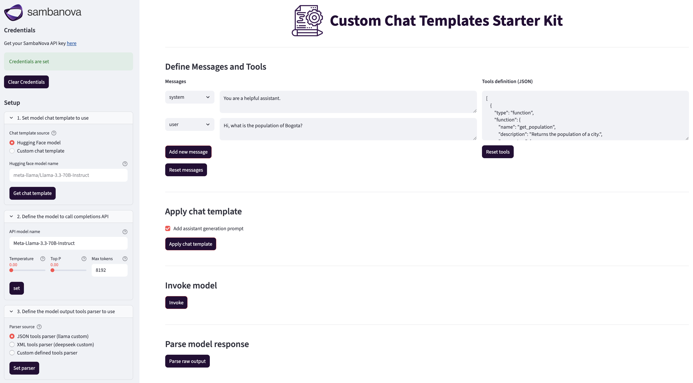

<a href="https://sambanova.ai/">
<picture>
 <source media="(prefers-color-scheme: dark)" srcset="../images/SambaNova-light-logo-1.png" height="100">
  
</picture>
</a>

Custom Chat Templates

Questions? Just <a href="https://discord.gg/54bNAqRw" target="_blank">message us</a> on Discord <a href="https://discord.gg/54bNAqRw" target="_blank"></a> or <a href="https://github.com/sambanova/ai-starter-kit/issues/new/choose" target="_blank">create an issue</a> in GitHub. We're happy to help live!

<!-- TOC -->

- [1. Overview](#1-overview)
- [2. Workflow](#2-workflow)
- [3. Before you begin](#3-before-you-begin)
  - [3.1. Clone this repository](#31-clone-this-repository)
  - [3.2. Set up the required environment variables](#32-set-up-the-required-environment-variables)
- [4. Deploy the starter kit GUI](#4-deploy-the-starter-kit-gui)
- [5. Use the starter kit:](#5-use-the-starter-kit)
  - [5.1 Select or define a chat template](#51-select-or-define-a-chat-template)
  - [5.2 Set the SambaNova model to use](#52-set-the-sambanova-model-to-use)
  - [5.3 Set the Output parser to use](#53-set-the-output-parser-to-use)
  - [5.4 Add messages and tools](#54-add-messages-and-tools)
  - [5.5 Render and apply the chat template](#55-render-and-apply-the-chat-template)
  - [5.6 Invoke the SambaNova Completions API](#56-invoke-the-sambanova-completions-api)
  - [5.7 Parse model output](#57-parse-model-output)
- [6. Explore the notebook workflow](#6-explore-the-notebook-workflow)
- [7. Third-party tools and data sources](#7-third-party-tools-and-data-sources)

<!-- /TOC -->

# 1. Overview

This AI Starter Kit demonstrates how modern chat models use Jinja-based chat templates to format conversations, invoke completion APIs, and parse structured tool-call outputs.

It includes:

- A Streamlit app for interactive exploration of chat templates.

- A complete notebook that walks step-by-step from chat message structure -> template rendering -> API call -> parser output.

- Default implementations for both JSON (Llama-style) and XML (DeepSeek-style) tool call parsing.

- Support for custom user-defined templates and parsers.

This kit helps you understand the end-to-end message formatting workflow behind instruction-tuned models.

# 2. Workflow

The following diagram illustrates the complete workflow when using Custom Chat Templates.
It highlights how conversation data moves from a structured list of messages and tools, through Jinja template rendering, model inference, and finally into structured assistant message response via output parsing.

```mermaid
flowchart LR

A[Instruction role<br/>messages and tools] 
  -->|"messages[]<br/>+ tools[]"| B[Apply Jinja<br/>chat template]

B -->|"rendered prompt<br/>raw string"| C[Send prompt<br/>to SambaNova<br/>Completions API]

C -->|"raw string response<br/>from model"| D[Apply parser<br/>convert raw text<br/>to structured data]

D -->|"assistant message<br/>dict"| E[Final Assistant<br/> structured message]

style A fill:#E6F0FF,stroke:#3366cc,stroke-width:1px,rx:6px,ry:6px
style B fill:#FFF8DC,stroke:#bfa500,stroke-width:1px,rx:6px,ry:6px
style C fill:#E4C6Fc,stroke:#A287D0,stroke-width:1px,rx:6px,ry:6px
style D fill:#FFF8DC,stroke:#bfa500,stroke-width:1px,rx:6px,ry:6px
style E fill:#E6F0FF,stroke:#3366cc,stroke-width:1px,rx:6px,ry:6px

```



# 3. Before you begin

You have to set up your environment before you can run or customize the starter kit.

## 3.1. Clone this repository

Clone the starter kit repo.

```bash
git clone https://github.com/sambanova/ai-starter-kit.git 
```

## 3.2. Set up the required environment variables 

The next step is to set up your environment variables to use one of the inference models available from SambaNova. You can obtain a free API key through SambaCloud.

Follow the instructions [here](../README.md#getting-a-sambanova-api-key-and-setting-your-generative-models) to set up your environment variables.

Additionally set a Hugging Face token, that is required to download tokenizer configurations and chat templates from gated models such as the Llama families.
Get it by logging into your Hugging Face account and visiting https://huggingface.co/settings/tokens.

Click “New token”, give it a name (e.g. sambanova_kit), and copy the generated string in your .env file.

# 4. Deploy the starter kit GUI

We recommend that you run the starter kit in a virtual environment or use a container. We also recommend using Python >= 3.10 and <= 3.12.

1. Install and update pip.

    ```bash
    cd ai-starter-kit/chat_templates
    python3 -m venv chat_templates_env
    source chat_templates_env/bin/activate
    pip  install  -r  requirements.txt
    ```

2. Run the following command:

   ```bash
   streamlit run streamlit/app.py --browser.gatherUsageStats false 
   ```

After deploying the starter kit you see the following user interface:
st


# 5. Use the starter kit:

After you've deployed the GUI, you can use the starter kit. Follow these steps:

## 5.1 Select or define a chat template

- Load a built-in template from a Hugging Face model (e.g., meta-llama/Llama-3.1-8B-Instruct).
- Or write your own Jinja template directly in the UI.
  
## 5.2 Set the SambaNova model to use

- Set the model name to call via completions API
- Set extra parameters to sent to the model
  
## 5.3 Set the Output parser to use

- Load a built-in parser from presets (JSON tools parser, XML tools parser).
- Or write your own parser methods directly in the UI.

## 5.4 Add messages and tools

Dynamically build a conversation message list and optional tool schema.

## 5.5 Render and apply the chat template
Visualize the raw text prompt that will be sent to the model.

## 5.6 Invoke the SambaNova Completions API
Submit the formatted prompt to the selected model and view its raw text output.

## 5.7 Parse model output
Use either a built-in parser (llama_json_parser, deepseek_xml_parser) or custom one in Python to convert the output into a structured assistant message.

# 6. Explore the notebook workflow

The [Chat templates Jupyter notebook](./notebooks/custom_chat_templates.ipynb) replicates the full process step-by-step, using print outputs instead of logs.
It is divided into:

- Setup – Load environment and dependencies.
- Load chat template – From Hugging Face or custom Jinja.
- Apply template – Render with messages and tools.
- Invoke completions – Send to SambaNova API.
- Parse output – Extract structured assistant message.

This provides a transparent view of how chat formatting, model inference, and tool parsing work together.

# 7. Third-party tools and data sources

All the packages/tools are listed in the `requirements.txt` file in the project directory.
