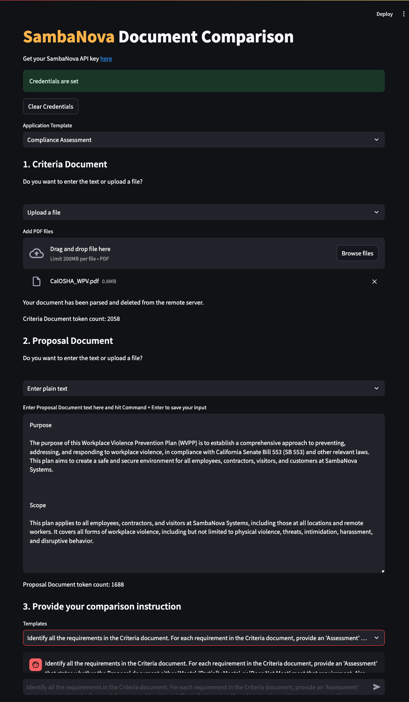

<a href="https://sambanova.ai/">
<picture>
 <source media="(prefers-color-scheme: dark)" srcset="../images/light-logo.png" height="100">
  
</picture>
</a>

Document Comparison
======================

Questions? Just <a href="https://discord.gg/54bNAqRw" target="_blank">message us</a> on Discord <a href="https://discord.gg/54bNAqRw" target="_blank"></a> or <a href="https://github.com/sambanova/ai-starter-kit/issues/new/choose" target="_blank">create an issue</a> in GitHub. We're happy to help live!

Table of Contents:

<!-- TOC -->

- [Document Comparison](#enterprise-knowledge-retrieval)
- [Overview](#overview)
- [Before you begin](#before-you-begin)
    - [Clone this repository](#clone-this-repository)
    - [Set up the models, environment variables and config file](#set-up-the-models-environment-variables-and-config-file)
        - [Set up the generative model](#set-up-the-generative-model)
        - [Set up the vector database](#set-up-the-vector-database)
    - [Windows requirements](#windows-requirements)
- [Deploy the starter kit GUI](#deploy-the-starter-kit-gui)
    - [Option 1: Use a virtual environment](#option-1-use-a-virtual-environment)
    - [Option 2: Deploy the starter kit in a Docker container](#option-2-deploy-the-starter-kit-in-a-docker-container)
- [Use the starter kit](#use-the-starter-kit)
- [Customizing the starter kit](#customizing-the-starter-kit)
    - [Import Data](#import-data)
    - [Split Data](#split-data)
    - [Embed data](#embed-data)
    - [Store embeddings](#store-embeddings)
    - [Retrieval and Reranking](#retrieval-and-reranking)
    - [Customize the LLM](#customize-the-llm)
    - [Experiment with prompt engineering](#experiment-with-prompt-engineering)
- [Third-party tools and data sources](#third-party-tools-and-data-sources)

<!-- /TOC -->

# Overview

This AI Starter Kit allows users to compare text documents and run custom analyses on them. You send two PDF files or blobs of text to the SambaNova server, and get analyses based on your instructions. The Kit includes:

- A configurable SambaNova connector. The connector generates answers from a deployed model.
- Templates for 
  - Generic document comparison
  - Compliance assessment
- Support for PDFs or text content copied directly into the app.

This sample is ready-to-use. We provide:

- Instructions for running the model as is.
- Instructions for customizing the model.

# Before you begin

You have to set up your environment before you can run or customize the starter kit.

## Clone this repository

Clone the starter kit repo.

```bash
git clone https://github.com/sambanova/ai-starter-kit.git
```

## Set up the models, environment variables and config file

### Set up the generative model

The next step is to set up your environment variables to use one of the inference models available from SambaNova. You can obtain a free API key through SambaCloud.

Follow the instructions [here](../README.md#getting-a-sambanova-api-key-and-setting-your-generative-models) to set up your environment variables.

Then, in the [config file](./config.yaml), set the `model` config depending on the model you want to use.

## Windows requirements

- If you are using Windows, make sure your system has Microsoft Visual C++ Redistributable installed. You can install it from [Microsoft Visual C++ Build Tools](https://visualstudio.microsoft.com/visual-cpp-build-tools/) and make sure to check all boxes regarding C++ section. (Compatible versions: 2015, 2017, 2019 or 2022)

# Deploy the starter kit GUI

We recommend that you run the starter kit in a virtual environment or use a container. We also recommend using Python >= 3.10 and < 3.12.

## Option 1: Use a virtual environment

If you want to use virtualenv or conda environment:

1. Install and update pip.

    ```bash
    cd ai-starter-kit/document_comparison
    python3 -m venv document_comparison_env
    source document_comparison_env/bin/activate
    pip  install  -r  requirements.txt
    ```

2. Run the following command:


   ```bash
   streamlit run streamlit/app.py --browser.gatherUsageStats false 
   ```


After deploying the starter kit you see the following user interface:



## Option 2: Deploy the starter kit in a Docker container 

NOTE: If you are deploying the docker container in Windows be sure to open the docker desktop application. 

To run the starter kit  with docker, run the following command:

    docker-compose up --build

You will be prompted to go to the link (http://localhost:8501/) in your browser where you will be greeted with the streamlit page as above.

# Use the starter kit 

TODO: Update this

After you've deployed the GUI, you can use the starter kit. Follow these steps:

1. In the **Pick a datasource** pane, either drag and drop files or browse to select them. The data source can be a series of PDF files or a
 [Chroma](https://docs.trychroma.com/getting-started) vectorstore.

2. Click **Process** to process all loaded PDFs. This will create a vectorstore in memory, which you can optionally save to disk. **Note**: This step may take some time, particularly if you are processing large documents or using CPU-based embeddings. 

3. In the main panel, you can ask questions about the PDF data. 

This pipeline uses the AI starter kit as is with an ingestion, retrieval, and Q&A workflows. More details about each workflow are provided below:

# Customizing the starter kit

You can further customize the starter kit based on the use case.

## Import Data

Different packages are available to extract text from different file documents. They can be broadly categorized as:
- OCR-based: [pytesseract](https://pypi.org/project/pytesseract/), [paddleOCR](https://pypi.org/project/paddleocr/), [unstructured](https://unstructured.io/)
- Non-OCR based: [pymupdf](https://pypi.org/project/PyMuPDF/), [pypdf](https://pypi.org/project/pypdf/)

Most of these packages have easy [integrations](https://python.langchain.com/docs/modules/data_connection/document_loaders/pdf) with the Langchain library. You can find examples of the usage of these loaders in the [Data extraction starter kit](../data_extraction/README.md).

This enterprise knowledge retriever kit uses either PyMuPDF or a custom implementation of the unstructured loader. This can be configured in the [config.yaml](./config.yaml) file:

* If `pdf_only_mode` is set to True, then PyMuPDF is used as the data loader. Please note that in this case, only PDF documents are supported.

* If `pdf_only_mode` is set to False, then the unstructured loader is used, which works well with all file types. Please note that in this case, you need to install the following system dependencies if they are not already available on your system, for example, using `brew install` for Mac. Depending on what document types you're parsing, you may not need all of these:

    * `libmagic-dev` (filetype detection)
    * `poppler` (images and PDFs)
    * `tesseract-ocr` (images and PDFs)
    * `qpdf` (PDFs)
    * `libreoffice` (MS Office docs)
    * `pandoc` (EPUBs)

*You can also modify several parameters in the loading strategies by changing the [../utils/parsing/config.yaml](../utils/parsing/config.yaml) file, see more [here](../utils/parsing/README.md)*.

## Experiment with prompt engineering

Prompting has a significant effect on the quality of LLM responses. Prompts can be further customized to improve the overall quality of the responses from the LLMs. For example, in this starter kit, default prompts are provided that can be modified as needed.

You can make modifications to the prompt template in the following file: 

```
file: templates/document_comparison_templates.json
```

# Third-party tools and data sources

All the packages/tools are listed in the `requirements.txt` file in the project directory.
