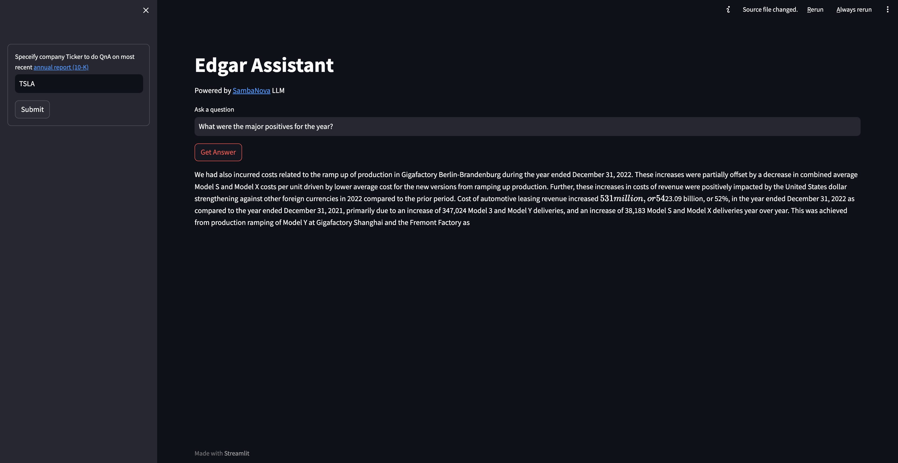

EDGAR Q&A
======================

# Overview

## About this template

This AI Starter Kit is an example of a semantic search workflow that can be built using the SambaNova platform to answer questions about organizations using their 10-K annual reports. It includes:
 -   A configurable SambaStudio connector to run inference off a model deployed in it.
 -   A configurable integration with a third-party vector database.
 -   An implementation of the semantic search workflow and prompt construction strategies.

This sample is ready-to-use. We provide two options to help you run this demo by following a few simple steps described in the [Getting Started](#getting-started) section. It also serves as a starting point for customization to your organization's needs, which you can learn more about in the [Customizing the Template](#customizing-the-template) section.

## Workflow
This AI Starter Kit implements two distinct workflows that pipelines a series of operations.
### Ingestion
This workflow is an example of downloading and indexing data for subsequent Q&A. The steps are:
1. **Download data:** This workflow begins with pulling 10K reports from the EDGAR dataset to be chunked, indexed and stored for future retrieval. EDGAR data is downloaded using the [SEC DATA DOWNLOADER](https://llamahub.ai/l/sec_filings), which retrieves the data as text.
2.  **Split data:** Once the data has been downloaded, we need to split the data into chunks of text to be embedded and stored in a vector database. This size of the chunk of text depends on the context (sequence) length offered by the model. Generally, larger context lengths result in better performance. The method used to split text also has an impact on performance (for instance, making sure there are no word breaks, sentence breaks, etc.). The downloaded data is split using [RecursiveCharacterTextSplitter](https://python.langchain.com/docs/modules/data_connection/document_transformers/text_splitters/recursive_text_splitter).
3. **Embed data:** For each chunk of text from the previous step, we use an embeddings model to create a vector representation of it. These embeddings are used in the storage and retrieval of the most relevant content based on the user's query. The split text is embedded using [HuggingFaceInstructEmbeddings](https://api.python.langchain.com/en/latest/embeddings/langchain.embeddings.huggingface.HuggingFaceInstructEmbeddings.html).
4. **Store embeddings:** Embeddings for each chunk, along with content and relevant metadata (such as source documents) are stored in a vector database. The embedding acts as the index in the database. In this template, we store information with each entry, which can be modified to suit your needs. There are several vector database options available, each with their own pros and cons. This AI template is setup to use [chromadb](https://www.trychroma.com/) or [QDrant](https://qdrant.tech/) as the vector database because they are free, open-source options with straightforward setup, but can easily be updated to use another if desired. 


### Retrieval
This workflow is an example of leveraging data stored in a vector database along with a large language model to enable retrieval-based Q&A off your data. The steps are:
 1.  **Embed query:** Given a user-submitted query, the first step is to convert it into a common representation (an embedding) for subsequent use in identifying the most relevant stored content. Because of this, it is recommended to use the *same* embedding model to generate embeddings. In this sample, the query text is embedded using [HuggingFaceInstructEmbeddings](https://api.python.langchain.com/en/latest/embeddings/langchain.embeddings.huggingface.HuggingFaceInstructEmbeddings.html), which is the same model as used in the ingestion workflow.
 2.  **Retrieve relevant content:** Next, we use the embeddings representation of the query to make a retrieval request from the vector database, which returns *relevant* entries (content). The vector database therefore also acts as a retriever for fetching relevant information from the database.

### Answering
1.  **SambaNova Large language model (LLM):** Once the relevant information is retrieved, the content is sent to a SambaNova LLM to generate the final response to the user query. 
    -  **Prompt engineering:** The user's query is combined with the retrieved content along with instructions to form the prompt before being sent to the LLM. This process involves prompt engineering, and is an important part of ensuring quality output. In this AI template, customized prompts are provided to the LLM to improve the quality of response for this use case.


## Third-party tools and data sources

All the packages/tools are listed in the requirements.txt file in the project directory. Some of the main packages are listed below:
- streamlit (version 1.25.0)
- llama-hub (version 0.0.25)
- langchain (version 0.0.266)
- llama-index (version 0.8.20)
- sentence_transformers (version 2.2.2)
- instructorembedding (version 1.0.1)
- beautifulsoup4 (version 4.12.2)
- chromadb (version 0.4.8)
- qdrant-client (version 1.5.2)
- fastapi (version 0.99.1)
- unstructured (version 0.8.1)


# Getting started
## 1. Deploy your model in SambaStudio
Begin by deploying your LLM of choice (e.g. Llama 2 13B chat, etc) to an endpoint for inference in SambaStudio either through the GUI or CLI, as described in the [SambaStudio endpoint documentation](https://docs.sambanova.ai/sambastudio/latest/endpoints.html).

## 2. Integrate your model in the starter kit
Integrate your LLM deployed on SambaStudio with this AI starter kit  in two simple steps:
1. Clone this repo.
```
  git clone https://github.com/sambanova/ai-starter-kit.git
```
2. Update API information for the SambaNova LLM and, optionally, the vector database.  These are represented as configurable variables in the environment variables file in sn-ai-starter-kit/edgar_assistant/export.env. For example, an endpoint with the URL
"https://api-stage.sambanova.net/api/predict/nlp/12345678-9abc-def0-1234-56789abcdef0/456789ab-cdef-0123-4567-89abcdef0123"
would be entered in the config file (with no spaces) as:
```
BASE_URL="https://api-stage.sambanova.net"
PROJECT_ID="12345678-9abc-def0-1234-56789abcdef0"
ENDPOINT_ID="456789ab-cdef-0123-4567-89abcdef0123"
API_KEY="89abcdef-0123-4567-89ab-cdef01234567"
VECTOR_DB_URL=http://host.docker.internal:6333
```

## 3. Deploy the starter kit
### Option 1: Run through local install
Running through local install is the simplest option and includes a simple Streamlit based UI for quick experimentation. It is not recommended for POC implementation.

> **Important:** When running through local install, no 10-Ks for organizations are pre indexed, with 10-Ks being pulled and indexed on-demand. The workflow to do this has been implemented in this Starter Kit. To pull the latest 10-K from EDGAR, simply specify the company ticker in the sample UI and click on `Submit`. This results in a one-time fetch of the latest 10-K from EDGAR, embedding and indexing it before making it available for Q&A. As a result, it takes some time for the data to be available the first time you ask a question for a new company ticker. As this is a one-time operation per company ticker, all subsequent Q&A off that company ticker is much faster, as this process does not need to be repeated.



Begin by updating pip and installing dependencies. It is recommended to use virtual env or `conda` environment for installation.
```
cd ai_starter_kit/edgar_qna/edgar_qna_streamlit
python3  -m  venv  edgar_demo
source  edgar_demo/bin/activate
pip  install  -r  requirements.txt
```

To run the demo through local install, run the following commands:
```
sh run.sh
```
This will open the demo in your default browser at port 8501.

### Option 2: Run via Docker
Running through Docker is the most scalable approach for running this AI Starter Kit, and one that provides a path to production deployment.


> **Important:** This approach does not include a UI, but allows inference via API to be connected to custom user experiences. Setting up to run via Docker includes pulling and indexing the latest 10-Ks for organizations in the S&P 500. While the setup may take a bit more time, it leads to a better Q&A experience as there are no delays due to fetching and indexing data on-the-fly.


#### Install dependencies to upload data to qdrant server
```
cd edgar_qna/edgar_qna_server
python3 -m venv edgar_server_demo
source edgar_server_demo/bin/activate
pip install -r requirements.txt
```

#### Setting-up vector database Qdrant

Make sure docker is installed and running.

Get `qdrant` docker
```
docker pull qdrant/qdrant
```

Run qdrant on local host
```
docker run -p 6333:6333 \
-v $(pwd)/qdrant_storage:/qdrant/storage:z \
qdrant/qdrant
```


#### Upload data to the database
**Note:** In case you have data already vectorized, you can download a snapshot and upload it in any new DB instance.


##### upload a snapshot to qdrant server
```
unzip edgar_tsla_sample.snapshot.zip
curl -X POST 'http://localhost:6333/collections/edgar/snapshots/upload' \
-H 'Content-Type:multipart/form-data' \
-F 'snapshot=@edgar_tsla_sample.snapshot'
```
##### Download a created snapshot from qdrant server (optional)
```
curl -O http://localhost:6333/collections/edgar/snapshots/<snapshot name>
```

#### Download and embed data for other organizations (optional)
For Q&A over other companies, one can download and vectorize the EDGAR dataset using the files ```get_snp500_data.py``` and ```vectorize_and_load.py```.

The commands below will download and embed the data for other organizations listed in ```ticker_to_download.csv```.
```
python3 get_snp500_data.py
python3 vectorize_and_load.py
```

#### Setting-up Q&A api
Build AI starter kit docker image
```
cd ../..
docker build -t edgar_assistant -f edgar_qna/edgar_qna_server/Dockerfile .
```


Run AI starter kit container with image
```
docker run -p 80:80   --env-file edgar_qna/export.env edgar_assistant
```
#### Make a request to the API

The app can be accessed at
```
http://127.0.0.1/docs#
```


Click the drop-down menu next to ```POST``` and click the ```Try it out``` button.


Edit the following JSON input for the ```ticker``` and ```query```.
```
{
"ticker": "string",
"query": "string"
}
```
For example, below is an edited version for a query regarding Tesla.
```
{
"ticker": "tsla",
"query": "What was the increase in R&D expenses in 2022 compared to 2021?"
}
```
Once you click the execute button, the LLM response will be populated in the ```Response body```. Here is an example for the query above.
```
{
"message": " R&D expenses increased $482 million, or 19% in the year ended December 31, 2022 as compared to the year ended December 31, 2021. The increase was primarily due to a $175 million increase in employee and labor related expenses, a $132 million increase in facilities, outside services, freight and depreciation expense, a $101 million increase in R&D expensed materials and an $87 million increase in stock-based compensation expense. These increases were to support our expanding product roadmap and \n"
}
```


# Customizing the template


The provided example template can be further customized based on the use case.


## Import Data


Depending on the format of input data files (e.g., .pdf, .docx, .rtf), different packages can be used to convert them into plain text files.


**PDF Format:**
- OCR-based: [pytesseract](https://pypi.org/project/pytesseract/)
- Non-OCR based: [pymupdf](https://pypi.org/project/PyMuPDF/), [pypdf](https://pypi.org/project/pypdf/), [unstructured](https://unstructured.io/)
Most of these packages have easy [integrations](https://python.langchain.com/docs/modules/data_connection/document_loaders/pdf) with the Langchain library.


This modification can be done in the following location:
```
file: edgar_sec_qa.py
function: vector_db_sec_docs
```


## Split Data


You can experiment with different ways of splitting the data, such as splitting by tokens or using context-aware splitting for code or markdown files. LangChain provides several examples of different kinds of splitting [here](https://python.langchain.com/docs/modules/data_connection/document_transformers/).


This modification can be done in the following location:
```
file: edgar_sec_qa.py
function: vector_db_sec_docs
```


The **RecursiveCharacterTextSplitter**, which is used for this template, can be further customized using the `chunk_size` and `chunk_overlap` parameters. For LLMs with a long sequence length, a larger value of `chunk_size` could be used to provide the LLM with broader context and improve performance. The `chunk_overlap` parameter is used to maintain continuity between different chunks.


```python
text_splitter = RecursiveCharacterTextSplitter(
chunk_size=100,
chunk_overlap=20
)


```
This modification can be done in the following location:
```
file: edgar_sec_qa.py
function: vector_db_sec_docs
```


## Embed data


There are several open-source embedding models available on HuggingFace. [This leaderboard](https://huggingface.co/spaces/mteb/leaderboard) ranks these models based on the Massive Text Embedding Benchmark (MTEB). A number of these models are available on SambaStudio and can be further fine-tuned on specific datasets to improve performance.


This modification can be done in the following location:
```
file: edgar_sec_qa.py
function: vector_db_sec_docs
```


## Store embeddings


The template can be customized to use different vector databases to store the embeddings generated by the embedding model. The [LangChain vector stores documentation](https://js.langchain.com/docs/modules/data_connection/vectorstores/integrations/) provides a broad collection of vector stores that can be easily integrated.


This modification can be done in the following location:
```
file: edgar_sec_qa.py
function: vector_db_sec_docs
```


## Retrieval


Similar to the vector stores, a wide collection of retriever options are available depending on the use case. In this template, the vector store was used as a retriever, but it can be enhanced and customized, as shown in some of the examples. [here](https://js.langchain.com/docs/modules/data_connection/retrievers/).


This modification can be done in the following location:
```
file: edgar_sec_qa.py
function: retreival_qa_chain
```


## Large language model (LLM)


### Fine-tuning


The template uses the SN LLM model, which can be further fine-tuned to improve response quality. To train a model in SambaStudio, learn how to [prepare your training data](https://docs.sambanova.ai/sambastudio/latest/generative-data-prep.html), [import your dataset into SambaStudio](https://docs.sambanova.ai/sambastudio/latest/add-datasets.html) and [run a training job](https://docs.sambanova.ai/sambastudio/latest/training.html)
### Prompt engineering


Finally, prompting has a significant effect on the quality of LLM responses. Prompts can be further customized to improve the overall quality of the responses from the LLMs. For example, in the given template, the following prompt was used to generate a response from the LLM, where ```question``` is the user query and ```context``` are the documents retrieved by the retriever.
```python
custom_prompt_template = """Use the following pieces of context about company annual/quarterly report filing to answer the question at the end. If the answer to the question cant be extracted from given CONTEXT than say I do not have information regarding this.
{context}


Question: {question}
Helpful Answer:"""
CUSTOMPROMPT = PromptTemplate(
template=custom_prompt_template, input_variables=["context", "question"]
)
```
This modification can be done in the following location:
```
file: edgar_sec_qa.py
function: retreival_qa_chain
```