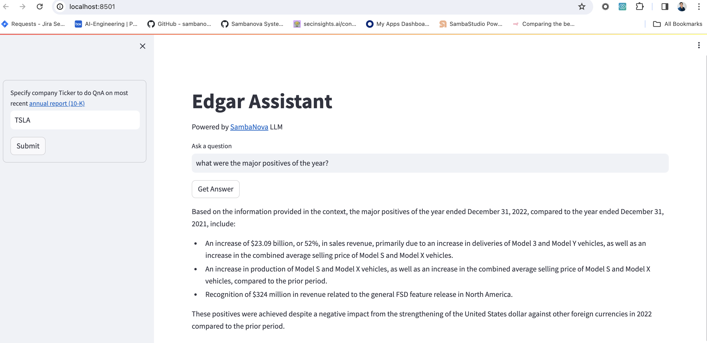
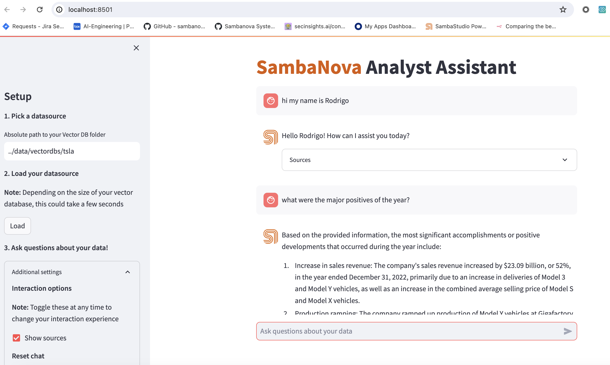
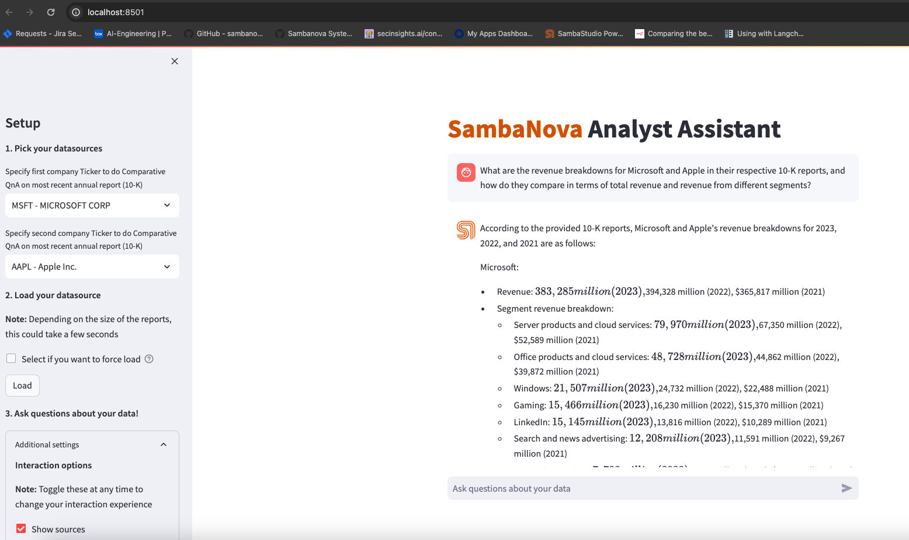

<a href="https://sambanova.ai/">
<picture>
 <source media="(prefers-color-scheme: dark)" srcset="../images/SambaNova-light-logo-1.png" height="60">
  
</picture>
</a>

EDGAR Q&A 
======================

<!-- TOC -->

- [EDGAR Q&A](#edgar-qa)
- [Overview](#overview)
    - [About this template](#about-this-template)
- [Workflow](#workflow)
        - [Ingestion](#ingestion)
        - [Retrieval](#retrieval)
        - [Answering](#answering)
- [Getting started](#getting-started)
    - [Deploy your model in SambaStudio](#deploy-your-model-in-sambastudio)
    - [Integrate your model in the starter kit](#integrate-your-model-in-the-starter-kit)
    - [Deploy the starter kit](#deploy-the-starter-kit)
        - [Option 1: Run through local install a Q&A streamlit app](#option-1-run-through-local-install-a-qa-streamlit-app)
        - [Option 2: Run through local install a Multiturn-chat streamlit app](#option-2-run-through-local-install-a-multiturn-chat-streamlit-app)
        - [Option 3: Run through local install a Comparative-Q&A-chat streamlit app](#option-3-run-through-local-install-a-comparative-qa-chat-streamlit-app)
        - [Option 4: Run via Docker](#option-4-run-via-docker)
            - [Run Q&A api](#run-qa-api)
            - [Make a request to the API](#make-a-request-to-the-api)
- [Customizing the template](#customizing-the-template)
    - [Import Data](#import-data)
    - [Split Data](#split-data)
    - [Embed data](#embed-data)
    - [Store embeddings](#store-embeddings)
    - [Retrieval](#retrieval)
    - [Large language model LLM](#large-language-model-llm)
        - [Prompt engineering](#prompt-engineering)
    - [Third-party tools and data sources](#third-party-tools-and-data-sources)

<!-- /TOC -->

# Overview

## About this template

This AI Starter Kit is an example of a semantic search workflow that can be built using the SambaNova platform to answer questions about organizations using their 10-K annual reports. It includes:
 -   A configurable SambaStudio connector to run inference off a model deployed in it.
 -   A configurable integration with a third-party vector database.
 -   An implementation of the semantic search workflow and prompt construction strategies.

This sample is ready-to-use. We provide two options to help you run this demo by following a few simple steps described in the [Getting Started](#getting-started) section. It also serves as a starting point for customization to your organization's needs, which you can learn more about in the [Customizing the Template](#customizing-the-template) section.

# Workflow
This AI Starter Kit implements two distinct workflows that pipelines a series of operations.
### Ingestion
This workflow is an example of downloading and indexing data for subsequent Q&A. The steps are:
1. **Download data:** This workflow begins with pulling 10K reports from the EDGAR dataset to be chunked, indexed and stored for future retrieval. EDGAR data is downloaded using the [SEC-DATA-DOWNLOADER](https://pypi.org/project/sec-edgar-downloader/), which retrieves the filing report in XBRL format.
2. **Parse data:** After obtaining the report in XBRL format, we parse the document and extract only relevant text information. The way we're parsing the document is using [Beautiful Soup](https://www.crummy.com/software/BeautifulSoup/bs4/doc/), which is a great tool for web scraping. 
3.  **Split data:** Once the data has been downloaded, we need to split the data into chunks of text to be embedded and stored in a vector database. This size of the chunk of text depends on the context (sequence) length offered by the model. Generally, larger context lengths result in better performance. The method used to split text also has an impact on performance (for instance, making sure there are no word breaks, sentence breaks, etc.). The downloaded data is split using [RecursiveCharacterTextSplitter](https://python.langchain.com/docs/modules/data_connection/document_transformers/text_splitters/recursive_text_splitter).
4. **Embed data:** For each chunk of text from the previous step, we use an embeddings model to create a vector representation of it. These embeddings are used in the storage and retrieval of the most relevant content based on the user's query. The split text is embedded using [HuggingFaceInstructEmbeddings](https://api.python.langchain.com/en/latest/embeddings/langchain.embeddings.huggingface.HuggingFaceInstructEmbeddings.html).
5. **Store embeddings:** Embeddings for each chunk, along with content and relevant metadata (such as source documents) are stored in a vector database. The embedding acts as the index in the database. In this template, we store information with each entry, which can be modified to suit your needs. There are several vector database options available, each with their own pros and cons. This AI template is setup to use [chromadb](https://www.trychroma.com/) as the vector database because it is free, open-source options with straightforward setup, but can easily be updated to use another if desired. 


### Retrieval
This workflow is an example of leveraging data stored in a vector database along with a large language model to enable retrieval-based Q&A off your data. The steps are:
 1.  **Embed query:** Given a user-submitted query, the first step is to convert it into a common representation (an embedding) for subsequent use in identifying the most relevant stored content. Because of this, it is recommended to use the *same* embedding model to generate embeddings. In this sample, the query text is embedded using [HuggingFaceInstructEmbeddings](https://api.python.langchain.com/en/latest/embeddings/langchain.embeddings.huggingface.HuggingFaceInstructEmbeddings.html), which is the same model as used in the ingestion workflow.
 2.  **Retrieve relevant content:** Next, we use the embeddings representation of the query to make a retrieval request from the vector database, which returns *relevant* entries (content). Therefore, the vector database also acts as a retriever for fetching relevant information from the database. If the retrieval engine uses memory, then it is able to remember the chat history between the user and the system to improve the interaction between them. 

### Answering
1.  **SambaNova Large language model (LLM):** Once the relevant information is retrieved, the content is sent to a SambaNova LLM to generate the final response to the user query. 
    -  **Prompt engineering:** The user's query is combined with the retrieved content along with instructions and chat history (if using memory) to form the prompt before being sent to the LLM. This process involves prompt engineering, and is an important part of ensuring quality output. In this AI template, customized prompts are provided to the LLM to improve the quality of response for this use case.


# Getting started
## 1. Deploy your model in SambaStudio
Begin by deploying your LLM of choice (e.g. Llama 2 13B chat, etc) to an endpoint for inference in SambaStudio either through the GUI or CLI, as described in the [SambaStudio endpoint documentation](https://docs.sambanova.ai/sambastudio/latest/endpoints.html).

## 2. Integrate your model in the starter kit
Integrate your LLM deployed on SambaStudio with this AI starter kit in two simple steps:
1. Clone this repo.
```
  git clone https://github.com/sambanova/ai-starter-kit.git
```

2. **Sambaverse Endpoint:**  Update API information for your Sambaverse account.  These are represented as configurable variables in the environment variables file in the root repo directory **```sn-ai-starter-kit/.env```**. For example, an api key
"456789ab-cdef-0123-4567-89abcdef0123"
would be entered in the env file (with no spaces) as:
```
SAMBAVERSE_API_KEY="456789ab-cdef-0123-4567-89abcdef0123"
```

Set in the [config file](./config.yaml), the variable *api* as: "sambaverse"


2.  **SambaStudio Endpoint:**  Update API information for the SambaNova LLM.  These are represented as configurable variables in the environment variables file in the root repo directory **```sn-ai-starter-kit/.env```**. For example, an endpoint with the URL
"https://api-stage.sambanova.net/api/predict/nlp/12345678-9abc-def0-1234-56789abcdef0/456789ab-cdef-0123-4567-89abcdef0123"
would be entered in the env file (with no spaces) as:
```
BASE_URL="https://api-stage.sambanova.net"
PROJECT_ID="12345678-9abc-def0-1234-56789abcdef0"
ENDPOINT_ID="456789ab-cdef-0123-4567-89abcdef0123"
API_KEY="89abcdef-0123-4567-89ab-cdef01234567"
```

Set in the [config file](./config.yaml), the variable *api* as: "sambastudio"

## 3. Deploy the starter kit
### Option 1: Run through local install a Q&A streamlit app
Running through local install is the simplest option and includes a simple Streamlit based UI for quick experimentation. 

> **Important:** When running through local install, no 10-Ks for organizations are pre indexed, with 10-Ks being pulled and indexed on-demand. The workflow to do this has been implemented in this Starter Kit. To pull the latest 10-K from EDGAR, simply specify the company ticker in the sample UI and click on `Submit`. This results in a one-time fetch of the latest 10-K from EDGAR, parsing the XBRL file downloaded, chunking, embedding and indexing it before making it available for Q&A. As a result, it takes some time for the data to be available the first time you ask a question for a new company ticker. As this is a one-time operation per company ticker, all subsequent Q&A off that company ticker is much faster, as this process does not need to be repeated.



Begin by updating pip and installing dependencies. It is recommended to use virtual env or `conda` environment for installation.
```
cd ai_starter_kit/edgar_qna/
python3 -m venv edgar_env
source edgar_env/bin/activate
pip  install  -r  requirements.txt
```

To run the demo through local install, run the following commands:
```
streamlit run streamlit/app_qna.py --browser.gatherUsageStats false 
```
This will open the demo in your default browser at port 8501.

### Option 2: Run through local install a Multiturn-chat streamlit app
This is a Streamlit based UI to experiment with a multiturn conversational AI assistant. 

> **Important:** When running through local install, at least a 10-K for any organization has to be pre-indexed. You can follow the steps in Option 1 to create the index of a 10-k report of available organizations. The workflow to interact with the system starts by picking a data source, in which you write the path to a previously indexed vector store. Then, click on `Load` and the specified vector data base will be used. As you imagine, this process is very fast since the vector store already exists. Finally, you have an up-and-running chatbot assitant that is more than happy to help you with any questions that you may have about the filing report stored. 



Begin by updating pip and installing dependencies. It is recommended to use virtual env or `conda` environment for installation.
```
cd ai_starter_kit/edgar_qna/
python3 -m venv edgar_env
source edgar_env/bin/activate
pip  install  -r  requirements.txt
```

To run the demo through local install, run the following commands:
```
streamlit run app_chat.py --browser.gatherUsageStats false 
```
This will open the demo in your default browser at port 8501.

### Option 3: Run through local install a Comparative-Q&A-chat streamlit app
This is a Streamlit based UI to experiment with a comparative question and answering assistant. 

> **Important:** The workflow to interact with the system starts by picking a pair of companies to compare with using the drop down boxes. Then, click on `Load` and a vector data base with both reports will be used. If the vector store was previously generated, it will load it quickly. In case you want to force a reload, there's an option to do that too. Finally, you have an up-and-running chatbot assitant that is more than happy to help you with any comparative questions that you may have about the filing report stored. 



Begin by updating pip and installing dependencies. It is recommended to use virtual env or `conda` environment for installation.
```
cd ai_starter_kit/edgar_qna/
python3 -m venv edgar_env
source edgar_env/bin/activate
pip  install  -r  requirements.txt
```

To run the demo through local install, run the following commands:
```
streamlit run app_comparative_chat.py --browser.gatherUsageStats false 
```
This will open the demo in your default browser at port 8501.

### Option 4: Run via Docker
Running through Docker is the most scalable approach for running this AI Starter Kit, and one that provides a path to production deployment.
We execute the comparative chat demo as in option 3.

To run the AI starter kit container with image, enter the following command:
```
docker-compose up --build
```

You will be prompted to run the link (http://0.0.0.0:8501/) in your browser where you will be greeted with an identical page as Option 3.

# Customizing the template

The provided example template can be further customized based on the use case.

## Import Data

Depending on the format of input data files (e.g., .pdf, .docx, .rtf), different packages can be used to convert them into plain text files.

this kit parses the information downloaded from SEC as xlbr file

This modification can be done in a separate method in the following location:
```
file: edgar_sec.py
methods: download_sec_data, parse_xbrl_data
```

## Split Data

You can experiment with different ways of splitting the data, such as splitting by tokens or using context-aware splitting for code or markdown files. LangChain provides several examples of different kinds of splitting [here](https://python.langchain.com/docs/modules/data_connection/document_transformers/).

The **RecursiveCharacterTextSplitter**, which is used for this template, can be further customized using the `chunk_size` and `chunk_overlap` parameters. For LLMs with a long sequence length, a larger value of `chunk_size` could be used to provide the LLM with broader context and improve performance. The `chunk_overlap` parameter is used to maintain continuity between different chunks.

This modification can be done setting this paramaters in the following location:

file: [config.yaml](./config.yaml)
```yaml
retrieval:
    "chunk_size": 500
    "chunk_overlap": 50
```

or modifying the following method

```
file: edgar_sec.py
function: create_load_vector_store
```

## Embed data

There are several open-source embedding models available on HuggingFace. [This leaderboard](https://huggingface.co/spaces/mteb/leaderboard) ranks these models based on the Massive Text Embedding Benchmark (MTEB). A number of these models are available on SambaStudio and can be further fine-tuned on specific datasets to improve performance.

This modification can be done in the following location:
```
file: edgar_sec.py
function: create_load_vector_store
```

> Find more information about the usage of SambaStudio hosted embedding models in the section *Use Sambanova's LLMs and Embeddings Langchain wrappers* [here](../README.md)

## Store embeddings

The template can be customized to use different vector databases to store the embeddings generated by the embedding model. The [LangChain vector stores documentation](https://js.langchain.com/docs/modules/data_connection/vectorstores/integrations/) provides a broad collection of vector stores that can be easily integrated.

This modification can be done in the following location:

```
file: edgar_sec.py
function: create_load_vector_store
```

## Retrieval

Similar to the vector stores, a wide collection of retriever options are available depending on the use case. In this template, the vector store was used as a retriever, but it can be enhanced and customized, as shown in some of the examples. [here](https://js.langchain.com/docs/modules/data_connection/retrievers/).


This modification can be done in a separate retrieval method in the following location:

```
file: src/edgar_sec.py
methods: retrieval_qa_chain, retrieval_conversational_chain, retrieval_comparative_process
```

and their parameteres can be updated in the following location
file: [config.yaml](./config.yaml)
```yaml
retrieval:
    "db_type": "chroma"
    "n_retrieved_documents": 3
```


## Large language model (LLM)

**If using Sambaverse endpoint**

You can test the performace of multiple models avalable in sambaverse, for changing the model in this template:

- Search in the available models in playground and select the three dots the click in show code, you should search the values of these two tags `modelName` and `select_expert` 
- Modify the parameters for calling the model, those are in *llm* in ```config,yaml``` file setting the values of `sambaverse_model_name` and `sambaverse_expert`, temperature and maximun generation token can aso be modified

**If using Sambastudio:**

The template uses the SN LLM model, which can be further fine-tuned to improve response quality. To train a model in SambaStudio, learn how to [prepare your training data](https://docs.sambanova.ai/sambastudio/latest/generative-data-prep.html), [import your dataset into SambaStudio](https://docs.sambanova.ai/sambastudio/latest/add-datasets.html) and [run a training job](https://docs.sambanova.ai/sambastudio/latest/training.html)

### Prompt engineering

Finally, prompting has a significant effect on the quality of LLM responses. Prompts can be further customized to improve the overall quality of the responses from the LLMs. For example, in the given template, the following prompt utilizes meta-tags for Llama LLM models and generates a response from the LLM, where ```question``` is the user query and ```context``` are the documents retrieved by the retriever.
```python
custom_prompt_template = """<s>[INST] <<SYS>>\nYou're a helpful assistant\n<</SYS>>
Use the following pieces of context about company annual/quarterly report filing to answer the question at the end. If the answer to the question cant be extracted from given CONTEXT than say I do not have information regarding this.

Context:
{context}

Question: {question}

Helpful Answer: [/INST]"""
CUSTOMPROMPT = PromptTemplate(
template=custom_prompt_template, input_variables=["context", "question"]
)
```
This modification can be done in the following location:
```
file: edgar_qna/prompts
```

## Third-party tools and data sources

All the packages/tools are listed in the requirements.txt file in the project directory. Some of the main packages are listed below:
- streamlit (version 1.25.0)
- llama-hub (version 0.0.25)
- langchain (version 0.0.266)
- langchain_community (version 0.0.16)
- llama-index (version 0.8.20)
- sentence_transformers (version 2.2.2)
- instructorembedding (version 1.0.1)
- beautifulsoup4 (version 4.12.2)
- chromadb (version 0.4.8)
- qdrant-client (version 1.5.2)
- fastapi (version 0.99.1)
- unstructured (version 0.8.1)
- sec-edgar-downloader (version 5.0.2)
- python-xbrl (version 1.1.1)
- sseclient (version 0.0.27)