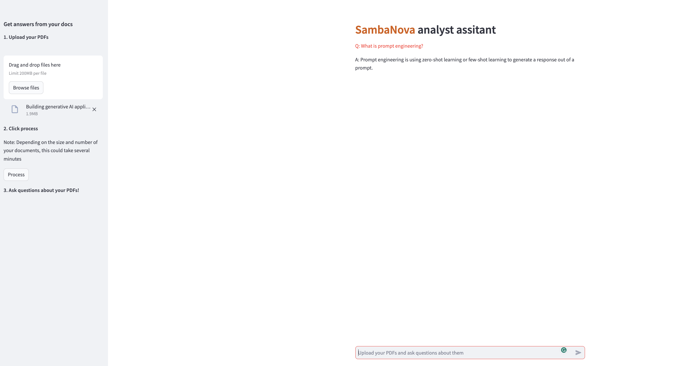

<a href="https://sambanova.ai/">
<picture>
 <source media="(prefers-color-scheme: dark)" srcset="../images/SambaNova-light-logo-1.png" height="60">
  
</picture>
</a>

Enterprise Knowledge Retrieval
======================

Questions? Just <a href="https://discord.gg/54bNAqRw" target="_blank">message us</a> on Discord <a href="https://discord.gg/54bNAqRw" target="_blank"></a> or <a href="https://github.com/sambanova/ai-starter-kit/issues/new/choose" target="_blank">create an issue</a> in GitHub. We're happy to help live!

Table of Contents:

<!-- TOC -->

- [Enterprise Knowledge Retrieval](#enterprise-knowledge-retrieval)
- [Overview](#overview)
- [Before you begin](#before-you-begin)
    - [Clone this repository](#clone-this-repository)
    - [Set up the models, environment variables and config file](#set-up-the-models-environment-variables-and-config-file)
        - [Set up the generative model](#set-up-the-generative-model)
        - [Set up the embedding model](#set-up-the-embedding-model)
    - [Windows requirements](#windows-requirements)
- [Deploy the starter kit GUI](#deploy-the-starter-kit-gui)
    - [Option 1: Use a virtual environment](#option-1-use-a-virtual-environment)
    - [Option 2: Deploy the starter kit in a Docker container](#option-2-deploy-the-starter-kit-in-a-docker-container)
- [Use the starter kit](#use-the-starter-kit)
- [Customizing the starter kit](#customizing-the-starter-kit)
    - [Import Data](#import-data)
    - [Split Data](#split-data)
    - [Embed data](#embed-data)
    - [Store embeddings](#store-embeddings)
    - [Retrieval and Reranking](#retrieval-and-reranking)
    - [Customize the LLM](#customize-the-llm)
    - [Experiment with prompt engineering](#experiment-with-prompt-engineering)
- [Third-party tools and data sources](#third-party-tools-and-data-sources)

<!-- /TOC -->

# Overview

This AI Starter Kit is an example of a semantic search workflow. You send your PDF or TXT file to the SambaNova platform, and get answers to questions about the documents content. The Kit includes:

- A configurable SambaNova Cloud or SambaStudio connector. The connector generates answers from a deployed model.
- A configurable integration with a third-party vector database.
- An implementation of a semantic search workflow using [Langchain LCEL](https://python.langchain.com/v0.1/docs/expression_language/) or [LangGraph](https://langchain-ai.github.io/langgraph/#why-langgraph).
- Prompt construction strategies.

This sample is ready-to-use. We provide:

- Instructions for setup with SambaNova Cloud or SambaStudio.
- Instructions for running the model as is.
- Instructions for customizing the model.

# Before you begin

You have to set up your environment before you can run or customize the starter kit.

## Clone this repository

Clone the starter kit repo.

```bash
git clone https://github.com/sambanova/ai-starter-kit.git
```

## Set up the models, environment variables and config file

### Set up the generative model

The next step is to set up your environment variables to use one of the inference models available from SambaNova. You can obtain a free API key through SambaNova Cloud. Alternatively, if you are a current SambaNova customer, you can deploy your models using SambaStudio.

- **SambaNova Cloud (Option 1)**: Follow the instructions [here](../README.md#use-sambanova-cloud-option-1) to set up your environment variables.
    Then, in the [config file](./config.yaml), set the llm `api` variable to `"sncloud"` and set the `select_expert` config depending on the model you want to use.

- **SambaStudio (Option 2)**: Follow the instructions [here](../README.md#use-sambastudio-option-2) to set up your endpoint and environment variables.
    Then, in the [config file](./config.yaml), set the llm `api` variable to `"sambastudio"`, and set the `CoE` and `select_expert` configs if you are using a CoE endpoint.

### Set up the embedding model

You have the following options to set up your embedding model:

* **CPU embedding model (Option 1)**: In the [config file](./config.yaml), set the variable `type` in `embedding_model` to `"cpu"`.

* **SambaStudio embedding model (Option 2)**: To increase inference speed, you can use a SambaStudio embedding model endpoint instead of using the default (CPU) Hugging Face embedding. Follow the instructions [here](../README.md#use-sambastudio-embedding-option-2) to set up your endpoint and environment variables. Then, in the [config file](./config.yaml), set the variable `type` in `embedding_model` to `"sambastudio"`, and set the configs `batch_size`, `coe` and `select_expert` according to your SambaStudio endpoint.

## Windows requirements

- If you are using Windows, make sure your system has Microsoft Visual C++ Redistributable installed. You can install it from [Microsoft Visual C++ Build Tools](https://visualstudio.microsoft.com/visual-cpp-build-tools/) and make sure to check all boxes regarding C++ section. (Compatible versions: 2015, 2017, 2019 or 2022)

# Deploy the starter kit GUI

We recommend that you run the starter kit in a virtual environment or use a container. We also recommend using Python >= 3.10 and < 3.12.

## Option 1: Use a virtual environment

If you want to use virtualenv or conda environment:

1. Install and update pip.

    ```bash
    cd ai-starter-kit/enterprise_knowledge_retriever
    python3 -m venv enterprise_knowledge_env
    source enterprise_knowledge_env/bin/activate
    pip  install  -r  requirements.txt
    ```

2. Run the following command:

    > This kit can be deployed using either a simple LCECL implementation or a LangGraph implementation, both of which produce identical results. This demonstrates the flexibility of the kit and showcases how to leverage these two approaches in Rag applications.

    - LCEL version

        ```bash
            streamlit run streamlit/app.py --browser.gatherUsageStats false 
        ```

    - LangGraph version

        ```bash
            streamlit run streamlit/langgraph_app.py --browser.gatherUsageStats false 
        ```

After deploying the starter kit you see the following user interface:



## Option 2: Deploy the starter kit in a Docker container 

NOTE: If you are deploying the docker container in Windows be sure to open the docker desktop application. 

To run the starter kit  with docker, run the following command:

    docker-compose up --build

You will be prompted to go to the link (http://localhost:8501/) in your browser where you will be greeted with the streamlit page as above.

Here's a short video demonstrating docker deployment:

https://github.com/sambanova/ai-starter-kit/assets/150964187/4f82e4aa-c9a9-45b4-961d-a4b369be5ec4


# Use the starter kit 

After you've deployed the GUI, you can use the starter kit. Follow these steps:

1. In the **Pick a datasource** pane, either drag and drop files or browse to select them. The data source can be a series of PDF files or a
 [Chroma](https://docs.trychroma.com/getting-started) vectorstore.

2. Click **Process** to process all loaded PDFs. This will create a vectorstore in memory, which you can optionally save to disk. **Note**: This step may take some time, particularly if you are processing large documents or using CPU-based embeddings. 

3. In the main panel, you can ask questions about the PDF data. 

This pipeline uses the AI starter kit as is with an ingestion, retrieval, and Q&A workflows. More details about each workflow are provided below:

<details>
<summary> Ingestion workflow </summary>

This workflow, included with this starter kit, is an example of parsing and indexing data for subsequent Q&A. The steps are:

1. **Document parsing:** Python packages like [PyMuPDF](https://pypi.org/project/PyMuPDF/) or [unstructured](https://github.com/Unstructured-IO/unstructured-inference) are used to extract text from file documents. On the LangChain website, multiple [integrations](https://python.langchain.com/v0.2/docs/how_to/#document-loaders) for text extraction from multiple file types are available. Depending on the quality and the format of the files, this step might require customization for different use cases. This kit uses the [parser util](../utils/parsing/) in the background for the document parsing step, which leverages either PyMuPDF or the unstructured module to parse the documents.

2. **Split data:** After the data has been parsed and its content extracted, it is necessary to split the data into chunks of text to be embedded and stored in a vector database. The size of the text chunks depends on the context (sequence) length offered by the model. Generally, larger context lengths result in better performance. The method used to split text also impacts performance; for instance, ensuring there are no word or sentence breaks is crucial. The downloaded data is split using the [parser util](../utils/parsing/), which leverages either PyMuPDF or the unstructured module to split the parsed documents into chunks.

3. **Embed data:** For each chunk of text from the previous step, we use an embeddings model to create a vector representation of the text. These embeddings are then used for storing and retrieving the most relevant content given a user's query. The split text is embedded using [HuggingFaceInstructEmbeddings](https://api.python.langchain.com/en/latest/embeddings/langchain_community.embeddings.huggingface.HuggingFaceInstructEmbeddings.html).

   *For more information about what embeddings are, click [here](https://towardsdatascience.com/neural-network-embeddings-explained-4d028e6f0526).*

4. **Store embeddings:** Embeddings for each chunk, along with content and relevant metadata (such as source documents) are stored in a vector database where the embedding acts as the index. In this template, we store information with each entry, which can be modified to suit your needs. Several vector database options are available, each with their own pros and cons. This starter kit is set up to use [Chroma](https://github.com/chroma-core/chroma) as the vector database because it is a free, open-source option with straightforward setup, but it can easily be updated to use another if desired. In terms of metadata, `filename` and `page` are also attached to the embeddings, which are extracted during parsing of the PDF documents.

</details>

<details>
<summary> Retrieval workflow </summary>

This workflow is an example of leveraging data stored in a vector database along with a large language model to enable retrieval-based Q&A from your data. The steps are:

1. **Embed query:** The first step is to convert a user-submitted query to a common representation (an embedding) for subsequent use in identifying the most relevant stored content. Use the same embedding mode for query parsing and to generate embeddings. In this start kit, the query text is embedded using [HuggingFaceInstructEmbeddings](https://api.python.langchain.com/en/latest/embeddings/langchain_community.embeddings.huggingface.HuggingFaceInstructEmbeddings.html), which is the same embedding model in the ingestion workflow.
 
2. **Retrieve relevant content:** Next, we use the embeddings representation of the query to make a retrieval request from the vector database, which in turn returns *relevant* entries (content) in it. Thus, the vector database also acts as a retriever for fetching relevant information.

   *For more information about embeddings and their retrieval, click [here](https://pub.aimind.so/llm-embeddings-explained-simply-f7536d3d0e4b).*

3. **Rerank retrieved content** After retrieving a specified number of relevant chunks of information, a reranker model can be set to rerank the retrieved passages in order of relevance to the user query. Then, the top N documents with the highest relevance scores are selected and passed to the QA chain as context.

   *For more information about retrieval augmented generation with LangChain, click [here](https://python.langchain.com/docs/modules/data_connection/).*

</details>

<details>
<summary> Q&A workflow </summary>

After the relevant information is retrieved, the content is sent to a SambaNova LLM to generate a final response to the user query.

Before being sent to the LLM, the user's query is combined with the retrieved content along with instructions to form the prompt. This process involves prompt engineering, and is an important part of ensuring quality output. In this AI starter kit, customized prompts are provided to the LLM to improve the quality of response for this use case.

*To learn more about prompt engineering, click [here](https://www.promptingguide.ai/).*

</details>

# Customizing the starter kit

You can further customize the starter kit based on the use case.

## Import Data

Different packages are available to extract text from different file documents. They can be broadly categorized as:
- OCR-based: [pytesseract](https://pypi.org/project/pytesseract/), [paddleOCR](https://pypi.org/project/paddleocr/), [unstructured](https://unstructured.io/)
- Non-OCR based: [pymupdf](https://pypi.org/project/PyMuPDF/), [pypdf](https://pypi.org/project/pypdf/)

Most of these packages have easy [integrations](https://python.langchain.com/docs/modules/data_connection/document_loaders/pdf) with the Langchain library. You can find examples of the usage of these loaders in the [Data extraction starter kit](../data_extraction/README.md).

This enterprise knowledge retriever kit uses either PyMuPDF or a custom implementation of the unstructured loader. This can be configured in the [config.yaml](./config.yaml) file:

* If `pdf_only_mode` is set to True, then PyMuPDF is used as the data loader. Please note that in this case, only PDF documents are supported.

* If `pdf_only_mode` is set to False, then the unstructured loader is used, which works well with all file types. Please note that in this case, you need to install the following system dependencies if they are not already available on your system, for example, using `brew install` for Mac. Depending on what document types you're parsing, you may not need all of these:

    * `libmagic-dev` (filetype detection)
    * `poppler` (images and PDFs)
    * `tesseract-ocr` (images and PDFs)
    * `qpdf` (PDFs)
    * `libreoffice` (MS Office docs)
    * `pandoc` (EPUBs)

*You can also modify several parameters in the loading strategies by changing the [../utils/parsing/config.yaml](../utils/parsing/config.yaml) file, see more [here](../utils/parsing/README.md)*.

## Split Data

You can experiment with different ways of splitting the data, such as splitting by tokens or using context-aware splitting for code or markdown files. LangChain provides several examples of different kinds of splitting; see more [here](https://python.langchain.com/docs/modules/data_connection/document_transformers/).

The `chunking` inside the parser utils config, which is used in this starter kit, can be further customized using the `chunk_max_characters` and `chunk_overlap` parameters. For LLMs with a long sequence length, use a larger value of `chunk_max_characters` to provide the LLM with broader context and improve performance. The `chunk_overlap` parameter is used to maintain continuity between different chunks.

You can modify this and other parameters in the `chunking` config in the [../utils/parsing/config.yaml](../utils/parsing/config.yaml); see more [here](../utils/parsing/README.md).

## Embed data

Several open-source embedding models are available on Hugging Face. [This leaderboard](https://huggingface.co/spaces/mteb/leaderboard) ranks these models based on the Massive Text Embedding Benchmark (MTEB). A number of these models, such as [e5-large-v2](https://huggingface.co/intfloat/e5-large-v2) and [e5-mistral-7b-instruct](https://huggingface.co/intfloat/e5-mistral-7b-instruct), are available on SambaStudio and can be further fine-tuned on specific datasets to improve performance.

To change the embedding model, do the following:
* If using CPU embedding (i.e., `type` in `embedding_model` is set to `"cpu"` in the [config.yaml](config.yaml) file), e5-large-v2 from HuggingFaceInstruct is used by default. If you want to use another model, you will need to manually modify the `EMBEDDING_MODEL` variable and the `load_embedding_model()` function in the [api_gateway.py](../utils/model_wrappers/api_gateway.py). 
* If using SambaStudio embedding (i.e., `type` in `embedding_model` is set to `"sambastudio"` in the [config.yaml](config.yaml) file), you will need to change the SambaStudio endpoint and/or the configs `batch_size`, `coe` and `select_expert` in the config file. 

## Store embeddings

The template can be customized to use different vector databases to store the embeddings generated by the embedding model. The [LangChain vector stores documentation](https://python.langchain.com/v0.1/docs/modules/data_connection/vectorstores/) provides a broad collection of vector stores that can be easily integrated.

By default, we use Chroma. You can change the vector store by setting `db_type` in the `create_vector_store()` function in [document_retrieval.py](./src/document_retrieval.py). 

## Retrieval and Reranking

A wide collection of retriever options is available. In this starter kit, the vector store is used as a retriever, but it can be enhanced and customized, as shown in some of the examples [here](https://python.langchain.com/v0.1/docs/modules/data_connection/retrievers/).

You can do this modification in the [config.yaml](config.yaml) file:

```yaml
    "k_retrieved_documents": 15
    "score_threshold": 0.2
    "rerank": False
    "reranker": 'BAAI/bge-reranker-large'
    "final_k_retrieved_documents": 5
```

There, you will be able to select the final number of retrieved documents and decide whether to use the reranker: 
* If `rerank` is set to `False`, then no reranker is used, and `final_k_retrieved_documents` represents the number of retrieved documents by the retriever. 
* If `rerank` is set to `True`, `k_retrieved_documents` first represent the number of documents retrieved by the retriever, and `final_k_retrieved_documents` represents the final number of documents after reranking. 

The implementation can be customized by modifying the `get_qa_retrieval_chain()` function in the [document_retrieval.py](src/document_retrieval.py) file for the LCEL implementation, or the `retrieve()` function in the [utils/rag/rag_components.py](../utils/rag/rag_components.py) file for the LangGraph implementation. 

## Customize the LLM

Certain customizations to the LLM itself can affect the starter kit performance. To modify the parameters for calling the model, make changes to the [config file](./config.yaml). You can also set the values of `temperature` and `max_tokens_to_generate` in that file. 

## Experiment with prompt engineering

Prompting has a significant effect on the quality of LLM responses. Prompts can be further customized to improve the overall quality of the responses from the LLMs. For example, in this starter kit, the following prompt template was used to generate a response from the LLM, where `question` is the user query and `context` is the documents retrieved by the retriever.

```yaml
template: |
    <|begin_of_text|><|start_header_id|>system<|end_header_id|> You are a knowledge base assistant chatbot powered by Sambanova's AI chip accelerator, designed to answer questions based on user-uploaded documents. 
    Use the following pieces of retrieved context to answer the question. Each piece of context includes the Source for reference. If the question references a specific source, then filter out that source and give a response based on that source. 
    If the answer is not in the context, say: "This information isn't in my current knowledge base." Then, suggest a related topic you can discuss based on the available context.
    Maintain a professional yet conversational tone. Do not use images or emojis in your answer.
    Prioritize accuracy and only provide information directly supported by the context. <|eot_id|><|start_header_id|>user<|end_header_id|>
    Question: {question} 
    Context: {context} 
    \n ------- \n
    Answer: <|eot_id|><|start_header_id|>assistant<|end_header_id|>
```

You can make modifications to the prompt template in the following file: 

```
file: prompts/qa_prompt.yaml
```

# Third-party tools and data sources

All the packages/tools are listed in the `requirements.txt` file in the project directory.
