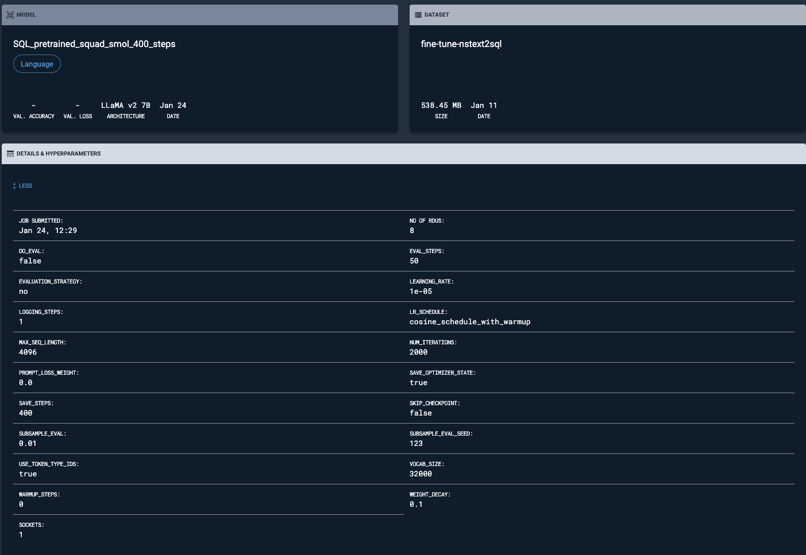
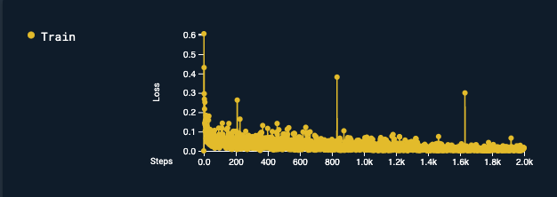

# AISK: SQL Model using SambaStudio

## Install dependencies

We recommend that you run the starter kit in a virtual environment

```bash
cd ai_starter_kit/fine_tuning_sql
python3 -m venv fine_tuning_sql_env
source fine_tuning_sql_env/enterprise_knowledge_env/bin/activate
pip  install  -r  requirements.txt
```

## Data download
Follow the notebook [1_download_data.ipynb](notebooks/1_download_data.ipynb) to download and store pre-training and fine-tuning datasets.

## Data preparation

Clone the [generative_data_prep](https://github.com/sambanova/generative_data_prep) github repo and follow the instructions. The repo required jsonl files produced in [Data download](#data-download) section above.

Below are the example commands used to prepare the data

### Pretraining data prep

Sample command:
```python
python -m generative_data_prep pipeline \
--input_file_path={input_path}/pretrain-squad-smol-sql.jsonl \
--output_path={output_path} \
--pretrained_tokenizer=meta-llama/Llama-2-7b-hf \
--max_seq_length=4096 \
--shuffle=on_RAM \
--keep_split_jsonls
```

### Fine-tuning data prep

Sample command:
```python
python -m generative_data_prep pipeline \
--input_file_path={input_path}/fine-tune-nstext2_test.jsonl \
--output_path={output_path} \
--pretrained_tokenizer=meta-llama/Llama-2-7b-hf \
--max_seq_length=4096 \
--shuffle=on_RAM \
--input_packing_config=greedy::drop \
--keep_split_jsonls
```

### Basic QA-QC

One can do basic QA-QC by loading the HDF5 and jsonl files as shown in the notebook [2_qa_data.ipynb](notebooks/2_qa_data.ipynb).

## Load the dataset on Sambastudio

Once the data preparation is done the datasets can be uploaded directly to SambaStudio.
Please refer to the SambaStudio documentation for uploading datasets ##TODO: LINK

## SambaStudio

### Pre-training
Once the datasets are uploaded, one can pre-train and fine-tune base-models on these datasets.
We use **Llama7B Base** as the starting model for further training. Below is a snapshot showing the hyperparameters 
for the training job.


### Fine-tuning
We start with a continuously pretrained model to do further fine-tuning. Below is a snapshot showing the hyperparameters 
for the fine-tuning job.



The training loss curve for the fine-tuning job is shown below.



### Hosting

The final fine-tuned model can then be hosted on SambaStudio. Once hosted, the API information, including environmental variables such as BASE_URL, PROJECT_ID, ENDPOINT_ID, and API_KEY, can be utilized to execute inference.

## Inference

The notebook [3_inference__model.ipynb](notebooks/3_inference__model.ipynb) uses the fine-tuned model in langchain to generate a SQL query from user input and then executes the query against the database.

## Benchmarking

How to benchmark the fine-tuned SQL model: WIP
