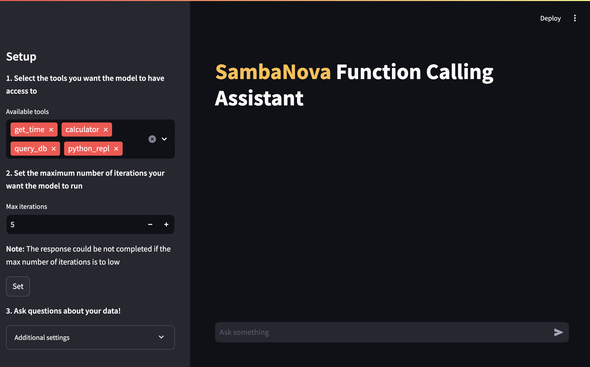

<a href="https://sambanova.ai/">
<picture>
 <source media="(prefers-color-scheme: dark)" srcset="../images/SambaNova-light-logo-1.png" height="100">
  
</picture>
</a>

Function Calling kit
====================

This function calling kit is an example of tools calling implementation and a generic function calling module that can be used inside your application workflows.
<!-- TOC -->

- [Function Calling kit](#function-calling-kit)
- [Before you begin](#before-you-begin)
    - [Clone this repository](#clone-this-repository)
    - [Set up the models, environment variables and config file](#set-up-the-models-environment-variables-and-config-file)
        - [Set up the generative model](#set-up-the-generative-model)
    - [Install dependencies](#install-dependencies)
- [Use the Function Calling kit](#use-the-function-calling-kit)
    - [Quick start](#quick-start)
        - [Streamlit App](#streamlit-app)
    - [Customizing the Function Calling module](#customizing-the-function-calling-module)
- [Third-party tools and data sources](#third-party-tools-and-data-sources)

<!-- /TOC -->
<!-- /TOC -->
# Overview

This example application for function calling automates multi-step analysis by enabling language models to use information and operations from user-defined functions. While you can use any functions or database with the application, an example use case is implemented here: Uncovering trends in music sales using the provided sample database and tools. By leveraging natural language understanding, database interaction, code generation, and data visualization, the application provides a real-world example of how models can use function calling to automate multi-step analysis tasks with accuraccy.

In addition to the sample DB of music sales, the application includes four tools that are available for the model to call as functions:

- **query_db**: Allows users to interact with the sample music sales database via natural queries. You can ask questions about the data, such as "What are the top-selling albums of all time?" or "What is the total revenue from sales in a specific region?" The function will then retrieve the relevant data from the database and display the results.
- **python_repl**: Provides a Python Read-Eval-Print Loop (REPL) interface, allowing the model to execute Python code and interact with the results in real-time. The model can use this function to perform data analysis, create data visualizations, or execute custom code to generate and verify the answer to any arbitrary question where code is helpful.
- **calculator**: Provides a simple calculator interface that allows the model to perform mathematical calculations using natural language inputs. The user can ask questions like "What is 10% of 100?" or "What is the sum of 2+2?" and the function will return the result.
- **get_time**: Returns the current date and time for use in queries or calculations.

Once the API credentials are set in the Streamlit GUI, a user can select which tools are available to the model for function calling, and select how many iterations (reasoning steps) that the model can call a tool before stopping. Once these parameters are set, users can then submit natural language queries about the dataset or select from the examples. While the application runs, the user can view how the model is trying to solve them in the execution scratchpad, and view the output from execution in the chat window.

Here is a five-minute video walking through use of the kit:
https://github.com/user-attachments/assets/71e1a4d1-fbc6-4022-a997-d31bfa0b5f14


# Before you begin

To use this in your application you need an instruction model, we recommend to use the Meta Llama3 70B or Llama3 8B. 

## Clone this repository

Clone the starter kit repo.
```
git clone https://github.com/sambanova/ai-starter-kit.git
```
## Set up the models, environment variables and config file

### Set up the generative model

The next step is to set up your environment variables to use one of the inference models available from SambaNova. You can obtain a free API key through SambaCloud.

Follow the instructions [here](../README.md#getting-a-sambanova-api-key-and-setting-your-generative-models) to set up your environment variables.

Then, in the [config file](./config.yaml), set the `model` config depending on the model you want to use.

## Install dependencies

We recommend that you run the starter kit in a virtual environment. We also recommend using Python >= 3.10 and < 3.12.

Install the python dependencies in your project environment:

```bash
cd ai-starter-kit/function_calling
python3 -m venv function_calling_env
source function_calling_env/bin/activate
pip install -r requirements.txt
```

# Use the Function Calling kit

## Quick start

### Streamlit App

We provide a simple GUI that allows you to interact with your function calling model

To run it execute the following command 

```bash
    streamlit run streamlit/app.py --browser.gatherUsageStats false 
```

After deploying the starter kit GUI App you see the following user interface:



On that page you will be able to select your function calling tools and the max number of iterations available for the model to answer your query.

## Customizing the Function Calling module

We provide a simple module for using the Function Calling LLM, for this you will need:

1. Create your set of tools:

    You can create a set of tools that you want the model to be able to use, those tools, should be langchain tools.

    We provide an example of different langchain integrated tools and implementation of custom tools in [src/tools.py](src/tools.py), and in the [step by step notebook](./notebooks/function_calling_guide.ipynb).

    > See more in [langchain tools](https://python.langchain.com/v0.1/docs/modules/tools/)

2. Instantiate your Function calling LLM, passing the model to use (Sambastudio), and the required tools as argument, then you can invoke the function calling pipeline using the `function_call_llm` method passing the user query

    ``` python
        from function_calling.src.function_calling  import FunctionCallingLlm
        
        ### Define your tools
        from function_calling.src.tools import get_time, calculator, python_repl, query_db
        tools = [get_time, calculator, python_repl, query_db]

        fc = FunctionCallingLlm(tools)

        fc.function_call_llm("<user query>", max_it=5, debug=True)
    ```

    we provide an [usage notebook](notebooks/usage.ipynb) that you can use as a guide for using the function calling module

The example module can be further customized based on the use case.

The complete tools generation, methods, prompting and parsing for implementing function calling, can be found and further customized for your specific use case following the [Guide notebook](./notebooks/function_calling_guide.ipynb)  

# Third-party tools and data sources

All the packages/tools are listed in the `requirements.txt` file in the project directory. 
