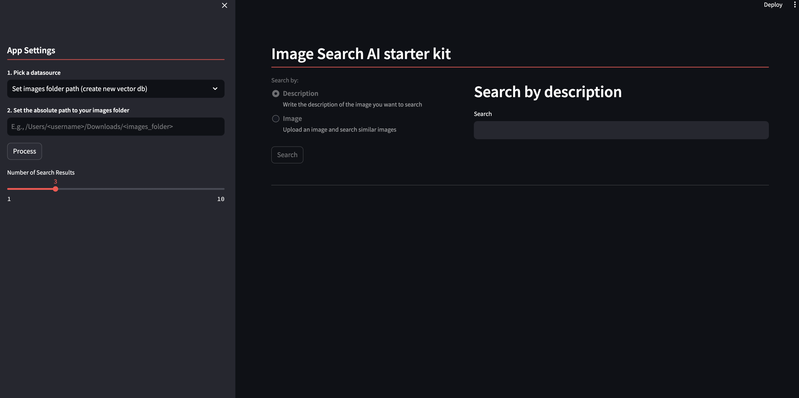

<a href="https://sambanova.ai/">
<picture>
  <source media="(prefers-color-scheme: dark)" srcset="../images/SambaNova-light-logo-1.png" height="100">
  
</picture>
</a>

SambaNova AI Starter Kits
====================
# Image Search
<!-- TOC -->
- [Overview](#overview)
- [Before you begin](#before-you-begin)
    - [Clone the repository](#clone-the-repository)
    - [Deploy an OpenCLIP SambaStudio endpoint](#deploy-an-openclip-sambastudio-endpoint)
    - [Integrate your SambaStudio endpoint with this starter kit](#integrate-your-sambastudio-endpoint-with-this-starter-kit)
- [Run the demo](#run-the-demo)
- [Use the starter kit](#use-the-starter-kit)
- [Understand starter kit workflows](#understand-the-starter-kit-workflow)
- [Third-party tools and data sources](#third-party-tools-and-data-sources)

<!-- /TOC -->


# Overview 

This AI starter kit shows a simple approach to image search by image description or image similarity. We leverage the [OpenCLIP](https://github.com/mlfoundations/open_clip) embedding models that are deployed using the SambaNova platform. After initial setup, his starter kit will automatically use the Sambanova CLI (Snapi) to create an OpenCLIP project and run batch inference jobs for doing image embedding.

This starter kit provides:

- Batch ingestion / inference for image collections
- Search image method with text as input
- Search image method with image as input
- Notebook and scripts for custom multimodal [Chroma](https://docs.trychroma.com/multi-modal) data base
- Notebook for downloading test images from [pixbay](https://pixabay.com/)  

# Before you begin

You have to prepare your environment before you begin. 

## Clone the repository

Start by running this command to clone the ai-starter-kit repository: 

```bash
    git clone https://github.com/sambanova/ai-starter-kit.git
```

## Deploy an OpenCLIP SambaStudio endpoint

SambaStudio includes a rich set of open source models that have been customized to run efficiently on RDU. Deploy a CLIP-ViT-B-32-laion2B-s34B-b79k model to an endpoint for inference in SambaStudio either through the GUI or CLI. See the [SambaStudio endpoint documentation](https://docs.sambanova.ai/sambastudio/latest/endpoints.html). 


## Integrate your SambaStudio endpoint with this starter kit

To set set up your environment, follow these steps: 

1. Get your API authorization key. The steps for getting this key are described [here](https://docs.sambanova.ai/sambastudio/latest/cli-setup.html#_acquire_the_api_key)

2. Update the environment variables file in the root repo directory `sn-ai-starter-kit/.env` to point to the SambaStudio endpoint. For example, enter an endpoint with the URL "https://api-stage.sambanova.net/api/predict/nlp/12345678-9abc-def0-1234-56789abcdef0/456789ab-cdef-0123-4567-89abcdef0123" and a SambaStudio key `"1234567890abcdef987654321fedcba0123456789abcdef"` with no spaces as:

```yaml
CLIP_BASE_URL="https://api-stage.sambanova.net/api/predict/nlp/12345678-9abc-def0-1234-56789abcdef0/456789ab-cdef-0123-4567-89abcdef0123"
CLIP_API_KEY="89abcdef-0123-4567-89ab-cdef01234567"
```
3. In the [config file](./config.yaml) file, set the variable `api` to `"sambastudio"`    

4. (Recommended) Use a virtualenv or conda environment for installation, and update pip:
```bash
    cd ai-starter-kit/image_search
    python3 -m venv image_search_env
    source image_search_env/bin/activate
    pip install -r requirements.txt
```

**If you want to speed up the ingestion of images to search use the following steps**

1. Download and install the SambaStudio CLI. Follow [these instructions](https://docs.sambanova.ai/sambastudio/latest/cli-setup.html) to install SambaNova SNSDK and SNAPI, (You can omit the *Create a virtual environment* step because you created a venv in the previous step.)

2. Find the OpenCLIP app ID. 
* First run the following command in your terminal:  
```bash
snapi app list 
```
* Then find the ID in the ```CLIP``` section.

3. Update the  [config file](./config.yaml):
* Set the `open_clip_app_id` key in the `apps` section to the ID you just found in Step 6. 
* Set the `base_url` key in the `urls` section to the url of your SambaStudio environment.
* Set the `ingestion_mode` key to batch_inference_job


# Run the demo

To run the demo, run the following command:

```bash
streamlit run streamlit/app.py --browser.gatherUsageStats false  
```

You will see the following Streamlit user interface:




# Use the starter kit 

Perform the following tasks in the Streamlit GUI:

1. In the **Set images folder path** section, make a selection: 
* Option 1: Specify a folder with PNG or JPEG images. If you do, all the images are passed through the OpenCLIP model and the embedding of each image is stored in a multimodal chroma vectorDB. This takes several minutes.
* Option 2: Specify a previously created VectorDB selecting *Use existing vector db*.

2. Select the search method, either image or text.

3. Search for an image. You have these options: 
* Option 1: Describe the image you are searching for in text.
* Upload a new image to search by image similarity.

# Understand the starter kit workflow

This starter kit has several distinct steps. Here's what each step does: 

* **Image ingestion and embedding:** This step involves the batch ingestion and inference process for image collections. When the user selects the source as *Image Collection* and provides the path to the folder containing JPG or PNG images, the images are passed through the OpenCLIP model for embedding generation.

* **Vector database storage:** After the image embeddings are generated using the OpenClip model, they are stored in a Vector DataBase (VectorDB). This VectorDB serves as a repository for efficiently storing and retrieving the embeddings of images processed during the ingestion phase. By leveraging vector similarity strategies, the embeddings can be quickly accessed for subsequent image retrieval tasks.

* **Image retrieval--Search with text:** In this method of image retrieval, users enter a textual description of the image they are searching for. Leveraging the embeddings stored in the VectorDB, the system tries to match the textual description with the corresponding image embeddings to identify relevant images. This search method enables users to find images based on semantic similarities derived from the text input.

* **Image retrieval--Search with image:** To find an image that's similar to an uploaded image, the system compares the embedding of the uploaded image with the embeddings stored in the VectorDB to identify images with similar visual features. This method allows users to search for images based on visual similarity, facilitating tasks such as finding visually related images or identifying visually similar objects within a dataset.

# Third-party tools and data sources

All the packages/tools are listed in the `requirements.txt` file in the project directory.
