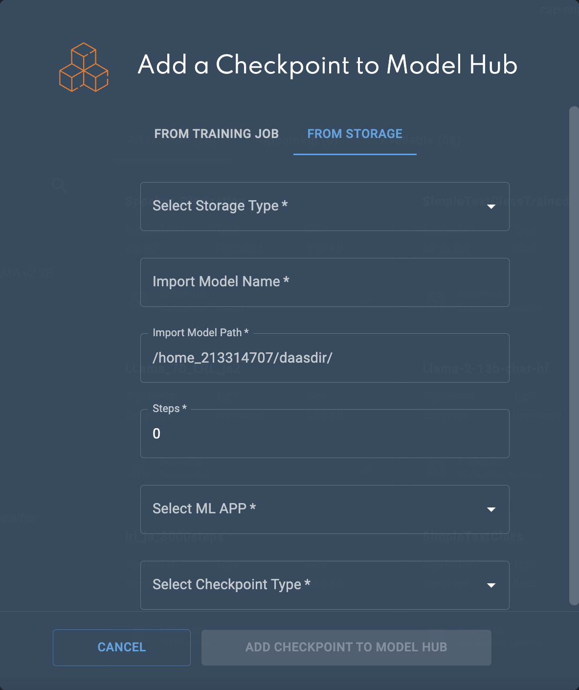

Low-resource languages
======================

# Overview

## About this template

This AI Starter Kit is an example of how to train an LLM for a low-resource language, when we have a shortage of target language training data.
It includes:
 -   Scripts to prepare the tokenizer and model for training on SambaStudio.
 -   Instructions for uploading the model and datasets to SambaStudio and details on training.
 -   Illustration of how the finetuned model behaves.

### Install requirements.
It is recommended to use virtualenv or conda environment for installation, and to update pip.
    ```bash
    cd ai-starter-kit/low_resource_languages
    python3 -m venv lrl
    source/lrl/bin/activate
    pip install -r requirements.txt
    ```

## Workflow
There are two main parts to this process: (1) preparing the model,tokenizer, and dataset for training and (2) Launching the training and inference on Sambastudio

### Preparing the model and tokenizer

Complete the `configs.yaml` file with the relevant details
```yaml
    vocab_size: # the desired tokenizer vocabulary size for the target-language
    input_data_file: # path to the input data file
    num_threads: # number of CPU threads to run in parallel for tokenizer training
    character_coverage: # amount of characters covered by the model, good defaults are: 0.9995 for languages with rich character set like Japanese or Chinese and 1.0 for other languages with small character set.
    
    base_tokenizer: # path to local tokenizer or huggingface name if you want to download it directly from HF e.g 'llama_2/Llama-2-7b-hf'
    sp_model_file: # path to the sentencepiece tokenizer model file generated from step 1 (training the target language tokenizer)
    output_dir: # path to save the merged tokenizer model
    
    model_path: # path to local model or huggingface name if you want to download it directly from HF e.g 'llama_2/Llama-2-7b-hf'
    output_model_path: # path to save the augmented model
    tokenizer_path: #path to merged tokenizer - this should be the same as `output_dir`.
    target_config: #path to configuration file for base model.
    init_method: #choice of initialization method for model parameters
```


#### Step 1: Train sentencepiece tokenizer

Firstly, we need to train a sentencepiece tokenizer of our target language dataset. You will need a 
one-sentence-per-line raw corpus file such as a txt file which you add in the config.

    python src/train_sentencepiece_tokenizer.py


#### Step 2: Add tokens 
Secondly, we need to merge the vocab of our new sentencepiece tokenizer with an existing pretrained base model.

    python src/add_tokens.py 

#### Step 3: Initialize new token Embeddings 
Lastly, we must augment our base LLM to accommodate the new vocab size.

    python src/checkpoint_extension.py  

### Launching the training on SambaStudio 
The next step is to upload the model and the datasets to SambaStudio.



Before uploading your dataset, you will need to process it via the gen_data_prep resource which you should consult for the latest updates.

Download the [Samabnova data preparation repository](https://github.com/sambanova/generative_data_prep)
   ```bash
    deactivate
    cd ../..
    git clone https://github.com/sambanova/generative_data_prep
    cd generative_data_prep
    python3 -m venv generative_data_prep_env
    source/generative_data_prep_env/bin/activate
   ```

    Then follow the [installation guide](https://github.com/sambanova/generative_data_prep?tab=readme-ov-file#installation)

For training hyperparameters please consult the [original paper](https://arxiv.org/pdf/2311.05741.pdf).

### Inference

To test the model, update your `.env` file and host the model on an endpoint in SambaStudio.

Update API information for the SambaNova LLM and your environment [sambastudio key](#get-your-sambastudio-api-key). 

```dotenv
    BASE_URL="https://api-stage.sambanova.net"
    PROJECT_ID="12345678-9abc-def0-1234-56789abcdef0"
    ENDPOINT_ID="456789ab-cdef-0123-4567-89abcdef0123"
    API_KEY="89abcdef-0123-4567-89ab-cdef01234567"

    YODA_BASE_URL="https://api-stage.sambanova.net"
    YODA_PROJECT_ID="12345678-9abc-def0-1234-56789abcdef0"
    BASELINE_ENDPOINT_ID="987654ef-fedc-9876-1234-01fedbac9876"
    BASELINE_API_KEY="12fedcba-9876-1234-abcd76543"

    SAMBASTUDIO_KEY="1234567890abcdef987654321fedcba0123456789abcdef"
   ```

Then run `inference.py` with your sentence to translate.


