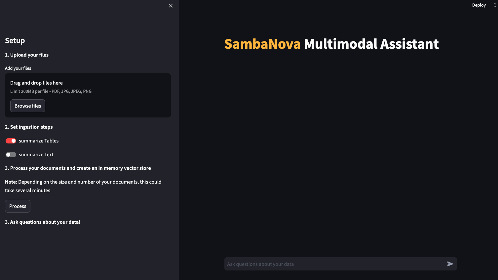

<a href="https://sambanova.ai/">
<picture>
 <source media="(prefers-color-scheme: dark)" srcset="../images/SambaNova-light-logo-1.png" height="100">
  
</picture>
</a>

Multimodal Knowledge Retrieval
======================

<!-- TOC -->

- [Multimodal Knowledge Retrieval](#multimodal-knowledge-retrieval)
- [Overview](#overview)
    - [Capabilities and Limitations of Image Analysis](#capabilities-and-limitations-of-image-analysis)
- [Before you begin](#before-you-begin)
    - [Clone this repository](#clone-this-repository)
    - [Set up the LVLM](#set-up-the-lvlm)
    - [Set up the inference endpoint, configs and environment variables](#set-up-the-inference-endpoint-configs-and-environment-variables)
    - [Update the Embeddings API information](#update-the-embeddings-api-information)
    - [Install system dependencies](#install-system-dependencies)
- [Deploy the starter kit GUI](#deploy-the-starter-kit-gui)
    - [Option 1: Use a virtual environment](#option-1-use-a-virtual-environment)
    - [Option 2: Deploy the starter kit in a Docker container](#option-2-deploy-the-starter-kit-in-a-docker-container)
- [Use the starter kit GUI](#use-the-starter-kit-gui)
- [Workflows](#workflows)
    - [Parsing and indexing workflow](#parsing-and-indexing-workflow)
    - [Retrieval workflow](#retrieval-workflow)
        - [More info](#more-info)
    - [Q&A workflow](#qa-workflow)
- [Customizing the starter kit](#customizing-the-starter-kit)
    - [Customize data import](#customize-data-import)
    - [Customize data splitting](#customize-data-splitting)
    - [Customize data embedding](#customize-data-embedding)
    - [Customize embedding storage](#customize-embedding-storage)
    - [Customize Retrieval](#customize-retrieval)
    - [Customize the LLM](#customize-the-llm)
        - [SambaStudio endpoint](#sambastudio-endpoint)
        - [Experiment with Prompt Engineering](#experiment-with-prompt-engineering)
- [Third-party tools and data sources](#third-party-tools-and-data-sources)

<!-- /TOC -->

# Overview

This AI Starter Kit is an example of a multimodal retrieval workflow. You load your images or PDF files, and get answers to questions about the documents content. The Kit includes:
 -   A configurable SambaStudio connector. The connector generates answers from a deployed multimodal model, and a deployed LLM.
 -   An integration with a third-party vector database.
 -   An implementation of a semantic search workflow.
 -   An implementation of a multi-vector database for searching over document summaries
 -   Prompt construction strategies.

This sample is ready-to-use. We provide two options:
* [Use the starter kit GUI](#use-the-starter-kit-gui) helps you run a demo by following a few simple steps. You must perform the setup in [Before you begin](#before-you-begin) and [Deploy the starter kit GUI](#deploy-the-starter-kit-gui) first. 
* [Customizing the starter kit](#customizing-the-starter-kit) serves as a starting point for customizing the demo to your organization's needs.

https://github.com/sambanova/ai-starter-kit/assets/150964187/21f83d80-c479-4677-9e80-3dcb096f120e

## Capabilities and Limitations of Image Analysis
The AI Starter Kit includes capabilities for retrieving and analyzing images contained in your source documents and integrating them with table textual information to generate comprehensive answers.

Image Source Retrieval: The system retrieves and shows the image sources used to generate an answer, allowing you to perform further analysis on the original images.

General Image Understanding: 
    
The model is capable of understanding the general content and some specific details of images such as photos, logos, and other visual elements.

- Charts and Graphs:

    General Understanding: The model can understand the generalities of charts, including simple and uncluttered charts where it can identify trends.
    Axes Recognition: It usually recognizes what the axes in plots represent.
    Detailed Data Points:
    Comparative Analysis: It is not proficient at making comparisons between data points or performing detailed analyses of graphs.

- Diagrams and Schematics:

    General Understanding: The model can grasp general concepts in diagrams such as schematics and database schemas.
    Detailed Information: It is unreliable in generating detailed information, such as text contained within diagrams or specific details of connections, and can sometimes produce hallucinated information.

PDF Documents: The model performs well in analyzing PDF documents that include both text and images. It uses tables and images to generate comprehensive answers and provides related images to support its responses.

This overview should help users understand the strengths and limitations of the image analysis capabilities in your AI Starter Kit, enabling them to make better use of the system.

# Before you begin

This starter kit, you need both a LVLM and a LLM. 
* We use the Llama4 Maverick as LVLM, which is currently available in SambaNovaCloud.
* You can use a LLM of your choice, from SambaStudio or SambaNovaCloud. 

It might make sense to use two SambaNovaCloud models.

## Clone this repository

Clone the starter kit repo.
```
git clone https://github.com/sambanova/ai-starter-kit.git
```

## Set up the LVLM

1. Deploy LVLM of choice (e.g. Llava 1.5) to an endpoint for inference in SambaStudio, either through the GUI or CLI. See the [SambaStudio endpoint documentation](https://docs.sambanova.ai/sambastudio/latest/llava-7b.html#_deploy_a_llava_v1_5_7b_endpoint).

## Set up the inference endpoint, configs and environment variables

The next step is to set up your environment variables to use one of the models available from SambaNova. If you're a current SambaNova customer, you can deploy your models with SambaStudio. If you are not a SambaNova customer, you can self-service provision API endpoints using SambaNova Cloud.

- If using **SambaNova Cloud** Please follow the instructions [here](../README.md#use-sambanova-cloud-option-1) for setting up your environment variables.
    Then in the [config file](./config.yaml) set the llm and lvlm `type` variable to `"sncloud"` and set the `select_expert` config depending on the models you want to use.

- If using **SambaStudio** Please follow the instructions [here](../README.md#use-sambastudio-option-2) for setting up endpoint and your environment variables.
    Then in the [config file](./config.yaml) set the llm and lvlm `type` variable to `"sambastudio"`, set the `bundle` and `select_expert` configs if using bundle endpoints.

## Update the Embeddings API information

You have the following options to set up your embedding model:

* **SambaNovaCloud embedding model (Option 1)**: To get maximum inference speed, you can use a SambaNova Cloud embeddings models. Follow the instructions [here](../README.md#use-sambanovacloud-embedding-option-1) to set up your endpoint and environment variables. Then, in the [config file](./config.yaml), set the variable `type` in `embedding_model` to `"sncloud"`, and set the `model`.

* **CPU embedding model (Option 2)**: In the [config file](./config.yaml), set the variable `type` in `embedding_model` to `"cpu"`.

* **SambaStudio embedding model (Option 3)**: To increase inference speed, you can use a SambaStudio embedding model endpoint instead of using the default (CPU) Hugging Face embedding. Follow the instructions [here](../README.md#use-sambastudio-embedding-option-3) to set up your endpoint and environment variables. Then, in the [config file](./config.yaml), set the variable `type` in `embedding_model` to `"sambastudio"`, and set the configs `batch_size`, `bundle` and `model` according to your SambaStudio endpoint.

    > NOTE: Using different embedding models (cpu or sncloud/sambastudio) may change the results, and change How the embedding model is set and what the parameters are. 

##  Install system dependencies

   - Ubuntu instalation:
      ```
      sudo apt install tesseract-ocr
      ```
   - Mac Homebrew instalation:
      ```
      brew install tesseract
      ```
    - Windows instalation:
      > [Windows tessearc instalation](https://github.com/UB-Mannheim/tesseract/wiki)

   - For other linux distributions, follow the [**Tesseract-OCR installation guide**](https://tesseract-ocr.github.io/tessdoc/Installation.html) 

# Deploy the starter kit GUI

We recommend that you run the starter kit in a virtual environment or use a container. 

## Option 1: Use a virtual environment

NOTE: python 3.10 or higher is required to run this kit.


1. Install and update pip.

    ```bash
      cd ai-starter-kit/multimodal_knowledge_retriever
      python3 -m venv multimodal_knowledge_env
      source multimodal_knowledge_env/bin/activate
      pip  install  -r  requirements.txt
    ```

2. Run the following command:
```
streamlit run streamlit/app.py --browser.gatherUsageStats false 
```

After deploying the starter kit you see the following user interface:



## Option 2: Deploy the starter kit in a Docker container 

NOTE: If you are deploying the docker container in Windows be sure to open the docker desktop application. 

To run the starter kit  with docker, run the following command:

    docker-compose up --build

You will be prompted to go to the link (http://localhost:8501/) in your browser where you will be greeted with the streamlit page as above.


# Use the starter kit GUI

When the GUI is up and running, follow these steps to use it: 

1. In the left pane, under **Upload your files**, drag and drop PDF or image files or browse for files.

2. Under **Set ingestion steps**, select processing steps you want to apply to the loaded files.

3. Under **Set retrieval steps**, select the retrieval method that you want to use for answering, see more in [Q&A workflow](#qa).

4. Click **Process** to process all loaded PDFs. A vector store is created in memory.

3. Ask questions about your data in the main panel.

# Workflows

The following workflows are part of this starter kit out of the box. 

## Parsing and indexing workflow

This workflow is an example of parsing and indexing data for subsequent Q&A. The steps are:

1. **Document parsing:** The [unstructured inference](https://github.com/Unstructured-IO/unstructured-inference) Python package is used to extract text from PDF documents. Multiple [integrations](https://python.langchain.com/docs/modules/data_connection/document_loaders/pdf) for text extraction from PDF are available on the LangChain website. Depending on the quality and the format of the PDF files, this step might require customization for different use cases.


2. **Split data:** After the data has been parsed and its content extracted, we need to split the data into chunks of text to be embedded and stored in a vector database. The size of the chunks of text depends on the context (sequence) length offered by the model. Generally, larger and related context chunks result in better performance. The method used to split text has an impact on performance (for instance, making sure there are no word breaks, sentence breaks, etc.). The downloaded data is split using the [unstructured partition pdf](https://unstructured-io.github.io/unstructured/core/partition.html) method with `chunking_strategy="by_title"`.

3 **Summarize data** Text chunks and identified tables are summarized using the selected Large Language Model. For image parsing the Large Vision-Language Model is used as image summarizer.


3. **Embed data:** For each chunk from the previous step, we use an embeddings model to create a vector representation. These embeddings are used in the storage and retrieval of the most relevant content given a user's query.

    For more information about what an embedding is click [here](https://towardsdatascience.com/neural-network-embeddings-explained-4d028e6f0526)

4. **Store embeddings:** Embeddings for each chunk are stored in a vector database, along with content and relevant metadata (such as source documents). The embedding acts as the index in the database. In this starter kit, we store information with each entry, which can be modified to suit your needs. Several vector databases are available, each with their own pros and cons. This AI starter kit is set up to use [Chroma](https://github.com/chroma-core/chroma) as the vector database because it is a free, open-source option with straightforward setup, but you could use a different vector database if you like. 

## Retrieval workflow

This workflow is an example of leveraging data stored in a vector database and doc storage along with a large language model to enable retrieval-based Q&A off your data. The steps are:

1.  **Embed query:** The first step is to convert a user-submitted query into a common representation (an embedding) for subsequent use in identifying the most relevant stored content. Use the *same* embedding model for ingestion and to generate embeddings. In this sample, the query text is embedded using [HuggingFaceInstructEmbeddings](https://api.python.langchain.com/en/latest/embeddings/langchain.embeddings.huggingface.HuggingFaceInstructEmbeddings.html), which is the same model in the ingestion workflow.
 
2.  **Retrieve relevant documents** Next, we use the embeddings representation of the query to make a retrieval request from the vector database, which in turn returns *relevant* entries (documents or summaries). The vector database and doc storage therefore also act as a retriever for finding the relevant information and fetching the original chunks from the doc storage.

### More info

* Find more information about embeddings and their retrieval [here](https://pub.aimind.so/llm-embeddings-explained-simply-f7536d3d0e4b)*
 
* Find more information about retrieval-augmented generation with LangChain [here](https://python.langchain.com/docs/modules/data_connection/)

* Find more information about multi-vector retrievers [here](https://python.langchain.com/docs/modules/data_connection/retrievers/multi_vector/)*

## Q&A workflow

After the relevant information is retrieved, what happens next depends on the setting of **Answer over raw images**.

* If **Answer over raw images** is disabled, the content (table and text documents/summaries, and images summaries) is sent directly to a SambaNova LLM to generate a final response to the user query.

* If **Answer over raw images** is enabled, the retrieved raw images and query are both sent to the LVLM. With each image, intermediate answers to the query are received. These intermediate answers are included with relevant text and table documents/summaries to be used as context.

The user's query is combined with the retrieved context along with instructions to form the prompt before being sent to the LLM. This process involves prompt engineering, and is an important part of ensuring quality output. In this AI starter kit, customized prompts are provided to the LLM to improve the response quality.

Learn more about [Prompt engineering](https://www.promptingguide.ai/)

# Customizing the starter kit

The example template can be further customized based on the use case.

## Customize data import

**PDF Format:** Different packages are available to extract text from PDF files. They can be broadly categorized as
- OCR-based: [pytesseract](https://pypi.org/project/pytesseract/), [paddleOCR](https://pypi.org/project/paddleocr/), [unstructured](https://unstructured.io/)
- Non-OCR based: [pymupdf](https://pypi.org/project/PyMuPDF/), [pypdf](https://pypi.org/project/pypdf/), [unstructured](https://unstructured.io/)
Most of these packages have easy [integrations](https://python.langchain.com/docs/modules/data_connection/document_loaders/pdf) with the Langchain library.

You can find examples of the usage of these loaders in the [Data extraction starter kit](../data_extraction/README.md)

Unstructured kit includes a easy to use image extraction method using YOLOX model which is used by default in the kit. When using other extraction tool, implement a proper image extraction strategy.


You can include a new loader in the following location:
```
file: src/multimodal.py
function: extract_pdf
```

## Customize data splitting 

This kit uses the data normalization and partition strategy from the unstructured package but you can experiment with different ways of splitting the data, such as splitting by tokens or using context-aware splitting for code or markdown files. LangChain provides several examples of different kinds of splitting [here](https://python.langchain.com/docs/modules/data_connection/document_transformers/).

you can modify the maximum length of each chunk in the following location:
file: [config.yaml](config.yaml)
```yaml
retrieval:
    "max_characters": 1000
    "new_after_n_chars": 800
    "combine_text_under_n_chars": 500
    ...
```

## Customize data embedding 

Several open-source embedding models are available on Hugging Face. [This leaderboard](https://huggingface.co/spaces/mteb/leaderboard) ranks these models based on the Massive Text Embedding Benchmark (MTEB). A number of these models are available on SambaStudio and can be further fine-tuned on specific datasets to improve performance.

You can do this modification in the following location:
```
file: src/multimodal.py
function: create_vectorstore
```

For details about the SambaStudio hosted embedding models see the section *Use Sambanova's LLMs and Embeddings Langchain wrappers* [here](../README.md)

## Customize embedding storage 

The starter kit can be customized to use different vector databases to store the embeddings generated by the embedding model. The [LangChain vector stores documentation](https://js.langchain.com/docs/modules/data_connection/vectorstores/integrations/) provides a broad collection of vector stores that can be easily integrated.

You can do this modification in the following location:
```
file: src/multimodal.py
function: create_vectorstore
```

## Customize Retrieval

A wide collection of retriever options is available. In this starter kit, the vector store and doc store are used as retriever, but they can be enhanced and customized, as shown in [here](https://python.langchain.com/docs/modules/data_connection/retrievers/multi_vector/).

You can do this modification in the following location:
file: [config.yaml](config.yaml)
```yaml
    "k_retrieved_documents": 3
```
and
file: [app.py](strematil/app.py)
```
function: get_retrieval_chain 
```

## Customize the LLM

You can customize the Large Language Model. The customization depends on the endpoint that you are using. 

### SambaStudio endpoint

The starter kit uses the SN LLM model, which can be further fine-tuned to improve response quality. 

1. To train a model in SambaStudio, [prepare your training data](https://docs.sambanova.ai/sambastudio/latest/generative-data-prep.html), [import your dataset into SambaStudio](https://docs.sambanova.ai/sambastudio/latest/add-datasets.html) and [run a training job](https://docs.sambanova.ai/sambastudio/latest/training.html)
2. To modify the parameters for calling the model, make changes to the `config.yaml` file. 
3. You can also set the values of temperature and maximum generation token in that file. 

### Experiment with Prompt Engineering

Prompting has a significant effect on the quality of LLM responses. Prompts can be further customized to improve the quality of the responses from the LLMs. For example, in this starter kit, the following prompt was used to generate a response from the LLM, where `question` is the user query and `context` is the documents retrieved by the retriever.
```python
custom_prompt_template = """[INST]<<SYS>> You are a helpful assistant for question-answering tasks. Use the following pieces of retrieved context to answer the question. If the answer is not in the context, say that you don't know. Cross check if the answer is contained in provided context. If not than say \"I do not have information regarding this\". Do not use images or emojis in your answer. Keep the answer conversational and professional.<</SYS>>

{context}    

Question: {question}

Helpful answer: [/INST]"""

CUSTOMPROMPT = PromptTemplate(
template=custom_prompt_template, input_variables=["context", "question"]
)
```

You can make modifications in the [prompts](./prompts) folder

# Third-party tools and data sources

All the packages/tools are listed in the `requirements.txt` file in the project directory.
