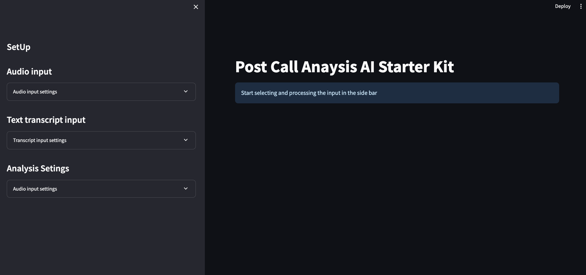
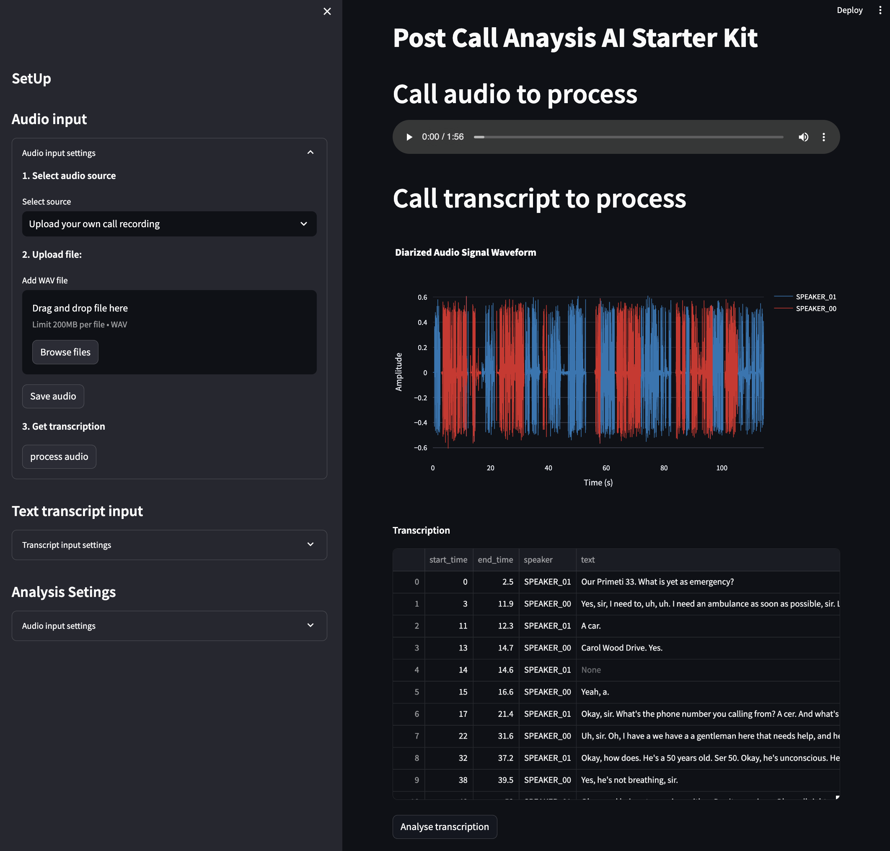
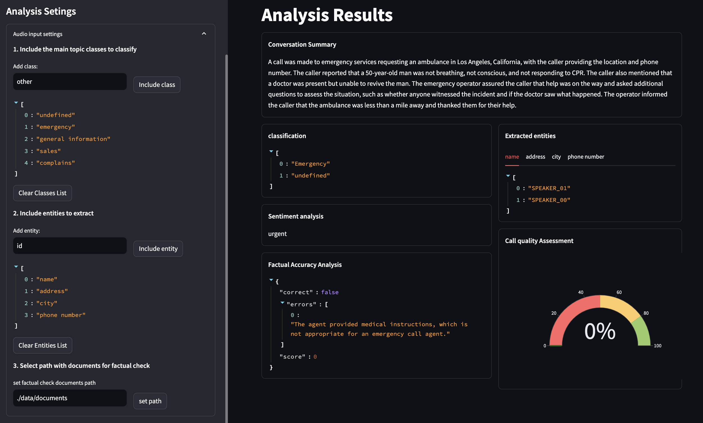

<a href="https://sambanova.ai/">
<picture>
  <source media="(prefers-color-scheme: dark)" srcset="../images/SambaNova-light-logo-1.png" height="60">
  
</picture>
</a>

Post Call Analysis
======================

<!-- TOC -->

- [Post Call Analysis](#post-call-analysis)
- [Overview](#overview)
- [Before you begin](#before-you-begin)
    - [Clone this repository](#clone-this-repository)
    - [Set up the models and config file](#set-up-the-models-and-config-file)
        - [Set up the inference endpoint, configs and environment variables](#set-up-the-inference-endpoint-configs-and-environment-variables)
        - [Update the Embeddings API information](#update-the-embeddings-api-information)
- [Run the starter kit](#run-the-starter-kit)
    - [Option 1: Use a virtual environment](#option-1-use-a-virtual-environment)
    - [Option 2: Deploy the starter kit in a Docker container](#option-2-deploy-the-starter-kit-in-a-docker-container)
- [Use post-call analysis with your own data](#use-post-call-analysis-with-your-own-data)
- [How the starter kit works](#how-the-starter-kit-works)
- [Customizing the starter kit](#customizing-the-starter-kit)
    - [Customize the model](#customize-the-model)
        - [SambaStudio](#sambastudio)
        - [Improve results with prompt engineering](#improve-results-with-prompt-engineering)
        - [Customize the factual accuracy analysis](#customize-the-factual-accuracy-analysis)
        - [Customize call quality assessment](#customize-call-quality-assessment)
        - [Customize batch inference](#customize-batch-inference)
- [Third-party tools and data sources](#third-party-tools-and-data-sources)

<!-- /TOC -->

# Overview

This AI starter kit illustrates a systematic approach to post-call analysis including Automatic Speech Recognition (ASR), diarization, large language model analysis, and retrieval augmented generation (RAG) workflows. All workflows are built using the SambaNova platform.

NOTE: You must use SambaStudio for the Automatic Speech Recognition (ASR) workflow. You can use SambaNovaCloud or SambaStudio to perform text analysis.

This starter kit provides:

- A customizable SambaStudio connector that facilitates LLM inference from deployed models.
- A configurable SambaStudio connector that enables ASR inference workflow from deployed models.
- Implementation of a RAG workflow that includes prompt construction strategies which are tailored for call analysis, including:
    
    - Call summarization
    - Classification
    - Named entity recognition
    - Sentiment analysis
    - Factual accuracy analysis
    - Call quality assessment

This example is ready to use. We provide:

- Instructions for setup.
- Instructions for running the model as is.
- Instructions for customization.

# Before you begin

This starter kit automatically uses the SambaNova `snapi` CLI to create an ASR project and run batch inference jobs for doing speech recognition steps. You only have to set up your environment first.

## Clone this repository

Clone the start kit repo.

``` bash
git clone https://github.com/sambanova/ai-starter-kit.git
```

## Set up the models and config file

### Set up the inference endpoint, configs and environment variables

The next step is to set up your environment variables to use one of the models available from SambaNova. If you're a current SambaNova customer, you can deploy your models with SambaStudio. If you are not a SambaNova customer, you can self-service provision API endpoints using SambaNova Cloud.

You must perform SambaStudio setup.

- The ASR pipeline requires that you perform the SambaStudio setup steps.
- For the text analysis, you can use either SambaStudio, SambaNovaCloud.

- If using **SambaNova Cloud** Please follow the instructions [here](../README.md#use-sambanova-cloud-option-1) for setting up your environment variables.
    Then in the [config file](./config.yaml) set the llm `api` variable to `"sncloud"` and set the `select_expert` config depending on the model you want to use.

- For **SambaStudio** setup please follow the instructions [here](../README.md#use-sambastudio-option-3) for setting up endpoint and your environment variables.
    Then in the [config file](./config.yaml) set the llm `api` variable to `"sambastudio"`, set the `bundle` and `select_expert` configs if using a bundle endpoint.

    >NOTE: You must have at least 3 RDUs available in your SambaStudio environment for the ASR pipeline batch inference jobs.

    Log in to SambaStudio and get your API authorization key. The steps for getting this key are described [here](https://docs.sambanova.ai/sambastudio/latest/cli-setup.html#_acquire_the_api_key). then include the generated key in the env file (with no spaces):

    ``` bash
        SAMBASTUDIO_KEY="1234567890abcdef987654321fedcba0123456789abcdef"
    ```

### Update the Embeddings API information

You have the following options to set up your embedding model:

* **SambaNovaCloud embedding model (Option 3)**: To get maximum inference speed, you can use a SambaNova Cloud embeddings models. Follow the instructions [here](../README.md#use-sambanovacloud-embedding-option-1) to set up your endpoint and environment variables. Then, in the [config file](./config.yaml), set the variable `type` in `embedding_model` to `"sncloud"`, and set the `model`.

* **CPU embedding model (Option 2)**: In the [config file](./config.yaml), set the variable `type` in `embedding_model` to `"cpu"`.

* **SambaStudio embedding model (Option 3)**: To increase inference speed, you can use a SambaStudio embedding model endpoint instead of using the default (CPU) Hugging Face embedding. Follow the instructions [here](../README.md#use-sambastudio-embedding-option-3) to set up your endpoint and environment variables. Then, in the [config file](./config.yaml), set the variable `type` in `embedding_model` to `"sambastudio"`, and set the configs `batch_size`, `bundle` and `model` according to your SambaStudio endpoint.


    > NOTE: Using different embedding models (cpu or sambastudio) may change the results, and change How the embedding model is set and what the parameters are.

# Run the starter kit

We recommend that you run  the the starter kit in a virtual environment or use a container.

## Option 1: Use a virtual environment

If you want to use virtualenv or conda environment

1. Install and update pip.

```bash
    cd ai-starter-kit/post_call_analysis
    python3 -m venv post_call_analysis_env
    source post_call_analysis_env/bin/activate
    pip install -r requirements.txt
```

2. Download and install the SambaStudio CLI. Follow [these instructions](https://docs.sambanova.ai/sambastudio/latest/cli-setup.html) to install SambaNova SNSDK and SNAPI, (You can omit the Create a virtual environment step because you created a venv in the previous step.)

3. Run the following command:

```bash
streamlit run streamlit/app.py --browser.gatherUsageStats false  
```

You will see the following Streamlit user interface



## Option 2: Deploy the starter kit in a Docker container 

If you want to use Docker:

1. Update the `SAMBASTUDIO_KEY`, `SNAPI`, `SNSDK` args in [docker-compose.yaml file](docker-compose.yaml)

2. Run the command:

    ```bash
    docker-compose up --build
    ```

You will be prompted to go to the link (http://localhost:8501/) in your browser where you will be greeted with the streamlit page as above.

#  Use post-call analysis with your own data

NOTE: For this task, you must have at least 3 RDUs available in your SambaStudio environment.

1. Pick your source audio (.wav file) or transcript (CSV file containing the call transcription with diarization). 

2. In the GUI, select either **Audio input** or **Text transcript input** and upload the file. If the input is an audio file, the processing step could take a couple of minutes to initialize the bash inference job in SambaStudio. Then the GUI is updated to show information like the following: 



3. In the GUI, select **Analysis Settings** and set the analysis parameters. You can define a list of classes for classification or specify entities for extraction.

    Provide the input path containing your facts and procedures knowledge bases, or you include a list of urls that you want to scrape to include it as facts and procedures knowledge bases.

    By default, this starter kit performs factual and procedures check only on .txt and PDF files or urls.  

4. Click the **Analyse transcription** button to run the analysis steps over the transcription. After a short time (a few minutes) you will see the following output structure.



# How the starter kit works

This section discusses how the start kit works and which tasks it performs with each step.

* **Audio processing:** Audio processing is performed by the batch inference pipeline for ASR and Diarization and is composed of these steps:

    - **Transcription:** The Transcription step involves converting the audio data into text format. This step utilizes Automatic Speech Recognition (ASR) technology to transcribe spoken words into written text.

    - **Diarization:** The Diarization process distinguishes between different speakers in the conversation. It segments the audio data based on speaker characteristics, identifies each speaker's audio segments, and enables further analysis on a per-speaker basis.

    This pipeline returns a CSV file that contains the timestamped audio segments with speaker labels and transcription assigned to each segment.

* **Text Analysis:** For the analysis process, you set a list of categories for classifying the text, and the LLM assigns the text to one category using zero shot classification. Analysis consists of several steps. 

    - **Transcript Reduction:** Transcript reduction involves condensing the transcribed text to eliminate redundancy and shorten it enough to fit within the context length of the LLM. This results in a more concise representation of the conversation. This process uses the [reduce](https://api.python.langchain.com/en/latest/chains/langchain.chains.combine_documents.reduce.ReduceDocumentsChain.html) langchain chain and the [`reduce prompt template`](./prompts/reduce.yaml), which iteratively takes chunks of the conversation and compresses them while preserving key ideas and entities.

    - **Summarization:** Summarization generates a summary of the conversation, capturing its key points and main themes. This process uses the [`summarization prompt template`](./prompts/sumarization.yaml).

    - **Classification:** Classification categorizes the call based on its content or purpose by assigning it to a list of predefined classes or categories. This zero-shot classification uses the [`classification prompt template`](./prompts/topic_clasification.yaml). The reduced call transcription and a list of possible classes is passed to the langchain [list output parser](https://python.langchain.com/docs/modules/model_io/output_parsers/types/csv) to get a list structure as result.

    - **Named entity recognition:** Named Entity Recognition (NER) identifies and classifies named entities mentioned in the conversation, such as names of people, organizations, locations, and other entities of interest. We pass (1) a list of entities and (2) the reduced conversation to the [`NER prompt template`](./prompts/ner.yaml). The output is parsed with the langchain [Structured Output parser](https://python.langchain.com/docs/modules/model_io/output_parsers/types/structured), which returns a JSON structure containing a list of extracted values for each entity.

    - **Sentiment Analysis:** Sentiment Analysis determines the overall sentiment expressed in the conversation. This can help gauge the emotional tone of the interaction. This process uses the [`sentiment analysis prompt template`](./prompts/sentiment_analysis.yaml).

    - **Factual Accuracy Analysis:** Factual Accuracy Analysis evaluates the factual correctness of statements made during the conversation. This process uses a RAG (Retrieval Augmented Generation) methodology:
        - A series of documents are loaded, chunked, embedded, and stored in a vectorstore database.
        - Relevant documents for factual checks and procedures are retrieved and contrasted with the call transcrip using the [`Factual Accuracy Analysis prompt template`](./prompts/factual_accuracy_analysis.yaml) and a [retrieval](https://api.python.langchain.com/en/latest/chains/langchain.chains.retrieval.create_retrieval_chain.html) langchain chain. 
        - The output is then parsed using the langchain [Structured Output parser](https://python.langchain.com/docs/modules/model_io/output_parsers/types/structured), which converts it into a JSON structure containing a `correctness` field, an `error` field containing a description of the errors in the transcription, and a `score` field.

    - **Procedure Analysis:** Procedure Analysis evaluates whether the agent follows predefined procedures during the conversation and ensures that the agent's procedures correspond with procedural guidelines. This process uses the [`procedures analysis prompt template`](./prompts/procedures_analysis.yaml).

        The output is then parsed using the langchain [Structured Output parser](https://python.langchain.com/docs/modules/model_io/output_parsers/types/structured), which converts it into a JSON structure containing a `correctness` field, an `error` field containing a description of the errors evidenced in the transcription, and a `score` field.

    - **Call Quality Assessment:** Call Quality Assessment evaluates agent accuracy in the call. It helps identify areas for improvement in call handling processes. In this starter kit, a basic analysis is performed alongside the [Factual Accuracy Analysis](#factual-accuracy-analysis) and [Procedure Analysis](#procedure-analysis) steps. The analysis assigns a score based on the errors made by the agent in the call, and predicts the NPS score that the user might give. This is achieved using the `get_call_quallity_assessment()` method in the [Analysis script](./src/analysis.py).

# Customizing the starter kit

You can customize this starter kit in many ways.

## Customize the model 

You can customize the Large Language Model. The customization depends on the endpoint that you are using.

### SambaStudio

For the ASR steps, only one pipeline is available. You can see the components in the Jupyter notebook.

For text analysis, we recommend that you use one of the most capable models like Llama2 7B. You can fine tune that model to improve response quality.

The SambaStudio documentation helps you learn how to [prepare your training data](https://docs.sambanova.ai/sambastudio/latest/generative-data-prep.html), [import your dataset into SambaStudio](https://docs.sambanova.ai/sambastudio/latest/add-datasets.html) and [run a training job](https://docs.sambanova.ai/sambastudio/latest/training.html).

NOTE: You set things like list of categories to classify the conversation in or the entities to extract from the conversation in the **Settings** section in the SambaStudio GUI. In the `config.yaml` file, you customize model-specific settings like the temperature.

### Improve results with prompt engineering

Prompting has a significant effect on the quality of LLM responses. A series of prompts used for each text analysis ste are in the `prompts` folder of this starter kit.

All prompts used in [Analysis section](#analysis) can be further customized to improve the overall quality of the responses from the LLMs. For example, the following prompt was used to generate a response from the LLM, where `question` is the user query and `context` are the documents retrieved.

```yaml
template: |
          <s>[INST] <<SYS>>\nUse the following pieces of context to answer the question at the end.
          If the answer is not in context for answering, say that you don't know, 
          don't try to make up an answer or provide an answer not extracted from provided context.
          Cross check if the answer is contained in provided context. 
          If not then say \"I do not have information regarding this.\"\n
          context
          {context}
          end of context
          <</SYS>>/n
          Question: {question}
          Helpful Answer: [/INST]
)
```
> Learn more about prompt engineering [here](https://www.promptingguide.ai/).


### Customize the factual accuracy analysis

During factual accuracy  analysis, we check if the agent in the conversation made any mistake by comparing it with files that have the informaition. This kit loads a TXT file. You can add or customize document loaders in the `load_files` method (in the [vectordb class](../vectordb/vector_db.py)). Several examples of document loaders for different formats with specific capabilities are in the [data extraction starter kit](../data_extraction/README.md).


### Customize call quality assessment

You can customize the basic example in this starter kit by including your own metrics in the evaluation steps. You can also modify the output parsers to obtain extra data or structures in the [analysis script](./src/analysis.py) methods.

### Customize batch inference

You can customize batch inference by modifying methods in the [analysis](./notebooks/analysis.ipynb), [asr](./notebooks/asr.ipynb) notebooks, and [analysis](./src/analysis.py), [asr](./src/asr.py) scripts.


# Third-party tools and data sources

All the packages/tools are listed in the `requirements.txt` file in the project directory.
