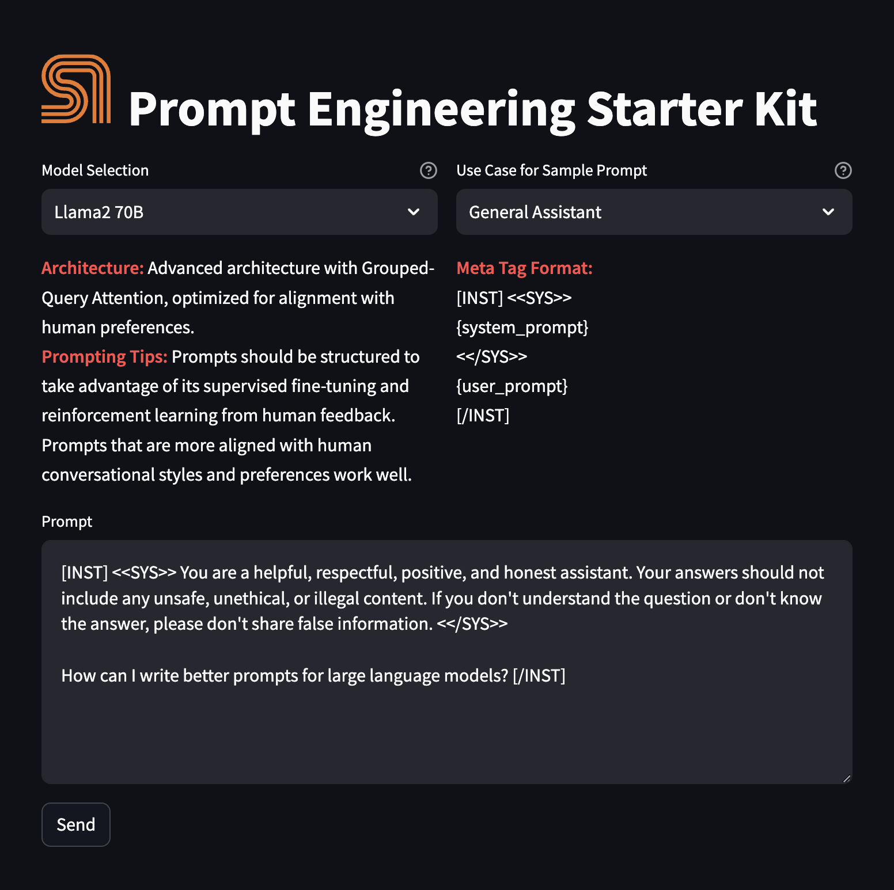

<a href="https://sambanova.ai/">
<picture>
  <source media="(prefers-color-scheme: dark)" srcset="../images/SambaNova-light-logo-1.png" height="100">
  
</picture>
</a>

Prompt Engineering Starter Kit
======================

<!-- TOC -->

- [Prompt Engineering Starter Kit](#prompt-engineering-starter-kit)
- [Before you begin](#before-you-begin)
    - [Clone this repository](#clone-this-repository)
    - [Set up the models and config file](#set-up-the-models-and-config-file)
        - [Set up the inference endpoint, configs and environment variables](#set-up-the-inference-endpoint-configs-and-environment-variables)
- [Deploy the starter kit GUI](#deploy-the-starter-kit-gui)
    - [Option 1: Use a virtual environment](#option-1-use-a-virtual-environment)
    - [Option 2: Deploy the starter kit in a Docker container](#option-2-deploy-the-starter-kit-in-a-docker-container)
- [Use the starterkit GUI](#use-the-starterkit-gui)
- [Customize the starter kit](#customize-the-starter-kit)
    - [Include additional models](#include-additional-models)
        - [Include models using SambaNova Cloud](#include-models-using-sambanova-cloud)
        - [Include models using SambaStudio](#include-models-using-sambastudio)
    - [Edit a prompt template](#edit-a-prompt-template)
    - [Add prompt templates and use cases](#add-prompt-templates-and-use-cases)
- [Examples, third-party tools, and data sources](#examples-third-party-tools-and-data-sources)

<!-- /TOC -->
Add prompt templates / use cases
# Before you begin

You have to set up your environment before you can run the starter kit. 

## Clone this repository

Clone the starter kit repo.
```
git clone https://github.com/sambanova/ai-starter-kit.git
```

## Set up the models and config file

### Set up the inference endpoint, configs and environment variables

The next step is to set up your environment variables to use one of the models available from SambaNova. If you're a current SambaNova customer, you can deploy your models with SambaStudio. If you are not a SambaNova customer, you can self-service provision API endpoints using SambaNova Cloud API.

- If using **SambaNova Cloud** Please follow the instructions [here](../README.md#use-sambanova-cloud-option-1) for setting up your environment variables.
    Then in the [config file](./config.yaml) set the llm `api` variable to `"sncloud"` and set the `select_expert` config depending on the model you want to use.

- If using **SambaStudio** Please follow the instructions [here](../README.md#use-sambastudio-option-2) for setting up endpoint and your environment variables.
    Then in the [config file](./config.yaml) set the llm `api` variable to `"sambastudio"`, set the `bundle` and `select_expert` configs if using a bundle endpoint.


# Deploy the starter kit GUI

We recommend that you run  the the starter kit in a virtual environment or use a container.

## Option 1: Use a virtual environment

If you want to use virtualenv or conda environment

1. Install and update pip.

    ```bash
    cd ai-starter-kit/prompt-engineering
    python3 -m venv prompt_engineering_env
    source prompt_engineering_env/bin/activate
    pip install -r requirements.txt
    ```
2. Run the following command:
    ```bash
    streamlit run streamlit/app.py --browser.gatherUsageStats false 
    ```

You should see the following user interface:




## Option 2: Deploy the starter kit in a Docker container 

If you want to use Docker:

1. Update the `SAMBASTUDIO_KEY`, `SNAPI`, `SNSDK` args in [docker-compose.yaml file](docker-compose.yaml)

2. Run the command:

    docker-compose up --build

You will be prompted to go to the link (http://localhost:8501/) in your browser where you will be greeted with the streamlit page as above.


# Use the starterkit GUI 

To use the starter kit, follow these steps:

1. Confirm the LLM to use from the text under **Model display** (Currently, only Llama2 and Llama3 models are available). You'll see a description of the architecture, prompting tips, and the metatag format required to optimize the model's performance.

2. In **Use Case for Sample Prompt**, select a template. You have the following choices:

    - **General Assistant**: Provides comprehensive assistance on a wide range of topics, including answering questions, offering explanations, and giving advice. It's ideal for general knowledge, trivia, educational support, and everyday inquiries.

    - **Document Search**: Specializes in locating and briefing relevant information from large documents or databases. Useful for research, data analysis, and extracting key points from extensive text sources.

    - **Product Selection**: Assists in choosing products by comparing features, prices, and reviews. Ideal for shopping decisions, product comparisons, and understanding the pros and cons of different items.

    - **Code Generation**: Helps in writing, debugging, and explaining code. Useful for software development, learning programming languages, and automating simple tasks through scripting.

    - **Summarization**: Outputs a summary based on a given context. Essential for condensing large volumes of text 

3. In the **Prompt** field, review and edit the input to the model, or use directly the default prompt. 

4. Click the **Send** button to submit the prompt. The model will generate and display the response.

# Customize the starter kit

You have several options for customizing this starter kit. 

## Include additional models

You can include more models with the kit. They will then show up in the **Model display** in the GUI according to the name of the `select_expert` value in the config file. 

### Include models using SambaNova Cloud

If you're using a SambaNova Cloud endpoint, follow these steps:
 
1. In the `config.json` file, add the `select_expert` name. Then, include the model description in the `models` section, like the ones already there. Ensure that both names are compatible. Example:
    - `select_expert` value: `Mistral-7B-Instruct-v0.2`
    - model name under `models`: `Mistral`  
2. Populate the API key provided for SambaNova Cloud.
3. Use `create_prompt_yamls` as a tool to create the prompts needed for your new model. These prompts will have a similar structure as the ones already existing in `prompt_engineering/prompts` folder, but will follow the metatags needed for the LLM model we want to add.

### Include models using SambaStudio

If you're using a SambaStudio endpoint, follow these steps:

1. Create a SambaStudio endpoint for inference. 
2. In the `config.json` file, add the `select_expert` name. Then, include the model description in the `models` section, like the ones already there. Ensure that both names are compatible. Example:
    - `select_expert` value: `Mistral-7B-Instruct-v0.2`
    - model name under `models`: `Mistral`  
3. Populate key variables on your env file.
4. Use `create_prompt_yamls` as a tool to create the prompts needed for your new model. These prompts will have a similar structure as the ones already existing in `prompt_engineering/prompts` folder, but will follow the metatags needed for the LLM model we want to add.

## Edit a prompt template

To change a template: 

1. Edit the `create_prompt_yamls()` method in `src/llm_management.py`.
2. Execute the method to modify the prompt yaml file in the `prompts` folder.

## Add prompt templates and use cases

To add a prompt template:

1. Follow the instructions in [Edit a template](#edit-a-prompt-template).
2. Include the template use case in the `use_cases` list of `config.yaml` file.

# Examples, third-party tools, and data sources

For further examples, we encourage you to visit any of the following resources:
- [Awesome chatgpt prompts](https://github.com/f/awesome-chatgpt-prompts)
- [Smith - Langchain hub](https://smith.langchain.com/hub)

# Third-party tools and data sources

All the packages/tools are listed in the `requirements.txt` file in the project directory.
