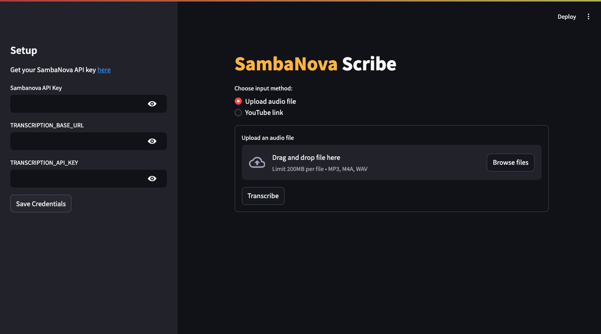

<a href="https://sambanova.ai/">
<picture>
 <source media="(prefers-color-scheme: dark)" srcset="../images/SambaNova-light-logo-1.png" height="100">
  
</picture>
</a>

# SambaNova scribe

Questions? Just <a href="https://discord.gg/54bNAqRw" target="_blank">message us</a> on Discord <a href="https://discord.gg/54bNAqRw" target="_blank"></a> or <a href="https://github.com/sambanova/ai-starter-kit/issues/new/choose" target="_blank">create an issue</a> in GitHub. We're happy to help live!

<!-- TOC -->

- [SambaNova scribe](#sambanova-scribe)
- [Overview](#overview)
- [Before you begin](#before-you-begin)
    - [Clone this repository](#clone-this-repository)
    - [Install System Dependencies](#install-system-dependencies)
    - [Set up the models, environment variables and config file](#set-up-the-models-environment-variables-and-config-file)
- [Deploy the starter kit GUI](#deploy-the-starter-kit-gui)
- [Use the starter kit](#use-the-starter-kit)
    - [Transcribe:](#transcribe)
    - [Chat](#chat)
    - [Audio QA](#audio-qa)
- [Customizing the starter kit](#customizing-the-starter-kit)
    - [Audio model params](#audio-model-params)
    - [Generation model parameters](#generation-model-parameters)
            - [Experiment with prompt engineering](#experiment-with-prompt-engineering)
- [Third-party tools and data sources](#third-party-tools-and-data-sources)

<!-- /TOC -->

# Overview

This AI Starter Kit is a simple example of a audio transcription and processing workflow. You send your audio file or a youtube link to app and the audio will be send to the SambaNova platform, and get the transcription and the bullet point summary of the PROVIDED audio.

This sample is ready-to-use. We provide:

- Instructions for setup with SambaNova Cloud.
- Instructions for running the application as is.
- Instructions for customizing the application.

# Before you begin

You have to set up your environment before you can run or customize the starter kit.

## Clone this repository

Clone the starter kit repo.

```bash
git clone https://github.com/sambanova/ai-starter-kit.git
```

## Install System Dependencies

this kit requires you to have installed in your system ffmpeg:

- On macOS, you can manually install them using Homebrew:
```bash
    brew install ffmpeg
```
3. On Linux (Ubuntu/Debian), you can install them manually:
```bash
    sudo apt-get update && sudo apt-get install -y ffmpeg
```
4. On Windows, you may need to install these dependencies manually from the [ffmpeg site](https://ffmpeg.org/download.html) and ensure they are in your system PATH.

## Set up the models, environment variables and config file

You should set up your environment variables to use one of the inference models available from SambaNova. You can obtain a free API key through SambaNova Cloud. Alternatively, if you are a current SambaNova customer, you can deploy your models using SambaStudio.

- **SambaNova Cloud (Option 1)**: Follow the instructions [here](../README.md#use-sambanova-cloud-option-1) to set up your environment variables.
    Then, in the [config file](./config.yaml), set the llm and audio model `type` variable to `"sncloud"` and set the `model` config depending on the models you want to use.

- **SambaStudio (Option 2)**: follow the instructions [here](../README.md#use-sambastudio-option-2) to deploy your model and set up your environment variables.
    Then, in the [config file](./config.yaml), set the llm and audio model `type` variable to `"sambastudio"` and set the `model` config depending on the models you want to use.

# Deploy the starter kit GUI

We recommend that you run the starter kit in a virtual environment or use a container. We also recommend using Python >= 3.10 and < 3.12.

1. Install and update pip.

```bash
    cd ai-starter-kit/sambanova_scribe
    python3 -m venv sambanova_scribe_env
    source sambanova_scribe_env/bin/activate
    pip  install  -r  requirements.txt
```

2. Run the following command:

```bash
    streamlit run streamlit/app.py --browser.gatherUsageStats false 
```

After deploying the starter kit you see the following user interface:



# Use the starter kit

After you've deployed the GUI, you can use the starter kit. Follow these steps:

Depending if you have set your env variables you will be prompted or not to set them in the set up bar.

The kit has 3 different interaction methods, you can select in the top tabs:

## Transcribe:

This interaction method allows you to transcribe and summarize audios from Youtube videos or local sources.

1. Select the Transcribe tab in the main panel top tab selector

2. In the main panel select the input method either a youtube link or a file.

    > Audios should be mp3, mp4 or wav format

    > Either from youtube download or audio file can not exceed 25MB

2. Click on the Transcribe button this will download the youtube audio or upload your file and generate the transcription of the audio

3. Click on the create summary button to get a bullet point summary of the recording

## Chat

this interaction method allows you to have a multiturn conversation using both recorded audio inputs or text messages with the model

1. Select the Chat tab in the main panel top tab selector

2. Record or write a message in the chat input

> you can reset the conversation history pressing reset button in the setup bar

## Audio QA

This interaction method allows you upload a local audio and do Question-Answering over the audio, for this the input audio is transcribed and also query using the audio model, then the transcription and intermediate response of the audio model are used to generate a final answer using the llm model.

1. Select the Audio QA tab in the main panel top tab selector

2. Upload the audio to query in the main panel

3. Start queringn the audio using the chat input 

> You can reset the conversation history pressing reset button in the setup bar

# Customizing the starter kit

You can further customize the starter kit based on the use case.

## Audio model params

The transcription parameters can be customized in the [config.yaml](./config.yaml) file, the the `audio_model` section you can change the `model` you want to use to transcribe, the `temperature` and the language.

## Generation model parameters

The llm parameters can be customized in the [config.yaml](./config.yaml) file, the the `llm` section you can change the model you want to use in `select_expert` parameter, also parameters like `temperature` or `max_tokens_to_generate`

#### Experiment with prompt engineering

Prompting has a significant effect on the quality of LLM responses. Prompts can be further customized to improve the overall quality of the responses from the LLMs. For example, in this starter kit, the following prompt template was used to generate a bullet point summary from the LLM, where `text` is the transcription of the audio, and `num` the number of bullet points to generate.

```yaml
template: |
    <|begin_of_text|><|start_header_id|>system<|end_header_id|> You are a helpful assistant powered by Sambanova's AI chip accelerator, designed to assist users to optimize their workflow. 
    Use the following transcription of an audio ang generate {num} bullet points that summarize what is covered in the audio.
    Maintain a professional yet conversational tone. Do not use images or emojis in your answer.
    Prioritize accuracy and only provide information directly supported by the text transcription. <|eot_id|><|start_header_id|>user<|end_header_id|>
    Transcription: {text} 
    \n ------- \n
    Answer: <|eot_id|><|start_header_id|>assistant<|end_header_id|>
```

You can make modifications to the prompt template in the following file:

```
    file: prompts/summary.yaml
```

Also you can check at the audio model chat prompts defined in:

```
    file: src/scribe.py
```

# Third-party tools and data sources

All the packages/tools are listed in the `requirements.txt` file in the project directory.
