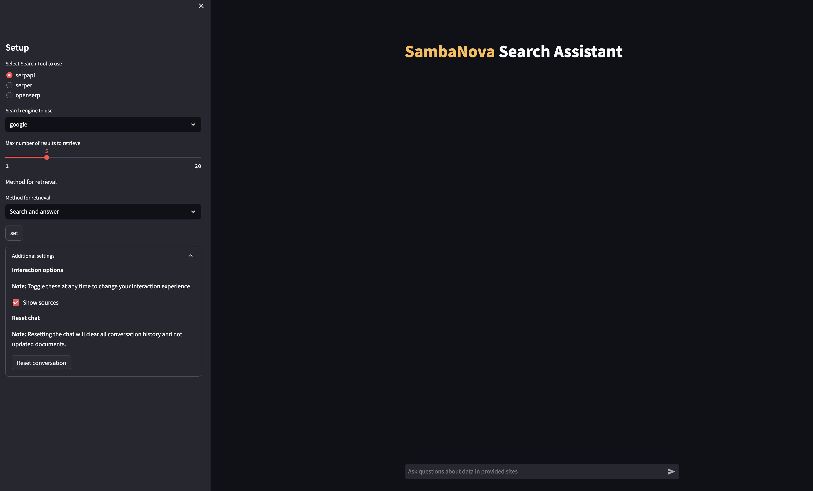

<a href="https://sambanova.ai/">
<picture>
  <source media="(prefers-color-scheme: dark)" srcset="../images/SambaNova-light-logo-1.png" height="60">
  
</picture>
</a>

Search Assistant
======================

<!-- TOC -->

- [Search Assistant](#search-assistant)
- [Overview](#overview)
- [Before you begin](#before-you-begin)
    - [Clone this repository](#clone-this-repository)
    - [Set up the models, environment variables and config file](#set-up-the-models-environment-variables-and-config-file)
        - [Set up the generative model](#set-up-the-generative-model)
        - [Set up the embedding model](#set-up-the-embedding-model)
- [Deploy the starter kit GUI](#deploy-the-starter-kit-gui)
    - [Option 1: Use a virtual environment](#option-1-use-a-virtual-environment)
    - [Option 2: Deploy the starter kit in a Docker container](#option-2-deploy-the-starter-kit-in-a-docker-container)
    - [Run the demo](#run-the-demo)
- [Workflow overview](#workflow-overview)
- [Customizing the starter kit](#customizing-the-starter-kit)
    - [Use a custom serp tool](#use-a-custom-serp-tool)
    - [Customize website scraping](#customize-website-scraping)
    - [Customize document transformation](#customize-document-transformation)
    - [Customize data splitting](#customize-data-splitting)
    - [Customize data embedding](#customize-data-embedding)
    - [Customize embedding storage](#customize-embedding-storage)
    - [Customize retrieval](#customize-retrieval)
    - [Customize LLM usage](#customize-llm-usage)
    - [Experiment with prompt engineering](#experiment-with-prompt-engineering)
- [Third-party tools and data sources](#third-party-tools-and-data-sources)

<!-- /TOC -->

# Overview

This AI Starter Kit is an example of a semantic search workflow that can be built using the SambaNova platform to get answers to your questions using Google search information as the source. This kit includes:

 -   A configurable SambaNova Cloud or SambaStudio connector to run inference off a model deployed and trained on SambaNova hardware. 
 -   A configurable integration with a third-party vector database.
 -   An implementation of the semantic search workflow and prompt construction strategies.
 -   Configurable integrations with multiple SERP APIs
 -   An strategy for an instant question - search - answer workflow
 -   An strategy for a query - search - web-crawl - answer workflow

This example is ready to use: 

* Run the model following the steps in [Before you begin](#before-you-begin) and [Deploy the starter kit GUI](#deploy-the-starter-kit-gui)
* Learn how the model works and look at resources in [Workflow overview](#workflow-overview).
* Customize the model to meet your organization's needs by looking at the [Customizing the starter kit](#customizing-the-starter-kit) section.

# Before you begin

## Clone this repository

Clone the start kit repo.

```
git clone https://github.com/sambanova/ai-starter-kit.git
```

## Set up the models, environment variables and config file

### Set up the generative model

The next step is to set up your environment variables to use one of the inference models available from SambaNova. You can obtain a free API key through SambaNova Cloud. Alternatively, if you are a current SambaNova customer, you can deploy your models using SambaStudio.

- **SambaNova Cloud (Option 1)**: Follow the instructions [here](../README.md#use-sambanova-cloud-option-1) to set up your environment variables.
    Then, in the [config file](./config.yaml), set the llm `api` variable to `"sncloud"` and set the `select_expert` config depending on the model you want to use.

- **SambaStudio (Option 2)**: Follow the instructions [here](../README.md#use-sambastudio-option-2) to set up your endpoint and environment variables.
    Then in the [config file](./config.yaml) set the llm `api` variable to `"sambastudio"`, and set the `CoE` and `select_expert` configs if you are using a CoE endpoint.

### Set up the embedding model

You have the following options to set up your embedding model:

* **CPU embedding model (Option 1)**: In the [config file](./config.yaml), set the variable `type` in `embedding_model` to `"cpu"`.

* **SambaStudio embedding model (Option 2)**: To increase inference speed, you can use a SambaStudio embedding model endpoint instead of using the default (CPU) Hugging Face embedding. Follow the instructions [here](../README.md#use-sambastudio-embedding-option-2) to set up your endpoint and environment variables. Then, in the [config file](./config.yaml), set the variable `type` in `embedding_model` to `"sambastudio"`, and set the configs `batch_size`, `coe` and `select_expert` according to your SambaStudio endpoint.

# Deploy the starter kit GUI

We recommend that you run the starter kit in a virtual environment or use a container. We also recommend using Python >= 3.10 and < 3.12.

## Option 1: Use a virtual environment

If you want to use virtualenv or conda environment 

1. Install and update pip.

    ``` bash
    cd ai-starter-kit/search_assistant
    python3 -m venv search_assistant_env
    source search_assistant_env/bin/activate
    pip install -r requirements.txt
    ```

2. Set the serp tool to use. This kit provides 3 options of serp tool to use: [SerpAPI](https://serpapi.com/), [Serper](https://serper.dev/), and [openSERP](https://github.com/karust/openserp).

- For [SerpAPI](https://serpapi.com/) and [Serper](https://serper.dev/): Create an account and follow the instructions to get your API key. Then, add the key to the environment variables file in the root repo directory `ai-starter-kit/.env`, as `SERPAPI_API_KEY` or `SERPER_API_KEY`.

- For [openSERP](https://github.com/karust/openserp): Follow the docker usage [instructions](https://github.com/karust/openserp?tab=readme-ov-file#docker-usage---)

  > Setting more than one of these tools is optional; you can set just one and run the kit with it. Each tool has its own pros and cons.


3. Run the following command:

    ```bash
    streamlit run streamlit/app.py --browser.gatherUsageStats false   
    ```

    You should see the following application user interface:



## Option 2: Deploy the starter kit in a Docker container 

If you want to use Docker:

1. Update the `SAMBASTUDIO_KEY`, `SNAPI`, `SNSDK` args in [docker-compose.yaml file](docker-compose.yaml)

2. Run the command:

    ```bash
    docker-compose up --build
    ```

You will be prompted to go to the link (http://localhost:8501/) in your browser where you will be greeted with the streamlit page shown in the screenshot above.

## Run the demo 

After the GUI is up and running, you can start making selections in the left pane of the GUI. 

1. Select the Search Tool to use. That's the tool that will search the internet. 
2. Select the search engine you want to use for retrieval.
3. Set the maximum number of search results to retrieve.
4. Select the method for retrieval
    - **Search and answer**: Does a search for each query you pass to the search assistant, and uses the search result snippets to provide an answer.
    - **Search and Scrape Sites**: Asks you for an initial query and searches and scrapes the sites. Creates a vector database from the result. You can then ask other questions related to your initial query and the method uses the stored information to give an answer.
5. Click the **Set** button to start asking questions!


# Workflow overview

This AI starter kit implements two distinct workflows, each with a series of operations:

<details>
<summary> Answer and search workflow </summary>

1. **Search** Use the Serp tool to retrieve the search results, and use the snippets of the organic search results (Serper, OpenSerp) or the raw knowledge graph (Serpapi) as context.

2. **Answer** Call the LLM using the retrieved information as context to answer your question.

</details>

<details>
<summary> Answer and scrape sites workflow </summary>

1. **Search:** Use the Serp tool to retrieve the search results and get links of organic search result.

2. **Website crawling:**  Scrape the HTML from the website using Langchain [AsyncHtmlLoader](https://python.langchain.com/docs/integrations/document_loaders/async_html) Document, which is built on top of the [requests](https://requests.readthedocs.io/en/latest/) and [aiohttp](https://docs.aiohttp.org/en/stable/) Python packages.

3. **Document parsing:** Document transformers are tools used to transform and manipulate documents. They take in structured documents as input and apply transformations to extract specific information or modify the documents' content. Document transformers can perform tasks such as extracting properties, generating summaries, translating text, filtering redundant documents, and more. Transformers process many documents efficiently and can be used to preprocess data before further analysis or to generate new versions of the documents with desired modifications.

   Depending on the required information you need to extract from websites, this step might require some customization.
   * Langchain Document Transformer [html2text](https://python.langchain.com/docs/integrations/document_transformers/html2text) is used to extract plain and clear text from the HTML documents. 
   * Other document transformers like the [BeautfulSoup transformer](https://python.langchain.com/docs/integrations/document_transformers/beautiful_soup) are available for plain text extraction from HTML and are included in the LangChain package. 
      
    If you want to retrieve remote files, this starter kit includes extra file type loading functionality. You can activate or deactivate these loaders listing the filetypes in the [config file](./config.yaml) in the parameter `extra_loaders`. Right now remote **PDF** loading is available

4. **Data splitting:** Due to token limits in LLMs, you need to split the data into chunks of text to be embedded and stored in a vector database after the data has been parsed and its content extracted. The size of the chunk of text depends on the context (sequence) length offered by the model. Generally, larger context lengths result in better performance. The method used to split text also has an impact on performance (for instance, making sure there are no word breaks, sentence breaks, etc.). The downloaded data is split using [RecursiveCharacterTextSplitter](https://python.langchain.com/docs/modules/data_connection/document_transformers/text_splitters/recursive_text_splitter).
    
5. **Data embedding:**  For each chunk of text from the previous step, we use an embeddings model to create a vector representation of it. These embeddings are used in the storage and retrieval of the most relevant content given a user's query. The split text is embedded using [HuggingFaceInstructEmbeddings](https://api.python.langchain.com/en/latest/embeddings/langchain_community.embeddings.huggingface.HuggingFaceInstructEmbeddings.html).

   *For more information about what an embeddings is, click [here](https://towardsdatascience.com/neural-network-embeddings-explained-4d028e6f0526).*

6. **Embedding storage:**  Embeddings for each chunk, along with content and relevant metadata (such as source website), are stored in a vector database. The embedding acts as the index in the database. In this starter kit, we store information with each entry, which can be modified to suit your needs. Several vector database options are available, each with its own pros and cons. This starter kit uses [Chroma](https://docs.trychroma.com/getting-started) as the vector database because it's a free, open-source option with straightforward setup, but can easily be updated to use another database if desired. In terms of metadata, `website source`  is also attached to the embeddings which are stored during web scraping.

7. **Retrieval workflow (optional):**  This workflow is an example of leveraging data stored in a vector database along with a large language model to enable retrieval-based Q&A of your data. This method is called [Retrieval Augmented Generation RAG](https://netraneupane.medium.com/retrieval-augmented-generation-rag-26c924ad8181). The steps are:

    * **Embed query:** The first step is to convert a user-submitted query into a common representation (an embedding) for subsequent use in identifying the most relevant stored content. Because of this, we recommend that you use the *same* embedding model to generate embeddings. In this sample, the query text is embedded using [HuggingFaceInstructEmbeddings](https://api.python.langchain.com/en/latest/embeddings/langchain_community.embeddings.huggingface.HuggingFaceInstructEmbeddings.html)), which is the same model in the ingestion workflow.
 
    * **Retrieve relevant content:** Next, we use the embeddings representation of the query to make a retrieval request from the vector database, which returns *relevant* entries (content). The vector database acts as a retriever for fetching relevant information from the database.
    
     *Find more information about embeddings and their retrieval [here](https://pub.aimind.so/llm-embeddings-explained-simply-f7536d3d0e4b)*.
 
     *Find more information about Retrieval augmented generation with LangChain [here](https://python.langchain.com/docs/modules/data_connection/)*.

</details>

# Customizing the starter kit

You can customize this starter kit based on your use case. 

## Use a custom serp tool

You can modify or change the behavior of the search step by including your custom method in [SearchAssistant](./src/search_assistant.py) class. Your method must be able to receive a query, have a `do_analysis` flag, and return a result and a list of retrieved URLs.

This modification can be done in the following location:
> file: [src/search_assistant.py](src/search_assistant.py)

## Customize website scraping

Different packages are available to crawl and extract from websites. This starter kit uses the [AsyncHtmlLoader](https://python.langchain.com/docs/integrations/document_loaders/async_html). Langchain also includes a couple of [HTML loaders](https://python.langchain.com/docs/modules/data_connection/document_loaders/html) that can be used.

This modification can be done in the following location:

> file: [src/search_assistant.py](src/search_assistant.py)
>
>function: `load_htmls`
>

The maximum number of sites in the scraping method is set to 20, but you can modify that limit and the web crawling behavior in the following location:

> file: [config.yaml](config.yaml)
>```yaml
>web_crawling:
>    "max_depth": 2
>    "max_scraped_websites": 20
>```

> file: [src/search_assistant.py](src/search_assistant.py)
>```
>function: web_crawl
>```

## Customize document transformation

Depending on the loader used for scraping the sites, you may want to use a transformation method to clean up the downloaded documents. You can do that in the following location:

> file: [src/search_assistant.py](src/search_assistant.py)
>
>function: `clean_docs`
>

[LangChain](https://python.langchain.com/docs/integrations/document_transformers) provides several document transformers that you can use.

## Customize data splitting

You can experiment with different ways of splitting the data, such as splitting by tokens or using context-aware splitting for code or markdown files. LangChain provides several examples of different kinds of splitting [here](https://python.langchain.com/docs/modules/data_connection/document_transformers/).


You can customize the **RecursiveCharacterTextSplitter** in the [kit src file](src/search_assistant.py), which is used by this starter kit by changing the `chunk_size` and `chunk_overlap` parameters. 
* For LLMs with a long sequence length, try using a larger value of `chunk_size` to provide the LLM with broader context and improve performance. 
* The `chunk_overlap` parameter is used to maintain continuity between different chunks.

This modification can be done in the following location:
> file: [config.yaml](config.yaml)
>```yaml
>retrieval:
>    "chunk_size": 1200
>    "chunk_overlap": 240
>    "db_type": "chroma"
>    "k_retrieved_documents": 3
>    "score_treshold": 0.3
>```

## Customize data embedding

Several open source embedding models are available on HuggingFace. [This leaderboard](https://huggingface.co/spaces/mteb/leaderboard) ranks these models based on the Massive Text Embedding Benchmark (MTEB). A number of these models, such as [e5-large-v2](https://huggingface.co/intfloat/e5-large-v2) and [e5-mistral-7b-instruct](https://huggingface.co/intfloat/e5-mistral-7b-instruct), are available on SambaStudio and can be further fine-tuned on specific datasets to improve performance.

To change the embedding model, do the following:
* If using CPU embedding (i.e., `type` in `embedding_model` is set to `"cpu"` in the [config.yaml](config.yaml) file), e5-large-v2 from HuggingFaceInstruct is used by default. If you want to use another model, you will need to manually modify the `EMBEDDING_MODEL` variable and the `load_embedding_model()` function in the [api_gateway.py](../utils/model_wrappers/api_gateway.py). 
* If using SambaStudio embedding (i.e., `type` in `embedding_model` is set to `"sambastudio"` in the [config.yaml](config.yaml) file), you will need to change the SambaStudio endpoint and/or the configs `batch_size`, `coe` and `select_expert` in the config file. 

## Customize embedding storage

Customize search assistant to use a different vector database to store the embeddings generated by the embedding model. The [LangChain vector stores documentation](https://python.langchain.com/docs/integrations/vectorstores) provides a broad collection of vector stores that are easy to integrate. By default, we use Chroma. 

This modification can be done in the following location:
> file: [../utils/vectordb/vector_db.py](../utils/vectordb/vector_db.py)
>
> function: `create_vector_store`
>
## Customize retrieval

Similar to the vector stores, a wide collection of retriever options is also available. This starter kit uses the vector store as a retriever, but it can be enhanced and customized, as shown in some of the examples [here](https://python.langchain.com/docs/integrations/retrievers).

This modification can be done in the following location:

file: [config.yaml](config.yaml)
```yaml
    "db_type": "chroma"
    "k_retrieved_documents": 3
    "score_treshold": 0.6
```

and
> file: [src/search_assistant.py](src/search_assistant.py)
>
>function: `retrieval_qa_chain`
>

## Customize LLM usage 

You can modify the parameters for calling the model and the `temperature` and `max_tokens_to_generate` in the [config.yaml](config.yaml) file.

## Experiment with prompt engineering

Prompting has a significant effect on the quality of LLM responses. Prompts can be further customized to improve the overall quality of the responses from the LLMs. For example, in this starter kit, the following prompt was used to generate a response from the LLM, where `question` is the user query and `context` is the documents retrieved by the search engine.

```yaml
template: |
          <|begin_of_text|><|start_header_id|>system<|end_header_id|>You are a helpful, respectful and honest assistant. Always answer as helpfully as possible, while being safe.  Your answers should not include any harmful, unethical, racist, sexist, toxic, dangerous, or illegal content. 
          Please ensure that your responses are socially unbiased and positive in nature.

          You will receive a user question and a set of contexts with google results of the user query, each context starts reference number with this structure [reference:n], where n is a number. Please use the context and cite the context at the end of each sentence if applicable.
          You should give a concise answer to the question based only in the contexts.
          You must cite the contexts using the reference number with the format [reference:x] withing the answer
          Your answer must be written in the same language as the question, if the information to return an answer is not in the context reply: "answer not found"
          Do not provide any extra analysis and keep your response as short as possible, if a question does not make any sense, or is not factually coherent, explain why instead of answering something not correct. If you don't know the answer to a question, please don't make up false information.

          <context>
          {context}
          </context>

          <|eot_id|><|start_header_id|>user<|end_header_id|>
          User Question: {question}
          <|eot_id|><|start_header_id|>assistant<|end_header_id|>
          Answer: 
```

Those modifications can be done in the [prompts](./prompts) folder.

*Learn more about prompt engineering [here](https://www.promptingguide.ai/).*

# Third-party tools and data sources

All the packages/tools are listed in the `requirements.txt` file in the project directory. 
