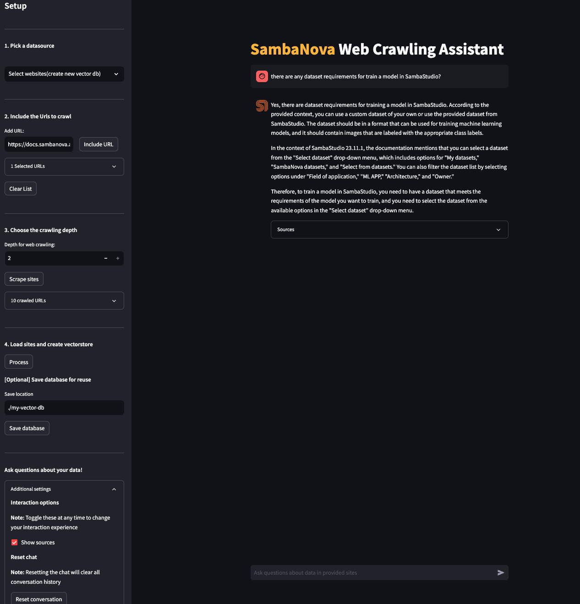

<a href="https://sambanova.ai/">
<picture>
  <source media="(prefers-color-scheme: dark)" srcset="../images/SambaNova-light-logo-1.png" height="100">
  
</picture>
</a>

Web Crawled Data Retrieval
======================

<!-- TOC -->

- [Web Crawled Data Retrieval](#web-crawled-data-retrieval)
- [Overview](#overview)
- [Before you begin](#before-you-begin)
    - [Clone this repository](#clone-this-repository)
    - [Set up the models and config file](#set-up-the-models-and-config-file)
        - [Set up the inference endpoint, configs and environment variables](#set-up-the-inference-endpoint-configs-and-environment-variables)
        - [Update the Embeddings API information](#update-the-embeddings-api-information)
- [Deploy the starter kit GUI](#deploy-the-starter-kit-gui)
    - [Option 1: Use a virtual environment](#option-1-use-a-virtual-environment)
    - [Option 2: Deploy the starter kit in a Docker container](#option-2-deploy-the-starter-kit-in-a-docker-container)
- [Use the starter kit GUI](#use-the-starter-kit-gui)
- [Workflows](#workflows)
    - [Ingestion workflow](#ingestion-workflow)
    - [Retrieval workflow](#retrieval-workflow)
    - [Response workflow](#response-workflow)
- [Customizing the AI starter kit](#customizing-the-ai-starter-kit)
    - [Customize website crawling](#customize-website-crawling)
        - [Customize the loader](#customize-the-loader)
        - [Customize iteration](#customize-iteration)
        - [Customize document transformation](#customize-document-transformation)
    - [Customize data splitting](#customize-data-splitting)
    - [Customize data embedding](#customize-data-embedding)
    - [Customize embedding storage](#customize-embedding-storage)
    - [Customize retrieval](#customize-retrieval)
    - [Customize LLM usage](#customize-llm-usage)
        - [SambaStudio endpoint](#sambastudio-endpoint)
    - [Experiment with prompt engineering](#experiment-with-prompt-engineering)
- [Third-party tools and data sources](#third-party-tools-and-data-sources)

<!-- /TOC -->

# Overview

This AI starter kit is an example of a semantic search workflow that can be built using the SambaNova platform to get answers to your questions using website-crawled information as the source. 

 -   A configurable SambaStudio connector for running inference off a model already available in SambaStudio. 
 -   A configurable integration with a third-party vector database.
 -   An implementation of a semantic search workflow and prompt construction strategies.

This sample is ready to use. We provide:

* Instructions for setup.
* Instructions for running the model as is.
* Instructions for customization.

You can view a demo video of deploying and using the starter kit:

https://github.com/sambanova/ai-starter-kit/assets/150964187/818a7ff8-f478-4899-8ebf-5b0c935d46d2


# Before you begin

You have to set up your environment before you can run or customize the starter kit.

## Clone this repository

Clone the starter kit repo.
```
git clone https://github.com/sambanova/ai-starter-kit.git
```

## Set up the models and config file

### Set up the inference endpoint, configs and environment variables

The next step is to set up your environment variables to use one of the models available from SambaNova. If you're a current SambaNova customer, you can deploy your models with SambaStudio. If you are not a SambaNova customer, you can self-service provision API endpoints using SambaNova Cloud.

- If using **SambaNova Cloud** Please follow the instructions [here](../README.md#use-sambanova-cloud-option-1) for setting up your environment variables.
    Then in the [config file](./config.yaml) set the llm `api` variable to `"sncloud"` and set the `select_expert` config depending on the model you want to use.

- If using **SambaStudio** Please follow the instructions [here](../README.md#use-sambastudio-option-3) for setting up endpoint and your environment variables.
    Then in the [config file](./config.yaml) set the llm `api` variable to `"sambastudio"`, set the `bundle` and `select_expert` configs if using a bundle endpoint.

### Update the Embeddings API information

You have these options to specify the embedding API info:

* **Option 1: Use a CPU embedding model**

    In the [config file](./config.yaml), set the variable `type` in `embedding_model` to `"cpu"`

* **Option 2: Set a SambaStudio embedding model**

To increase inference speed, you can use a SambaStudio embedding model endpoint instead of using the default (CPU) Hugging Face embeddings.

1. Follow the instructions [here](../README.md#use-sambastudio-embedding-option-2) for setting up your environment variables.

2. In the [config file](./config.yaml), set the variable `type` `embedding_model` to `"sambastudio"` and set the configs `batch_size`, `bundle` and `select_expert` according your sambastudio endpoint

    > NOTE: Using different embedding models (cpu or sambastudio) may change the results, and change How the embedding model is set and what the parameters are.

# Deploy the starter kit GUI

We recommend that you run  the the starter kit in a virtual environment or use a container. 

## Option 1: Use a virtual environment

If you want to use virtualenv or conda environment:

1. Install and update pip.

    ``` bash
    cd ai-starter-kit/web_crawled_data_retriever
    python3 -m venv web_crawled_data_retriever_env
    source web_crawled_data_retriever_env/bin/activate
    pip install -r requirements.txt
    ```
2. Run the following command:
    ``` bash
    streamlit run streamlit/app.py --browser.gatherUsageStats false 
    ```

You should see the following user interface:



## Option 2: Deploy the starter kit in a Docker container 

If you want to use Docker, run the following command:

  docker-compose up --build

You will be prompted to go to the link (http://localhost:8501/) in your browser where you will be greeted with the streamlit GUI as above.

# Use the starter kit GUI

After you've deployed the GUI, you can use the start kit. Follow these steps:

1. Under **Pick a datasource**, select a previously stored [FAISS](https://github.com/facebookresearch/faiss) vectorstore or a list of website URLs.

2. Under **Include the Urls to crawl**, specify each site you want to crawl in the text area and click **Include URL**. You can clear the list if needed.

3. Under **Choose the crawling depth**, specify how many layers of internal links to explore. (limited to 2)

> NOTE: An increase in  crawling depth leads to exponential growth in the number of processed sites. Consider resource implications for efficient workflow performance.

4. Click **Scrape sites** to crawl and process the sites. The app creates a vectorstore in memory, which you can store on disk if you want. 

5. Use the question area on the right to ask questions about website data!


# Workflows
This AI starter kit implements these distinct workflows. Each consist of a sequence of operations.


## Ingestion workflow

This workflow is an example of crawling, parsing and indexing data for subsequent Q&A. The steps are:

1. **Website crawling**: The Langchain [AsyncHtmlLoader](https://python.langchain.com/docs/integrations/document_loaders/async_html), which is built on top of the [requests](https://requests.readthedocs.io/en/latest/) and [aiohttp](https://docs.aiohttp.org/en/stable/) Python packages, is used to scrape the HTML from the websites.

    This starter kit uses an iterative approach to delve deeper into the website's references.
    * First we load the initial  HTML content and extract links using the [beautifulSoup](https://www.crummy.com/software/BeautifulSoup/) package. 
    * For each extracted link, we repeat the crawling process, loading the linked page's HTML content, and again identifying additional links within that content. 
    
    This iterative cycle continues for 'n' iterations, where 'n' represents the specified depth. With each iteration, the workflow explores deeper levels of the website hierarchy, progressively expanding the scope of data retrieval.

2. **Document parsing:** Document transformers are tools used to transform and manipulate documents. They take structured documents as input and apply transformations to extract specific information or modify the document's content. Document transformers can extract properties, generate summaries, translate text, filter redundant documents, and more. These transformers can process a large number of documents efficiently and can be used to preprocess data before further analysis or to generate new versions of the documents with desired modifications.

    We use the Langchain [html2text](https://python.langchain.com/docs/integrations/document_transformers/html2text) document transformer to extract plain and clear text from the HTML documents. Other document transformers like[BeautfulSoup transformer](https://python.langchain.com/docs/integrations/document_transformers/beautiful_soup) are available for plain text extraction from HTML included in the LangChain package. Depending on the information you need to extract from websites, this step might require some customization.

    If you want to retrieve remote files, this starter kit includes extra file type loading functionality. You can activate or deactivate these loaders listing the filetypes in the config file in the parameter extra_loaders. Right now remote PDF loading is available

3.  **Data splitting:**  Due to token limits in LLMs, you need to split the data into chunks of text to be embedded and stored in a vector database after the data has been parsed and its content extracted. The size of the chunk of text depends on the context (sequence) length offered by the model. Generally, larger context lengths result in better performance. The method used to split text also has an impact on performance (for instance, making sure there are no word breaks, sentence breaks, etc.). The downloaded data is split using [RecursiveCharacterTextSplitter](https://python.langchain.com/docs/modules/data_connection/document_transformers/text_splitters/recursive_text_splitter).


3. **Data embedding:** For each chunk of text from the previous step, we use an embeddings model to create a vector representation of it. These embeddings are used in the storage and retrieval of the most relevant content given a user's query. The split text is embedded using [HuggingFaceInstructEmbeddings](https://api.python.langchain.com/en/latest/embeddings/langchain.embeddings.huggingface.HuggingFaceInstructEmbeddings.html).

For more information about what an embeddings is click [here](https://towardsdatascience.com/neural-network-embeddings-explained-4d028e6f0526)*


4. **Store embeddings:** Embeddings for each chunk, along with content and relevant metadata (such as source website), are stored in a vector database. The embedding acts as the index in the database. In this starter kit, we store information with each entry, which can be modified to suit your needs. Several vector database options are available, each with its own pros and cons. This starter kit uses FAISS as the vector database because it's a free, open-source option with straightforward setup, but can easily be updated to use another database if desired. In terms of metadata, `website source` is also attached to the embeddings which are stored during web scraping.

## Retrieval workflow

This workflow is an example of leveraging data stored in a vector database along with a large language model to enable retrieval-based Q&A of your data. This method is called [Retrieval Augmented Generation RAG](https://netraneupane.medium.com/retrieval-augmented-generation-rag-26c924ad8181), The steps are:

1.  **Embed query:** The first step is to convert a user-submitted query into a common representation (an embedding) for subsequent use in identifying the most relevant stored content. Because of this, we recommend that you use the same embedding model to generate embeddings. In this sample, the query text is embedded using [HuggingFaceInstructEmbeddings](https://api.python.langchain.com/en/latest/embeddings/langchain.embeddings.huggingface.HuggingFaceInstructEmbeddings.html), which is the same model  in the ingestion workflow.
 
2. **Retrieve relevant content:** Next, we use the embeddings representation of the query to make a retrieval request from the vector database, which returns relevant entries (content). The vector database acts as a retriever for fetching relevant information from the database.
    
Find more information about embeddings and their retrieval [here](https://pub.aimind.so/llm-embeddings-explained-simply-f7536d3d0e4b)
 
Find more information about Retrieval augmented generation with LangChain [here](https://python.langchain.com/docs/modules/data_connection/)

## Response workflow

When the relevant information has been retrieved, the content is sent to a SambaNova LLM to generate the final response to the user query. The user's query is combined with the retrieved content along with instructions to form the prompt before being sent to the LLM. This process involves prompt engineering, and is an important part in ensuring quality output. In this starter kit, customized prompts are provided to the LLM to improve the quality of response for this use case.

Learn more about prompt engineering [here](https://www.promptingguide.ai/).


# Customizing the AI starter kit


You can further customize the code in this starter kit.


## Customize website crawling 

### Customize the loader

Different packages are available to crawl and extract from websites. The demo app uses the [AsyncHtmlLoader](https://python.langchain.com/docs/integrations/document_loaders/async_html), langchain also includes several [HTML loaders](https://python.langchain.com/docs/modules/data_connection/document_loaders/html) that you can use.
This modification can be done in the following location:

> file: [src/web_crawling_retriever.py](src/web_crawling_retriever.py)
>
>function: `load_htmls`
>

### Customize iteration

After the scraping, all the referenced links are saved and filtered using [beautifulSoup](https://www.crummy.com/software/BeautifulSoup/) package for each site. Then the web crawling method iterates 'n' times scraping the sites and finding referenced links,. The maximum depth is currently 2 and the maximum number of crawled sites is 20, but you can modify these limits and the behavior of the web crawling in the following location:

> file: [config.yaml](config.yaml)
>```yaml
>web_crawling:
>    "max_depth": 2
>    "max_scraped_websites": 20
>```

> file: [src/web_crawling_retriever.py](src/web_crawling_retriever.py)
>```
>function: web_crawl
>```

> WARNING: An increase in crawling depth leads to exponential growth in the number of processed sites. Consider resource implications for efficient workflow performance.

### Customize document transformation

Depending on the loader used for scraping the sites, you may want to use a transformation method to clean up the downloaded documents. You can do the cleanup in the following location:

> file: [src/web_crawling_retriever.py](src/web_crawling_retriever.py)
>
>function: `clean_docs`
>
[LangChain](https://python.langchain.com/docs/integrations/document_transformers) provides several document transformers that you can use with your data.

## Customize data splitting 

You can experiment with different ways of splitting the data, such as splitting by tokens or using context-aware splitting for code or markdown files. LangChain provides several examples of different kinds of splitting [here](https://python.langchain.com/docs/modules/data_connection/document_transformers/).


You can customize the **RecursiveCharacterTextSplitter** in get_text_chunks method of [vectordb class](../vectordb/vector_db.py), which is used by this starter kit by changing the `chunk_size` and `chunk_overlap` parameters. 
* For LLMs with a long sequence length, try using a larger value of `chunk_size` to provide the LLM with broader context and improve performance. 
* The `chunk_overlap` parameter is used to maintain continuity between different chunks.

This modification can be done in the following location:
> file: [config.yaml](config.yaml)
>```yaml
>retrieval:
>    "chunk_size": 1200
>    "chunk_overlap": 240
>    "db_type": "faiss"
>    "k_retrieved_documents": 4
>    "score_treshold": 0.5
>```

## Customize data embedding

Several open source embedding models are available on HuggingFace. [This leaderboard](https://huggingface.co/spaces/mteb/leaderboard) ranks these models based on the Massive Text Embedding Benchmark (MTEB). Several of these models are available on SambaStudio and can be used or further fine-tuned on specific datasets to improve performance.

This modification can be done in the following location:
> file: [../vectordb/vector_db.py](../vectordb/vector_db.py)
>
> function: `load_embedding_model`
>

> Find more information about the usage of SambaStudio hosted embedding models in the section *Use Sambanova's LLMs and Embeddings Langchain wrappers* [here](../README.md).

## Customize embedding storage

Customize search assistant to use a different vector database to store the embeddings generated by the embedding model. The [LangChain vector stores documentation](https://python.langchain.com/docs/integrations/vectorstores) provides a broad collection of vector stores that are easy to integrate.

This modification can be done in the following location:
> file: [../vectordb/vector_db.py](../vectordb/vector_db.py)
>
> function: `create_vector_store`
>

## Customize retrieval

Similar to the vector stores, a wide collection of retriever options is also available. This starter kit uses the vector store as a retriever, but it can be enhanced and customized, as shown in some of the examples [here](https://python.langchain.com/docs/integrations/retrievers).

This modification can be done in the following location:

file: [config.yaml](config.yaml)
```yaml
    "db_type": "chroma"
    "k_retrieved_documents": 3
    "score_treshold": 0.6
```

and
> file: [src/search_assistant.py](src/search_assistant.py)
>
>function: `retrieval_qa_chain`
>

## Customize LLM usage 

You can further customize the model itself.

### SambaStudio endpoint

The starter kit uses the SN LLM model, which can be further fine-tuned to improve response quality. 

To train a model in SambaStudio, learn how to: 
* [prepare your training data](https://docs.sambanova.ai/sambastudio/latest/generative-data-prep.html)
* [import your dataset into SambaStudio](https://docs.sambanova.ai/sambastudio/latest/add-datasets.html)
* [run a training job](https://docs.sambanova.ai/sambastudio/latest/training.html)

You can modify the parameters for calling the model and the temperature and maximum generation token in the `config.yaml` file.

## Experiment with prompt engineering

Prompting has a significant effect on the quality of LLM responses. Prompts can be further customized to improve the overall quality of the responses from the LLMs. For example, in this starter kit, the following prompt was used to generate a response from the LLM, where `question` is the user query and `context` are the documents retrieved by the search engine.
```yaml
template: |
          <s>[INST] <<SYS>>\nUse the following pieces of context to answer the question at the end.
          If the answer is not in context for answering, say that you don't know, don't try to make up an answer or provide an answer not extracted from provided context.
          Cross check if the answer is contained in provided context. If not than say \"I do not have information regarding this.\"\n
          context
          {context}
          end of context
          <</SYS>>/n
          Question: {question}
          Helpful Answer: [/INST]
)
```

This modification can be done in the file [prompts/llama7b-web_crwling_data_retriever.yaml](prompts/llama7b-web_crwling_data_retriever.yaml)

Learn more about prompt engineering [here](https://www.promptingguide.ai/).

# Third-party tools and data sources

All the packages/tools are listed in the `requirements.txt` file in the project directory.
